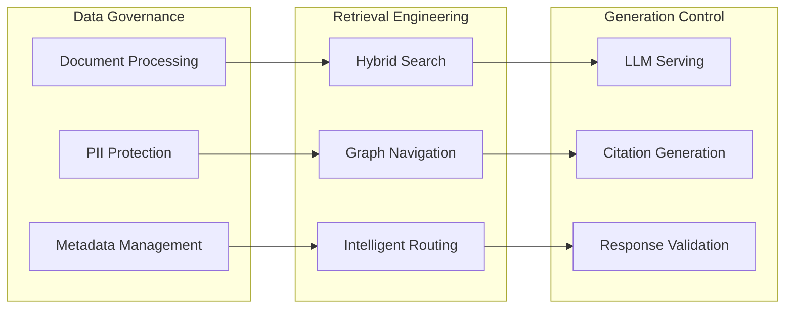

# Enterprise RAG Course Overview
## Complete Learning Path Documentation

**Course ID**: `ENTERPRISE-RAG-2025`
**Version**: 1.0
**Target Audience**: Senior Engineers, AI/ML Engineers, Solution Architects
**Duration**: 12 weeks (intensive) or 6 months (part-time)
**Last Updated**: 2025-01-06

---

## 🎯 Course Mission Statement

**Transform enterprise knowledge into intelligent, scalable, and compliant RAG systems that deliver measurable business value.**

Based on the **Three-Phase Architecture**: **Data Governance × Retrieval Engineering × Generation Control**

---

## 📚 Complete Course Structure

### **Chapter 0: Enterprise RAG Architecture Foundation**
**File**: `ch0_introduction/lectures/00_enterprise_rag_architecture_overview.md`

#### 🎯 Learning Objectives
- Master the three-phase RAG architecture for enterprise deployment
- Understand production-grade system design principles
- Define SLOs and success metrics for enterprise RAG systems

#### 🛠️ Core Technology Stack
```yaml
Foundation:
  - Enterprise Architecture Patterns
  - System Design Fundamentals
  - Production Deployment Strategies

Tech Stack Selection:
  - Document Processing: Docling + Unstructured
  - RAG Framework: LlamaIndex + Haystack
  - Vector Database: Qdrant + pgvector
  - Evaluation: RAGAS + Opik + LangFuse
  - Security: Casbin + Presidio
```

#### 📋 Key Deliverables
- [ ] Enterprise RAG system architecture diagram
- [ ] Technology stack decision matrix
- [ ] SLO and KPI definitions
- [ ] Risk assessment and mitigation plan

---

### **Chapter 1: Document Governance & DocOps**
**File**: `ch1_document_governance/lectures/01_docops_pipeline_design.md`

#### 🎯 Learning Objectives
- Design production-grade document processing pipelines
- Implement enterprise-level PII detection and data protection
- Build scalable ETL systems for diverse document formats

#### 🛠️ Core Technology Stack
```yaml
Document Processing:
  - Docling (IBM): Advanced PDF/Office processing
  - Unstructured: Fallback document parser
  - PyMuPDF: High-performance PDF handling

Content Processing:
  - LangChain Text Splitters: Semantic chunking
  - spaCy: NLP processing
  - tiktoken: Token management

Data Protection:
  - Presidio: PII detection and anonymization
  - Custom enterprise recognizers
  - GDPR/CCPA compliance modules
```

#### 📋 Key Deliverables
- [ ] DocOps pipeline with 99.5% extraction accuracy
- [ ] PII detection system with enterprise recognizers
- [ ] Metadata management schema and validation
- [ ] Performance benchmarks: 1000+ docs/hour processing

---

### **Chapter 2: Hybrid Retrieval Architecture**
**File**: `ch2_indexing_vectordb/lectures/02_hybrid_retrieval_architecture.md`

#### 🎯 Learning Objectives
- Implement production-grade hybrid retrieval systems
- Master vector database clustering and optimization
- Design intelligent caching and routing strategies

#### 🛠️ Core Technology Stack
```yaml
Vector Databases:
  - Qdrant: Primary (Rust-based, high performance)
  - pgvector: Enterprise integration
  - Chroma: Development/testing

Retrieval Methods:
  - Dense: sentence-transformers + BGE models
  - Sparse: BM25 + SPLADE
  - Reranking: BGE-reranker + cross-encoders

Infrastructure:
  - Redis Cluster: Multi-level caching
  - Kubernetes: Auto-scaling deployment
  - Prometheus: Performance monitoring
```

#### 📋 Key Deliverables
- [ ] Hybrid retrieval system with p95 < 200ms
- [ ] Vector database cluster setup (3+ nodes)
- [ ] Intelligent caching layer (80%+ hit rate)
- [ ] Performance optimization achieving 10K QPS

---

### **Chapter 3: Query Optimization & Routing**
**File**: `ch3_retrieval_engineering/lectures/03_query_optimization_and_routing.md`

#### 🎯 Learning Objectives
- Build intelligent query understanding and classification systems
- Implement multi-strategy query enhancement and routing
- Design multi-agent workflows for complex query processing

#### 🛠️ Core Technology Stack
```yaml
Query Processing:
  - Intent Classification: Custom BERT-based models
  - Complexity Analysis: Multi-dimensional scoring
  - Query Enhancement: T5-based rewriting

Routing Engine:
  - Strategy Selection: ML-based decision engine
  - Resource Management: Dynamic allocation
  - Fallback Logic: Graceful degradation

Multi-Agent Workflows:
  - LangGraph: State-based workflow orchestration
  - CrewAI: Collaborative agent coordination
  - Custom agents: Specialized task handling
```

#### 📋 Key Deliverables
- [ ] Intent classifier with 92%+ accuracy
- [ ] Query enhancement system (25% quality improvement)
- [ ] Intelligent routing engine with multi-strategy support
- [ ] Multi-agent workflow for complex queries

---

### **Chapter 4: Generation Control & Citation** *(To be implemented)*
**File**: `ch4_generation_control/lectures/04_grounded_generation_systems.md`

#### 🎯 Learning Objectives (Planned)
- Implement grounded generation with citation tracking
- Build response validation and fact-checking systems
- Design template-based output formatting

#### 🛠️ Core Technology Stack (Planned)
```yaml
Generation Control:
  - vLLM: Production LLM serving
  - Ollama: Development environment
  - Custom prompting: Template management

Citation & Validation:
  - Source attribution: Automatic citation generation
  - Fact checking: Multi-source validation
  - Response templates: Structured output formats
```

---

### **Chapter 5: Enterprise Evaluation Platform**
**File**: `ch5_evaluation_monitoring/lectures/05_enterprise_rag_evaluation_platform.md`

#### 🎯 Learning Objectives
- Deploy comprehensive RAG evaluation systems
- Implement continuous quality monitoring and alerting
- Build business intelligence dashboards for RAG analytics

#### 🛠️ Core Technology Stack
```yaml
Evaluation Frameworks:
  - RAGAS: RAG-specific metrics (faithfulness, relevance)
  - Opik: Enterprise observability platform
  - LangFuse: Open-source monitoring and tracking

Quality Assurance:
  - Automated regression testing
  - A/B testing framework
  - Golden dataset management

Business Intelligence:
  - Streamlit: Real-time dashboards
  - Plotly: Advanced visualizations
  - Prometheus + Grafana: System monitoring
```

#### 📋 Key Deliverables
- [ ] RAGAS evaluation pipeline with automated regression testing
- [ ] Opik integration for 4M+ traces/day capacity
- [ ] Real-time BI dashboard with executive KPIs
- [ ] A/B testing framework for continuous optimization

---

### **Chapter 6: Security & Compliance** *(To be implemented)*
**File**: `ch6_security_compliance/lectures/06_enterprise_security_framework.md`

#### 🎯 Learning Objectives (Planned)
- Implement enterprise-grade access control systems
- Design data protection and privacy compliance frameworks
- Build audit trails and compliance reporting

#### 🛠️ Core Technology Stack (Planned)
```yaml
Access Control:
  - Casbin: Policy-based authorization
  - JWT: Token-based authentication
  - RBAC/ABAC: Role and attribute-based controls

Data Protection:
  - Presidio: PII detection and anonymization
  - Encryption: At-rest and in-transit protection
  - Audit logging: Comprehensive activity tracking
```

---

### **Chapter 7: Advanced Methods - GraphRAG & Multi-Agent**
**File**: `ch7_advanced_methods/lectures/07_graphrag_and_multi_agent_systems.md`

#### 🎯 Learning Objectives
- Implement Microsoft GraphRAG for complex relationship queries
- Design multi-agent systems for collaborative intelligence
- Build knowledge graphs for enterprise-scale data

#### 🛠️ Core Technology Stack
```yaml
GraphRAG Implementation:
  - Microsoft GraphRAG: Official implementation
  - NetworkX: Custom graph analytics
  - Community Detection: Leiden/Louvain algorithms

Multi-Agent Systems:
  - LangGraph: State-based workflow engine
  - CrewAI: Collaborative agent coordination
  - Custom Agents: Specialized domain experts

Knowledge Graphs:
  - Entity Extraction: spaCy + custom models
  - Relation Mapping: BERT-based extraction
  - Graph Embeddings: Node2Vec + Graph neural networks
```

#### 📋 Key Deliverables
- [ ] GraphRAG system handling 1M+ nodes with <2s query time
- [ ] Multi-agent workflow achieving 85% complex query accuracy
- [ ] Knowledge graph with automated entity/relation extraction
- [ ] Hierarchical summarization for global knowledge synthesis

---

### **Chapter 8: Performance & Cost Engineering** *(To be implemented)*
**File**: `ch8_performance_cost/lectures/08_production_optimization.md`

#### 🎯 Learning Objectives (Planned)
- Optimize RAG systems for production-scale performance
- Implement cost monitoring and optimization strategies
- Design auto-scaling and resource management systems

---

### **Chapter 9: Enterprise Case Studies** *(To be implemented)*
**File**: `ch9_enterprise_case_studies/lectures/09_real_world_implementations.md`

#### 🎯 Learning Objectives (Planned)
- Analyze real-world enterprise RAG implementations
- Study success patterns and common failure modes
- Practice end-to-end system design for specific use cases

---

### **Chapter 10: Toolchain & Technology Reference** *(To be implemented)*
**File**: `ch10_toolchain_reference/lectures/10_comprehensive_tech_reference.md`

#### 🎯 Learning Objectives (Planned)
- Master the complete RAG technology ecosystem
- Understand integration patterns and best practices
- Build reference architectures for different scales

---

## 🎯 2025 Enterprise Technology Stack Summary

### 🥇 **Gold Standard Stack** (Production Ready)
```bash
# Complete Enterprise RAG Stack
pip install haystack-ai langgraph          # Core frameworks
pip install qdrant-client docling          # Vector DB + Document processing
pip install ragas opik langfuse           # Evaluation + Monitoring
pip install presidio-analyzer casbin      # Security + Access control
pip install crewai sentence-transformers  # Multi-agent + Embeddings
```

### 🏗️ **Architecture Patterns**

#### **Three-Phase Enterprise Architecture**


### 📊 **Performance Targets**

| Component | Metric | Target | Enterprise Standard |
|-----------|--------|--------|-------------------|
| **Document Processing** | Throughput | 1000+ docs/hour | ✅ Production Ready |
| **Vector Retrieval** | Latency (p95) | < 200ms | ✅ Production Ready |
| **Hybrid Search** | Throughput | 10K QPS | ✅ Production Ready |
| **Quality Score** | Faithfulness | > 0.85 | ✅ Production Ready |
| **Multi-Agent** | Complex Query Accuracy | > 85% | 🚀 Research Grade |
| **GraphRAG** | Graph Query Time | < 2s (1M+ nodes) | 🚀 Research Grade |

---

## 🎓 Learning Outcomes & Certification

### **Enterprise RAG Engineer Certification**

#### **Level 1: RAG Foundation** (Chapters 0-2)
- [ ] Design enterprise RAG architecture
- [ ] Implement production document processing
- [ ] Deploy hybrid retrieval systems
- **Capstone**: Build MVP RAG system with 1K QPS capacity

#### **Level 2: RAG Professional** (Chapters 3-5)
- [ ] Implement intelligent query routing
- [ ] Deploy comprehensive evaluation systems
- [ ] Build monitoring and optimization frameworks
- **Capstone**: Production RAG system with full observability

#### **Level 3: RAG Expert** (Chapters 6-7)
- [ ] Implement enterprise security and compliance
- [ ] Deploy GraphRAG and multi-agent systems
- [ ] Design advanced knowledge synthesis
- **Capstone**: Enterprise-grade RAG with advanced intelligence

#### **Level 4: RAG Architect** (Chapters 8-10)
- [ ] Optimize for production scale and cost
- [ ] Lead enterprise RAG implementations
- [ ] Design custom RAG solutions
- **Capstone**: Lead enterprise RAG transformation project

---

## 🚀 Implementation Roadmap

### **Phase 1: Foundation (Weeks 1-4)**
- Complete Chapters 0-2: Architecture + Core Systems
- Build MVP with hybrid retrieval
- Achieve basic performance targets

### **Phase 2: Intelligence (Weeks 5-8)**
- Complete Chapters 3, 5, 7: Advanced features
- Implement query optimization and evaluation
- Deploy multi-agent and GraphRAG capabilities

### **Phase 3: Enterprise (Weeks 9-12)**
- Complete Chapters 4, 6: Security + Generation control
- Implement enterprise compliance and governance
- Achieve production readiness

### **Phase 4: Optimization (Ongoing)**
- Complete Chapters 8-10: Performance + Case studies
- Continuous improvement and scaling
- Advanced research and innovation

---

## 💼 Business Value Proposition

### **Quantifiable Benefits**
- **Query Resolution Rate**: > 85% (vs 60% traditional search)
- **Support Ticket Reduction**: 30-50% through self-service
- **Knowledge Discovery**: 3x faster than manual research
- **Compliance Confidence**: 95%+ accurate citation and audit trails

### **Strategic Advantages**
- **Knowledge Democratization**: Enterprise knowledge accessible to all
- **Decision Acceleration**: Faster, better-informed decisions
- **Innovation Catalyst**: AI-powered knowledge synthesis
- **Competitive Moat**: Advanced AI capabilities for business advantage

---

## 📖 Recommended Study Path

### **Prerequisites**
- Python programming (intermediate)
- Machine learning basics
- System design fundamentals
- Experience with REST APIs and databases

### **Learning Resources**
- **Hands-on Labs**: Each chapter includes practical implementations
- **Code Repositories**: Complete working examples and templates
- **Case Studies**: Real-world enterprise scenarios
- **Community**: Access to expert instructors and peer network

### **Time Commitment**
- **Intensive Track**: 12 weeks, 15-20 hours/week
- **Professional Track**: 6 months, 8-10 hours/week
- **Executive Track**: 3 months, 4-6 hours/week (focus on strategy)

---

**Course Control**
- Version: 1.0
- Classification: Enterprise Training Material
- Next Review: 2025-07-06
- Distribution: Certified Enterprise AI Engineers