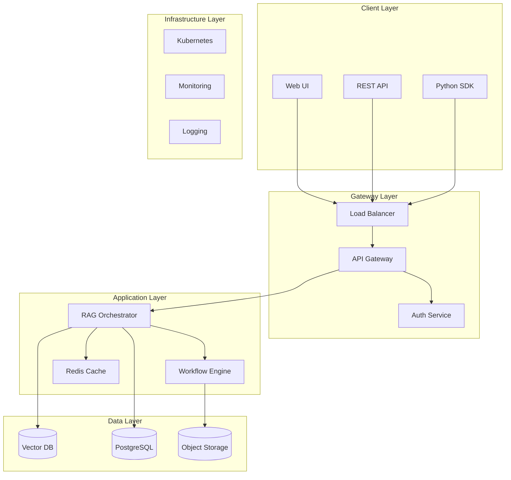
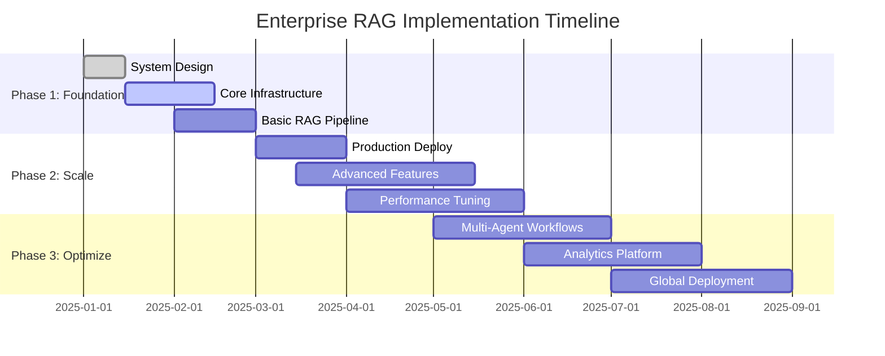

# Enterprise RAG Architecture Overview
## System Design Document v1.0

**Document ID**: `CH0-ARCH-001`
**Author**: Enterprise AI Team
**Reviewers**: Principal Engineers, Staff Engineers
**Status**: `RFC` → `APPROVED`
**Last Updated**: 2025-01-06

---

## 1. Executive Summary

### 1.1 Problem Statement
Modern enterprises require intelligent knowledge retrieval systems that can:
- Process petabytes of unstructured enterprise data
- Maintain sub-500ms p95 latency at scale
- Ensure data governance and access control compliance
- Provide explainable, citation-backed responses
- Scale to 10M+ queries per day with 99.9% availability

### 1.2 Solution Architecture
This document outlines the **Enterprise RAG Platform** - a production-grade, horizontally scalable system implementing the **Three-Phase Architecture**:

```
┌─────────────────┐    ┌─────────────────┐    ┌─────────────────┐
│ Data Governance │───▶│ Retrieval Eng   │───▶│ Generation Ctrl │
│                 │    │                 │    │                 │
│ • DocOps        │    │ • Hybrid Search │    │ • LLM Gateway   │
│ • Chunking      │    │ • Reranking     │    │ • Citation      │
│ • Metadata      │    │ • Caching       │    │ • Validation    │
│ • ACL           │    │ • Routing       │    │ • Monitoring    │
└─────────────────┘    └─────────────────┘    └─────────────────┘
```

### 1.3 Success Metrics (SLOs)
- **Latency**: p95 < 500ms, p99 < 1s
- **Availability**: 99.9% uptime (8.76 hours downtime/year)
- **Accuracy**: Faithfulness > 0.85, Relevance > 0.8
- **Throughput**: 10M queries/day peak capacity
- **Cost**: < $0.05 per query at scale

---

## 2. Technical Requirements

### 2.1 Functional Requirements
| Requirement ID | Priority | Description |
|---|---|---|
| **FR-001** | P0 | Support PDF, DOCX, PPTX, Confluence, SharePoint ingestion |
| **FR-002** | P0 | Implement role-based access control (RBAC) |
| **FR-003** | P0 | Provide source attribution for all responses |
| **FR-004** | P1 | Support incremental index updates |
| **FR-005** | P1 | Multi-language support (EN, ZH, JA, ES) |

### 2.2 Non-Functional Requirements
| Requirement ID | Category | Specification |
|---|---|---|
| **NFR-001** | Performance | p95 latency < 500ms end-to-end |
| **NFR-002** | Scalability | 100K concurrent users |
| **NFR-003** | Availability | 99.9% uptime SLA |
| **NFR-004** | Security | SOC2 Type II compliance |
| **NFR-005** | Compliance | GDPR, CCPA data protection |

---

## 3. Technology Stack

### 3.1 Core Infrastructure Stack

#### **Document Processing Layer**
```yaml
Primary:
  - docling==1.2.0          # IBM enterprise document parser
  - unstructured[all-docs]   # Fallback document processor

Supporting:
  - langchain-text-splitters # Semantic chunking
  - tiktoken                 # Token counting
  - presidio-analyzer        # PII detection
```

#### **Retrieval Engine Stack**
```yaml
Vector Database:
  - qdrant-client==1.6.0     # Primary vector store
  - pgvector                 # Backup/hybrid deployment

Search & Ranking:
  - sentence-transformers    # Embedding models
  - rank-bm25               # Sparse retrieval
  - transformers            # Reranking models
```

#### **Generation & Orchestration**
```yaml
RAG Framework:
  - haystack-ai==2.0.0      # Primary RAG orchestration
  - langgraph               # Advanced workflows

LLM Infrastructure:
  - vllm                    # Production LLM serving
  - ollama                  # Development environment
```

#### **Evaluation & Monitoring**
```yaml
Assessment:
  - ragas==0.1.0            # RAG evaluation metrics
  - opik                    # Enterprise observability
  - langfuse                # Open-source monitoring

Security:
  - casbin                  # Authorization engine
  - presidio-anonymizer     # Data protection
```

### 3.2 Model Specifications

#### **Embedding Models (Production)**
| Model | Use Case | Context Length | Performance |
|---|---|---|---|
| `BAAI/bge-large-zh-v1.5` | Chinese documents | 512 tokens | 64.4 NDCG@10 |
| `sentence-transformers/all-MiniLM-L6-v2` | English documents | 256 tokens | 59.76 NDCG@10 |
| `BAAI/bge-reranker-large` | Cross-encoder reranking | 512 tokens | 67.3 NDCG@10 |

#### **LLM Models (Inference)**
| Model | Use Case | Context | VRAM | Throughput |
|---|---|---|---|---|
| `qwen2.5:7b` | Development/Testing | 32K tokens | 8GB | 50 tok/s |
| `qwen2.5:14b` | Production (Quality) | 32K tokens | 16GB | 35 tok/s |
| `llama3.2:70b` | Critical Analysis | 128K tokens | 40GB | 15 tok/s |

---

## 4. System Architecture

### 4.1 High-Level Architecture



### 4.2 Data Flow Architecture

#### **Ingestion Pipeline**
```python
# Enterprise Document Processing Pipeline
Document → [Docling] → Chunks → [BGE-Embeddings] → [Qdrant] → [Index]
    ↓            ↓           ↓             ↓            ↓
[Metadata]  [PII Scan]  [ACL Tags]   [Quality Check] [Search Ready]
```

#### **Query Pipeline**
```python
# Production Query Processing Flow
Query → [Auth Check] → [Query Rewrite] → [Hybrid Search] → [Rerank] → [Generation] → [Citation] → Response
  ↓         ↓             ↓               ↓             ↓            ↓            ↓
[Rate Limit] [ACL Filter] [Cache Check] [BM25+Vector] [Cross-Enc] [LLM Call] [Source Attribution]
```

---

## 5. Deployment Strategy

### 5.1 Environment Specifications

#### **Development Environment**
```yaml
Compute:
  - 4 vCPU, 16GB RAM per service
  - Single GPU (RTX 4090, 24GB VRAM)

Storage:
  - 100GB SSD for indices
  - 1TB object storage

Models:
  - ollama + qwen2.5:7b
  - Local Qdrant instance
```

#### **Production Environment**
```yaml
Compute:
  - Auto-scaling: 2-50 instances
  - 8 vCPU, 32GB RAM per instance
  - GPU cluster: 4x A100 (80GB each)

Storage:
  - 10TB NVMe for hot indices
  - Unlimited object storage
  - Multi-region replication

Models:
  - vLLM cluster deployment
  - Qdrant cluster (3+ nodes)
```

### 5.2 Scalability Targets

| Component | Current Scale | Target Scale | Scaling Strategy |
|---|---|---|---|
| **Documents** | 1M docs | 100M docs | Horizontal partitioning |
| **Vectors** | 10M vectors | 1B vectors | Sharded Qdrant clusters |
| **QPS** | 1K QPS | 10K QPS | Auto-scaling pods |
| **Storage** | 1TB | 100TB | Distributed object storage |

---

## 6. Security & Compliance

### 6.1 Access Control Matrix

| Role | Document Access | Query Capability | Admin Functions |
|---|---|---|---|
| **End User** | Department-scoped | Read queries only | None |
| **Power User** | Cross-department | Advanced queries | Basic analytics |
| **Admin** | Global access | All operations | User management |
| **Super Admin** | Full system | System operations | Full control |

### 6.2 Data Protection

#### **At Rest**
- AES-256 encryption for all stored data
- Encrypted vector indices in Qdrant
- PII anonymization before indexing

#### **In Transit**
- TLS 1.3 for all API communications
- mTLS for inter-service communication
- VPN-only access to admin interfaces

#### **At Processing**
- Memory encryption during embedding generation
- Secure model serving with authentication
- Audit logging for all data access

---

## 7. Monitoring & Observability

### 7.1 Key Metrics Dashboard

#### **Business Metrics**
```yaml
User Engagement:
  - Daily Active Users (DAU)
  - Query Success Rate
  - Average Session Duration
  - User Satisfaction Score (CSAT)

Quality Metrics:
  - Faithfulness Score (target: >0.85)
  - Answer Relevance (target: >0.8)
  - Source Attribution Rate (target: >95%)
  - Hallucination Rate (target: <5%)
```

#### **Technical Metrics**
```yaml
Performance:
  - Query Latency (p50, p95, p99)
  - Throughput (QPS)
  - Cache Hit Rate
  - Error Rate

Infrastructure:
  - CPU/Memory Utilization
  - Storage IOPS
  - Network Bandwidth
  - GPU Utilization
```

### 7.2 Alerting Strategy

| Severity | Condition | Response Time | Escalation |
|---|---|---|---|
| **Critical** | p95 latency > 1s | 5 minutes | Page on-call |
| **High** | Error rate > 5% | 15 minutes | Slack alert |
| **Medium** | Cache hit < 80% | 1 hour | Ticket creation |
| **Low** | Storage > 80% | 4 hours | Weekly review |

---

## 8. Success Criteria & KPIs

### 8.1 Phase 1 Goals (Month 1-3)
- [ ] MVP deployment with basic RAG functionality
- [ ] Support for 3 document types (PDF, DOCX, Confluence)
- [ ] 1K QPS capacity
- [ ] Basic RBAC implementation

### 8.2 Phase 2 Goals (Month 4-6)
- [ ] Production deployment with full stack
- [ ] 10K QPS capacity
- [ ] Advanced workflow support (LangGraph)
- [ ] Comprehensive monitoring (Opik + RAGAS)

### 8.3 Phase 3 Goals (Month 7-12)
- [ ] Multi-region deployment
- [ ] 100K QPS capacity
- [ ] AI-powered optimization
- [ ] Advanced analytics and insights

---

## 9. Risk Assessment

### 9.1 Technical Risks

| Risk | Probability | Impact | Mitigation |
|---|---|---|---|
| **Model hallucination** | High | Medium | Citation validation, human review |
| **Latency degradation** | Medium | High | Caching, model optimization |
| **Vector index corruption** | Low | High | Multi-region backups |
| **API rate limiting** | Medium | Medium | Circuit breakers, graceful degradation |

### 9.2 Business Risks

| Risk | Probability | Impact | Mitigation |
|---|---|---|---|
| **Data privacy violation** | Low | Critical | PII detection, anonymization |
| **Intellectual property leak** | Low | High | Access control, audit trails |
| **Service unavailability** | Medium | High | Multi-AZ deployment, failover |
| **Cost overrun** | High | Medium | Budget alerts, auto-scaling limits |

---

## 10. Implementation Timeline



---

## Appendix A: Detailed Tech Stack Versions

### A.1 Production Dependencies
```toml
[tool.poetry.dependencies]
python = "^3.11"

# Document Processing
docling = "^1.2.0"
unstructured = {extras = ["all-docs"], version = "^0.11.0"}
langchain-text-splitters = "^0.0.1"

# Vector & Search
qdrant-client = "^1.6.0"
sentence-transformers = "^2.2.2"
rank-bm25 = "^0.2.2"

# RAG Framework
haystack-ai = "^2.0.0"
langgraph = "^0.0.40"

# LLM Serving
vllm = "^0.2.0"
transformers = "^4.35.0"

# Evaluation & Monitoring
ragas = "^0.1.0"
opik = "^0.1.0"
langfuse = "^2.0.0"

# Security & Compliance
casbin = "^1.17.0"
presidio-analyzer = "^2.2.33"
presidio-anonymizer = "^2.2.33"

# Infrastructure
redis = "^5.0.0"
psycopg2-binary = "^2.9.7"
kubernetes = "^27.2.0"
```

### A.2 Development Dependencies
```toml
[tool.poetry.group.dev.dependencies]
pytest = "^7.4.0"
pytest-asyncio = "^0.21.0"
black = "^23.7.0"
isort = "^5.12.0"
mypy = "^1.5.0"
pre-commit = "^3.3.0"
```

---

**Document Control**
- Version: 1.0
- Classification: Internal
- Next Review: 2025-04-06
- Distribution: Engineering, Product, Leadership