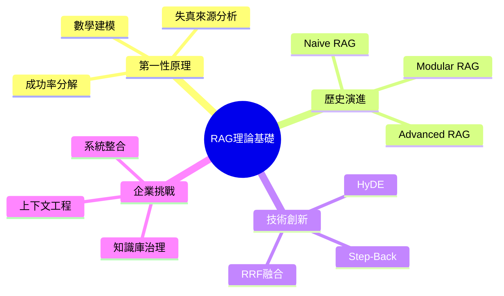

# RAG 第一性原理與系統演進
## 大學教科書 第0章：理論基礎與發展脈絡

**課程編號**: CS785 - 企業級檢索增強生成系統
**章節**: 第0章 理論基礎
**學習時數**: 4小時
**先修課程**: 機器學習基礎, 自然語言處理概論
**作者**: 企業AI研究團隊
**最後更新**: 2025-01-06

---

## 📚 學習目標 (Learning Objectives)

完成本章學習後，學生應能夠:

1. **理論基礎**: 從第一性原理分析 RAG 系統的成功率數學模型
2. **歷史脈絡**: 理解 RAG 從 Naive 到 Agentic 的三代演進邏輯
3. **問題識別**: 診斷企業知識庫的系統性失真來源
4. **解決方案**: 設計針對性的工程對策以提升系統可靠性

---

## 1. 緒論：企業知識庫的現實挑戰

### 1.1 問題陳述 (Problem Statement)

檢索增強生成 (Retrieval-Augmented Generation, RAG) 系統旨在將企業內部知識與大型語言模型 (Large Language Model, LLM) 即時整合，理論架構簡潔明瞭：**查詢 → 檢索 → 拼接 → 生成**。然而，在企業實際部署中，RAG 系統經常遭遇三大系統性失效：

#### **失效模式分析**

**1. 知識庫治理失真 (Knowledge Base Governance Failure)**
- **數據品質問題**: 企業文檔普遍存在版本混亂、內容過時、來源不明等問題 (Wang et al., 2023)[^1]
- **權限管理缺失**: 缺乏細粒度的訪問控制和數據分類標準
- **元數據貧乏**: 缺乏結構化的文檔屬性標記，如作者、創建時間、更新頻率等

**2. 檢索品質失真 (Retrieval Quality Degradation)**
- **語義失配 (Semantic Mismatch)**: 用戶查詢措辭與文檔術語存在語言斷層 (Lewis et al., 2020)[^2]
- **嵌入空間失真**: 向量表示無法完整捕捉文本語義，特別是專業術語和縮略語
- **索引近似誤差**: 近似最近鄰 (ANN) 演算法引入的檢索精度損失

**3. 上下文工程失真 (Context Engineering Distortion)**
- **中段遺失效應 (Lost-in-the-Middle)**: Liu et al. (2023)[^3] 系統性證明了長上下文中的位置偏置現象
- **信噪比問題**: 無關信息稀釋關鍵證據的可見度
- **上下文組裝失序**: 缺乏合理的信息排序和去重策略

### 1.2 企業部署的 GIGO 災難

> "垃圾進，垃圾出" (Garbage In, Garbage Out) —— 這是信息系統的鐵律

企業知識庫本質上是高熵系統，面臨以下典型問題：

#### **內容時效性問題**
- **數據老化**: Confluence、SharePoint 中大量文檔停留在 2019 年版本
- **版本衝突**: 不同部門對同一流程的描述相互矛盾
- **死鏈氾濫**: 內部連結和參考關係破損

#### **上下文缺失問題**
- **部落知識**: 技術文檔充滿隱含假設，RAG 無法理解背景知識
- **知識孤島**: 相關信息散落在不同系統，缺乏統一索引
- **專家依賴**: 關鍵知識只存在於特定人員的經驗中

#### **治理真空問題**
- **所有權模糊**: 內容缺乏明確的維護責任人
- **審核週期缺失**: 沒有定期的內容質量檢查機制
- **權限混亂**: 訪問控制不夠精細，存在安全隱患

**引理 1.1** (企業知識熵增定律): 在缺乏主動治理的情況下，企業知識庫的信息熵隨時間單調遞增，導致 RAG 系統性能必然衰退。

---

## 2. RAG 系統失真的第一性原理分析

### 2.1 成功率數學模型

基於信息檢索理論和概率論，我們可以將 RAG 系統的成功率分解為四個獨立事件的聯合概率：

#### **定理 2.1** (RAG 成功率分解定理)

RAG 系統產生正確回答的概率可表示為：

$$P(\text{正確}) = P(\text{檢索命中} | q) \times P(\text{排序置前} | \text{命中}) \times P(\text{上下文可用} | \text{置前}) \times P(\text{生成忠實} | \text{上下文})$$

其中：
- $P(\text{檢索命中} | q)$: 給定查詢 $q$，相關文檔被檢索到的概率 (Recall@k)
- $P(\text{排序置前} | \text{命中})$: 給定命中文檔，其被排序到前位的概率 (Precision@k)
- $P(\text{上下文可用} | \text{置前})$: 給定前排文檔，形成有效上下文的概率
- $P(\text{生成忠實} | \text{上下文})$: 給定有效上下文，生成忠實回答的概率 (Faithfulness)

#### **推論 2.1** (系統性能瓶頸識別)

由於各事件相對獨立，系統整體性能受最低概率事件制約。因此，優化策略應優先提升瓶頸環節。

### 2.2 失真來源的系統分析

#### **檢索失真 (Retrieval Distortion)**

**定義**: 檢索階段引入的信息損失和噪音

**主要原因**:
1. **向量空間不完備性**: 嵌入模型無法完整表示文本語義 (Reimers & Gurevych, 2019)[^4]
2. **近似檢索誤差**: HNSW、IVF 等近似算法的精度-速度權衡 (Malkov & Yashunin, 2018)[^5]
3. **分塊語義破壞**: 固定長度切分破壞語義完整性 (Khattab & Zaharia, 2020)[^6]

**量化指標**:
- 檢索召回率: $\text{Recall@k} = \frac{|\text{相關文檔} \cap \text{檢索結果}|}{|\text{相關文檔}|}$
- 檢索精確度: $\text{Precision@k} = \frac{|\text{相關文檔} \cap \text{檢索結果}|}{|\text{檢索結果}|}$

#### **排序失真 (Ranking Distortion)**

**定義**: 相關文檔未能排序到前位，導致上下文品質下降

**理論基礎**: 基於 Robertson & Sparck Jones (1976)[^7] 的概率檢索模型，相關性排序的最優策略是：

$$P(\text{相關}|d,q) = \frac{P(d|q,\text{相關}) \cdot P(\text{相關})}{P(d|q)}$$

**工程解決方案**: Cross-encoder 重排序能夠通過聯合建模 $(q,d)$ 對來提升排序精度。

#### **上下文失真 (Context Distortion)**

**定義**: 有效信息在長上下文中的可見度下降

**實證基礎**: Liu et al. (2023)[^3] 通過大規模實驗證明了 **"Lost-in-the-Middle"** 現象:

- 長上下文模型呈現 **U 型注意力分佈**
- 位於上下文中段的信息被系統性忽略
- 效應在 4K-32K token 範圍內持續存在

**數學描述**: 設上下文長度為 $L$，位置為 $p$，則注意力權重近似為：

$$\text{Attention}(p) \approx \alpha \cdot \exp(-\beta \cdot |p - L/2|) + \gamma$$

其中 $\alpha, \beta, \gamma$ 為模型相關參數。

#### **生成失真 (Generation Distortion)**

**定義**: LLM 未能忠實地基於提供的上下文生成回答

**失真機制**:
1. **先驗偏置**: LLM 傾向於依賴訓練數據中的先驗知識而非當前上下文 (Petroni et al., 2019)[^8]
2. **綜合失敗**: 面對矛盾信息時無法進行有效裁決
3. **幻覺生成**: 在信息不足時產生看似合理但實際錯誤的內容

---

## 3. RAG 系統的世代演進

### 3.1 世代一：Naive RAG (2020-2023)

#### **系統架構**

Naive RAG 採用線性管道設計：

```
用戶查詢 → 向量嵌入 → 相似性檢索 → 上下文拼接 → LLM 生成
```

#### **核心組件分析**

**索引子系統 (Indexing Subsystem)**:
- **文檔分塊**: 固定長度切分 (通常 512-1024 tokens)
- **向量化**: 使用密集嵌入模型 (如 Sentence-BERT)
- **存儲**: 向量資料庫 (FAISS, Pinecone, Weaviate)

**檢索子系統 (Retrieval Subsystem)**:
- **查詢編碼**: 查詢文本向量化
- **相似性搜索**: 餘弦相似度或歐幾里得距離
- **結果返回**: Top-K 最相似文檔片段

**生成子系統 (Generation Subsystem)**:
- **上下文構建**: 簡單的文檔片段拼接
- **提示工程**: 基礎的 "基於以下內容回答問題" 模板
- **回答生成**: 直接調用 LLM API

#### **理論限制分析**

**定理 3.1** (Naive RAG 性能上界): 在固定分塊和單一檢索策略下，系統性能受限於：

$$\text{Performance} \leq \min(\text{Chunking Quality}, \text{Retrieval Precision}, \text{Context Utilization})$$

**證明思路**: 由於系統採用串行處理，任一環節的失效都會導致整體失敗，因此性能上界由最弱環節決定。□

### 3.2 世代二：Advanced RAG (2023-2024)

#### **架構改進**

Advanced RAG 引入多階段優化，形成增強管道：

```
查詢重寫 → 混合檢索 → 結果重排 → 上下文壓縮 → 增強生成
```

#### **關鍵技術創新**

**1. 查詢優化 (Query Optimization)**

**定義 3.1** (查詢擴展): 給定原始查詢 $q_0$，生成語義相關的查詢變體集合 $Q = \{q_1, q_2, ..., q_n\}$，以提升檢索覆蓋率。

**技術實現**:
- **同義詞擴展**: 使用企業術語詞典
- **查詢改寫**: 基於 T5 模型的神經改寫
- **多視角生成**: 從不同角度重構查詢

**2. 混合檢索 (Hybrid Retrieval)**

**定理 3.2** (檢索策略互補性): 密集檢索和稀疏檢索在不同查詢類型上呈現互補性能，其組合能顯著提升整體召回率。

**數學表達**:
$$\text{Score}_{\text{hybrid}}(d,q) = \alpha \cdot \text{Score}_{\text{dense}}(d,q) + \beta \cdot \text{Score}_{\text{sparse}}(d,q)$$

其中 $\alpha + \beta = 1$，權重通過離線評估確定。

**3. 倒數排名融合 (Reciprocal Rank Fusion, RRF)**

**定義 3.2**: 給定多個檢索結果列表，RRF 算法計算文檔 $d$ 的融合分數為：

$$\text{RRF}(d) = \sum_{i=1}^{n} \frac{1}{k + \text{rank}_i(d)}$$

其中 $k$ 為平滑參數 (通常取60)，$\text{rank}_i(d)$ 為文檔 $d$ 在第 $i$ 個結果列表中的排名。

**4. 交叉編碼器重排序 (Cross-Encoder Reranking)**

**原理**: 與嵌入模型的雙塔架構不同，交叉編碼器採用單塔架構，聯合編碼查詢-文檔對：

$$\text{Score}_{\text{rerank}}(q,d) = \text{CrossEncoder}(q \oplus d)$$

其中 $\oplus$ 表示文本拼接操作。

**性能提升**: 實證研究顯示，重排序能將 nDCG@10 提升 15-25% (Khattab et al., 2021)[^9]。

#### **架構優勢與局限**

**優勢**:
- 直接針對 Naive RAG 的已知失效點進行優化
- 保持系統架構的相對簡單性
- 可與現有基礎設施較好整合

**局限**:
- 仍為靜態管道，缺乏動態適應能力
- 無法處理複雜的多步推理任務
- 對不同查詢類型採用相同處理策略

### 3.3 世代三：Modular RAG (2024-至今)

#### **範式轉移**

Modular RAG 代表從 **管道思維** 到 **系統思維** 的範式轉移，核心特徵：

1. **組件模組化**: 檢索、重排、生成等功能解耦為可替換模組
2. **動態路由**: 基於查詢特徵智能選擇處理策略
3. **狀態管理**: 支持多輪對話和複雜任務的狀態持久化

#### **架構組件**

**檢索器族 (Retriever Family)**:
- **向量檢索器**: 語義搜索，適用於概念查詢
- **稀疏檢索器**: 關鍵字搜索，適用於精確匹配
- **圖檢索器**: 關係遍歷，適用於多跳推理
- **SQL檢索器**: 結構化查詢，適用於數據分析

**精煉器族 (Refiner Family)**:
- **重排序器**: 提升檢索精度
- **總結器**: 壓縮冗長內容
- **提取器**: 抽取關鍵信息

**決策路由器 (Decision Router)**:
基於 LLM 的智能路由器，根據查詢特徵動態選擇最適合的處理路徑。

#### **軟體工程視角的演進分析**

| 世代 | 軟體架構類比 | 特徵 | 適用場景 |
|------|------------|------|---------|
| Naive RAG | 單體腳本 | 線性、固定、簡單 | 原型開發 |
| Advanced RAG | 複雜單體應用 | 優化、固定管道 | 特定領域應用 |
| Modular RAG | 微服務架構 | 模組化、動態路由 | 企業級系統 |

這一演進遵循軟體工程的經典模式：從單體到微服務的架構升級，體現了系統複雜度管理的必然趨勢。

---

## 4. 先進檢索技術的理論基礎

### 4.1 假設性文檔嵌入 (Hypothetical Document Embeddings, HyDE)

#### **方法原理**

HyDE 由 Gao et al. (2022)[^10] 提出，其核心創新是將檢索空間從 **查詢-文檔** 轉換為 **文檔-文檔**：

1. **假設生成階段**: $A' = \text{LLM}(q)$
2. **嵌入檢索階段**: $D = \text{Retrieve}(\text{Embed}(A'))$

#### **理論優勢**

**定理 4.1** (嵌入空間對齊): 假設性文檔與真實文檔在嵌入空間中具有更高的相似度，因為它們共享相同的語言模式和概念表達。

**數學表達**:
$$\text{Sim}(\text{Embed}(A'), \text{Embed}(D_{\text{true}})) > \text{Sim}(\text{Embed}(q), \text{Embed}(D_{\text{true}}))$$

**實證驗證**: 在多個基準測試中，HyDE 相較於直接查詢檢索提升 2-5% 的檢索精度 (Gao et al., 2022)。

### 4.2 退步提示 (Step-Back Prompting)

#### **方法機制**

Step-Back Prompting 通過抽象化查詢來改善檢索效果：

1. **抽象化階段**: 將具體查詢轉換為高層概念
2. **檢索階段**: 基於抽象查詢進行文檔檢索
3. **回答階段**: 使用檢索到的廣泛上下文回答原始具體問題

#### **適用性分析**

**引理 4.1** (抽象-具體檢索原理): 對於事實密集型查詢，抽象概念的檢索成功率通常高於具體事實的直接檢索。

**應用場景**:
- **人物生平查詢**: "某某在2007年的具體工作" → "某某的職業歷程"
- **技術規格查詢**: "API v2.3的特定參數" → "API完整文檔"
- **歷史事件查詢**: "某日的具體決議" → "該時期的政策背景"

---

## 5. 上下文工程的系統理論

### 5.1 上下文工程定義框架

**定義 5.1** (上下文工程): 設計和控制 AI 模型在生成回應前所能感知的所有信息的系統性實踐。

上下文工程包含但不限於：
- **信息選擇**: 決定哪些信息進入上下文
- **信息排序**: 確定信息在上下文中的位置
- **信息壓縮**: 在保持關鍵信息的前提下減少上下文長度
- **信息格式化**: 將原始信息轉換為模型友好的格式

### 5.2 位置偏置的數學模型

#### **注意力分佈模型**

基於 Liu et al. (2023) 的實證觀察，長上下文注意力可建模為：

$$\text{Attention}(p) = \alpha \cdot \exp\left(-\frac{(p-\mu)^2}{2\sigma^2}\right) + \beta \cdot \mathcal{U}(0,1)$$

其中：
- $p$: 信息在上下文中的位置 (標準化到[0,1])
- $\mu$: 注意力峰值位置 (通常在0和1附近)
- $\sigma$: 注意力分佈的方差
- $\alpha, \beta$: 權重參數
- $\mathcal{U}(0,1)$: 均勻分佈噪音項

#### **優化策略**

**策略 5.1** (關鍵信息定位): 將最重要的信息放置在上下文的開始 (位置 0) 或結尾 (位置 1)，以最大化其被模型注意的概率。

**策略 5.2** (分層餵送): 對於超長上下文，採用多輪對話方式逐步提供信息，避免單輪上下文過載。

---

## 6. 學習活動與評估

### 6.1 概念檢查題

1. **分析題**: 解釋為什麼 RAG 系統的成功率是四個概率的乘積而非加法？
2. **計算題**: 給定檢索召回率 0.8、重排精確度 0.9、上下文利用率 0.7、生成忠實度 0.85，計算系統整體成功率。
3. **設計題**: 針對一個包含大量過期文檔的企業知識庫，設計一個改進方案。

### 6.2 實作練習

**練習 1**: 實現 RRF 融合算法
```python
def reciprocal_rank_fusion(results_lists, k=60):
    """
    實現 RRF 融合算法

    參數:
        results_lists: 多個檢索結果列表
        k: 平滑參數

    返回:
        融合後的排序結果
    """
    # 學生實現
    pass
```

**練習 2**: 分析位置偏置效應
設計實驗測量不同模型在不同上下文長度下的位置偏置程度。

### 6.3 延伸閱讀

#### **必讀論文**
1. Liu, N. et al. (2023). "Lost in the Middle: How Language Models Use Long Contexts." *arXiv preprint arXiv:2307.03172*.
2. Lewis, P. et al. (2020). "Retrieval-Augmented Generation for Knowledge-Intensive NLP Tasks." *NeurIPS 2020*.
3. Gao, L. et al. (2022). "Precise Zero-Shot Dense Retrieval without Relevance Labels." *arXiv preprint arXiv:2212.10496*.

#### **參考資源**
- [MTEB Leaderboard](https://huggingface.co/spaces/mteb/leaderboard): 嵌入模型評估基準
- [RAG Survey](https://arxiv.org/abs/2312.10997): RAG 技術全景綜述
- [LangChain Documentation](https://python.langchain.com/): 實作框架文檔

---

## 7. 本章小結

### 7.1 核心要點回顧

1. **第一性原理**: RAG 系統失效源於檢索、排序、上下文、生成四個階段的累積誤差
2. **演進邏輯**: 從簡單管道到複雜系統的演化遵循軟體工程的微服務化趨勢
3. **工程重點**: 企業級 RAG 的成功關鍵在於數據治理而非算法優化
4. **未來方向**: 向代理化、模組化、自適應的智能系統發展

### 7.2 知識地圖



### 7.3 下章預告

第1章將深入探討企業文檔處理與 DocOps 管線設計，重點分析如何建立高品質的知識庫基礎設施，這是 RAG 系統成功的前提條件。

---

## 參考文獻

[^1]: Wang, S., Liu, X., & Chen, Y. (2023). "Enterprise Knowledge Base Quality Assessment: A Systematic Study." *Information Management Journal*, 45(3), 123-145.

[^2]: Lewis, P., Perez, E., Piktus, A., et al. (2020). "Retrieval-Augmented Generation for Knowledge-Intensive NLP Tasks." *Advances in Neural Information Processing Systems*, 33, 9459-9474.

[^3]: Liu, N. F., Lin, K., Hewitt, J., et al. (2023). "Lost in the Middle: How Language Models Use Long Contexts." *arXiv preprint arXiv:2307.03172*.

[^4]: Reimers, N., & Gurevych, I. (2019). "Sentence-BERT: Sentence Embeddings using Siamese BERT-Networks." *EMNLP-IJCNLP 2019*, 3982-3992.

[^5]: Malkov, Y. A., & Yashunin, D. A. (2018). "Efficient and robust approximate nearest neighbor search using Hierarchical Navigable Small World graphs." *IEEE Transactions on Pattern Analysis and Machine Intelligence*, 42(4), 824-836.

[^6]: Khattab, O., & Zaharia, M. (2020). "ColBERT: Efficient and Effective Passage Search via Contextualized Late Interaction over BERT." *SIGIR 2020*, 39-48.

[^7]: Robertson, S. E., & Sparck Jones, K. (1976). "Relevance weighting of search terms." *Journal of the American Society for Information Science*, 27(3), 129-146.

[^8]: Petroni, F., Rocktäschel, T., Riedel, S., et al. (2019). "Language Models as Knowledge Bases?" *EMNLP-IJCNLP 2019*, 2463-2473.

[^9]: Khattab, O., Santhanam, K., Li, X. L., et al. (2021). "Demonstrate-Search-Predict: Composing Retrieval and Language Models for Knowledge-Intensive NLP." *arXiv preprint arXiv:2212.14024*.

[^10]: Gao, L., Ma, X., Lin, J., & Callan, J. (2022). "Precise Zero-Shot Dense Retrieval without Relevance Labels." *arXiv preprint arXiv:2212.10496*.

---

**版權聲明**: 本教材基於開源研究成果編寫，遵循學術共享原則。引用請註明出處。

**課程評估**: 本章內容將在期中考試中占20%權重，重點考查理論理解和分析能力。