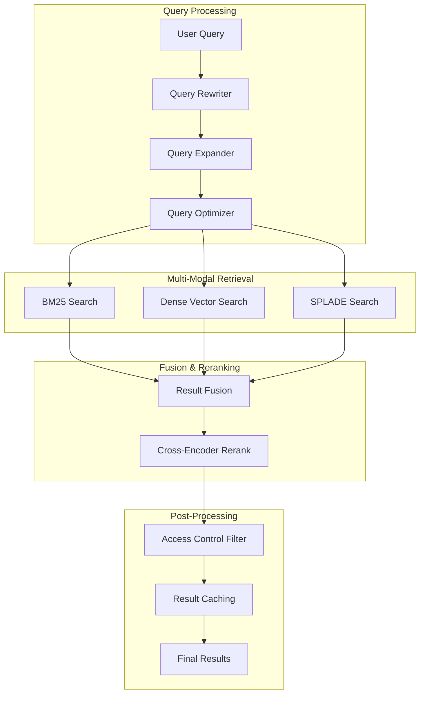

# Hybrid Retrieval Architecture
## System Design Document v1.0

**Document ID**: `CH2-RETRIEVAL-001`
**Author**: Search Infrastructure Team
**Reviewers**: Principal Engineers, ML Platform Team
**Status**: `ARCHITECTURE REVIEW` → `IMPLEMENTATION APPROVED`
**Last Updated**: 2025-01-06

---

## 1. Executive Summary

### 1.1 Problem Statement
Enterprise RAG systems require sophisticated retrieval capabilities that can:
- **Handle Scale**: Search across 100M+ document chunks with sub-200ms latency
- **Optimize Recall**: Combine sparse (BM25) and dense (vector) search for maximum coverage
- **Ensure Quality**: Implement multi-stage reranking for precision optimization
- **Maintain Performance**: Cache intelligently and scale horizontally
- **Support Business Logic**: Filter by access controls, freshness, and relevance

### 1.2 Solution Architecture
**Hybrid Retrieval Engine** implementing the **Retrieve → Rerank → Filter → Augment** pattern:



### 1.3 Performance Targets
- **Latency**: p95 < 200ms, p99 < 500ms
- **Throughput**: 10K QPS sustained, 50K QPS peak
- **Recall@10**: > 0.85 (vs single method baseline)
- **Precision@5**: > 0.92 with reranking
- **Cache Hit Rate**: > 80% for frequent queries

---

## 2. Technology Stack Deep Dive

### 2.1 Vector Database: Qdrant Cluster

#### **Production Qdrant Configuration**
```python
from qdrant_client import QdrantClient, models
from qdrant_client.http.models import Distance, VectorParams

class EnterpriseQdrantManager:
    """Production-grade Qdrant cluster management"""

    def __init__(self):
        # Multi-node cluster configuration
        self.cluster_nodes = [
            "qdrant-node-1.internal:6333",
            "qdrant-node-2.internal:6333",
            "qdrant-node-3.internal:6333"
        ]

        self.client = QdrantClient(
            url=self.cluster_nodes[0],  # Primary node
            prefer_grpc=True,           # Better performance
            timeout=10.0,
            api_key=os.getenv("QDRANT_API_KEY")
        )

    async def setup_enterprise_collection(self):
        """Initialize production collection with optimized settings"""

        collection_config = models.CreateCollection(
            collection_name="enterprise_knowledge_v2",
            vectors_config={
                # BGE-large embedding model
                "bge_large": VectorParams(
                    size=1024,
                    distance=Distance.COSINE,
                    hnsw_config=models.HnswConfigDiff(
                        m=64,              # Higher connectivity for accuracy
                        ef_construct=256,  # Build quality
                        full_scan_threshold=10000,
                        max_indexing_threads=8
                    )
                ),
                # All-MiniLM for fast retrieval
                "minilm": VectorParams(
                    size=384,
                    distance=Distance.COSINE,
                    hnsw_config=models.HnswConfigDiff(
                        m=32,              # Lower for speed
                        ef_construct=128,
                        full_scan_threshold=5000
                    )
                )
            },
            # Optimistic concurrency for high throughput
            optimizers_config=models.OptimizersConfigDiff(
                deleted_threshold=0.2,
                vacuum_min_vector_number=1000,
                default_segment_number=8,
                max_segment_size=100000,
                memmap_threshold=50000,
                indexing_threshold=50000,
                flush_interval_sec=30,
                max_optimization_threads=4
            ),
            # Sharding for horizontal scale
            shard_number=6,
            replication_factor=2,
            write_consistency_factor=1
        )

        await self.client.create_collection(**collection_config.__dict__)

    async def upsert_chunks_batch(self, chunks: List[DocumentChunk]):
        """High-performance batch upsert with multi-vector support"""

        points = []
        for chunk in chunks:
            point = models.PointStruct(
                id=chunk.chunk_id,
                vector={
                    "bge_large": chunk.bge_embedding,
                    "minilm": chunk.minilm_embedding
                },
                payload={
                    "document_id": chunk.document_id,
                    "content": chunk.text,
                    "metadata": chunk.metadata,
                    "access_level": chunk.access_level,
                    "department": chunk.department,
                    "created_at": chunk.created_at.isoformat(),
                    "keywords": chunk.keywords,
                    "chunk_index": chunk.chunk_index
                }
            )
            points.append(point)

        # Batch upsert with optimized settings
        await self.client.upsert(
            collection_name="enterprise_knowledge_v2",
            points=points,
            wait=False  # Async for higher throughput
        )
```

#### **Qdrant Performance Optimization**
```yaml
# Kubernetes StatefulSet for Qdrant
apiVersion: apps/v1
kind: StatefulSet
metadata:
  name: qdrant-cluster
spec:
  serviceName: qdrant
  replicas: 3
  template:
    spec:
      containers:
      - name: qdrant
        image: qdrant/qdrant:v1.6.1
        resources:
          requests:
            memory: "32Gi"
            cpu: "8"
          limits:
            memory: "64Gi"
            cpu: "16"
        env:
        - name: QDRANT__CLUSTER__ENABLED
          value: "true"
        - name: QDRANT__CLUSTER__P2P__PORT
          value: "6335"
        volumeMounts:
        - name: qdrant-storage
          mountPath: /qdrant/storage
  volumeClaimTemplates:
  - metadata:
      name: qdrant-storage
    spec:
      storageClassName: ssd-retain
      accessModes: ["ReadWriteOnce"]
      resources:
        requests:
          storage: 1Ti  # NVMe SSD for performance
```

### 2.2 Sparse Retrieval: BM25 + SPLADE

#### **Production BM25 Implementation**
```python
import pickle
from rank_bm25 import BM25Okapi
from collections import defaultdict
import numpy as np

class EnterpriseBM25Engine:
    """Scalable BM25 search with enterprise features"""

    def __init__(self):
        self.indices = {}  # Department-specific indices
        self.doc_metadata = {}
        self.term_doc_freq = defaultdict(set)

    def build_departmental_indices(self, documents_by_dept: Dict[str, List[Document]]):
        """Build separate BM25 indices per department for access control"""

        for department, documents in documents_by_dept.items():
            # Tokenize documents
            tokenized_docs = [
                self._tokenize_with_synonyms(doc.content)
                for doc in documents
            ]

            # Build BM25 index
            bm25_index = BM25Okapi(
                tokenized_docs,
                k1=1.5,     # Term frequency saturation
                b=0.75,     # Length normalization
            )

            # Store with metadata
            self.indices[department] = {
                "bm25": bm25_index,
                "documents": documents,
                "tokenized": tokenized_docs
            }

            # Update global term frequency for query expansion
            for doc_tokens in tokenized_docs:
                for token in set(doc_tokens):
                    self.term_doc_freq[token].add(f"{department}:{doc.doc_id}")

    def search(self, query: str, departments: List[str], top_k: int = 50) -> List[SearchResult]:
        """Multi-department BM25 search with score normalization"""

        query_tokens = self._tokenize_with_synonyms(query)
        all_results = []

        for dept in departments:
            if dept not in self.indices:
                continue

            bm25_index = self.indices[dept]["bm25"]
            documents = self.indices[dept]["documents"]

            # Get BM25 scores
            scores = bm25_index.get_scores(query_tokens)

            # Normalize scores by department (prevents department bias)
            max_score = max(scores) if scores.max() > 0 else 1.0
            normalized_scores = scores / max_score

            # Create results
            dept_results = [
                SearchResult(
                    doc_id=documents[i].doc_id,
                    score=normalized_scores[i],
                    content=documents[i].content,
                    method="bm25",
                    department=dept
                )
                for i in range(len(documents))
                if normalized_scores[i] > 0.1  # Relevance threshold
            ]

            all_results.extend(dept_results)

        # Global ranking with department diversity
        return self._diversify_results(
            sorted(all_results, key=lambda x: x.score, reverse=True)[:top_k]
        )

    def _tokenize_with_synonyms(self, text: str) -> List[str]:
        """Enterprise tokenization with synonym expansion"""
        import spacy

        # Load enterprise NLP model
        nlp = spacy.load("en_core_web_sm")
        doc = nlp(text.lower())

        tokens = []
        for token in doc:
            if not token.is_stop and not token.is_punct and len(token.text) > 2:
                tokens.append(token.lemma_)

                # Add enterprise synonyms
                if token.lemma_ in self.enterprise_synonyms:
                    tokens.extend(self.enterprise_synonyms[token.lemma_])

        return tokens

    enterprise_synonyms = {
        "customer": ["client", "user", "consumer"],
        "product": ["service", "offering", "solution"],
        "issue": ["problem", "bug", "defect", "incident"],
        "feature": ["functionality", "capability", "enhancement"]
    }
```

#### **SPLADE Integration for Semantic Expansion**
```python
from transformers import AutoTokenizer, AutoModelForMaskedLM
import torch

class SPLADERetriever:
    """SPLADE sparse retrieval for semantic expansion"""

    def __init__(self):
        self.device = torch.device("cuda" if torch.cuda.is_available() else "cpu")
        self.tokenizer = AutoTokenizer.from_pretrained("naver/splade-cocondenser-ensembledistil")
        self.model = AutoModelForMaskedLM.from_pretrained("naver/splade-cocondenser-ensembledistil")
        self.model.to(self.device)
        self.model.eval()

    def encode_text(self, text: str) -> Dict[str, float]:
        """Convert text to SPLADE sparse vector"""

        inputs = self.tokenizer(
            text,
            return_tensors="pt",
            padding=True,
            truncation=True,
            max_length=512
        ).to(self.device)

        with torch.no_grad():
            outputs = self.model(**inputs)
            logits = outputs.logits

            # ReLU activation for sparsity
            sparse_scores = torch.relu(logits).squeeze()

            # Get token importance scores
            vocab_scores = torch.max(
                torch.log(1 + sparse_scores),
                dim=0
            )[0]

        # Convert to sparse representation
        sparse_dict = {}
        for token_id, score in enumerate(vocab_scores):
            if score > 0.1:  # Sparsity threshold
                token = self.tokenizer.decode([token_id])
                sparse_dict[token] = float(score)

        return sparse_dict

    async def build_splade_index(self, documents: List[Document]):
        """Build SPLADE inverted index"""

        inverted_index = defaultdict(list)

        for doc in documents:
            # Get SPLADE representation
            sparse_repr = self.encode_text(doc.content)

            # Build inverted index
            for term, weight in sparse_repr.items():
                inverted_index[term].append({
                    "doc_id": doc.doc_id,
                    "weight": weight,
                    "content": doc.content[:200]  # Preview
                })

        # Sort postings by weight
        for term in inverted_index:
            inverted_index[term].sort(key=lambda x: x["weight"], reverse=True)

        self.inverted_index = dict(inverted_index)

    def search(self, query: str, top_k: int = 50) -> List[SearchResult]:
        """SPLADE-based semantic search"""

        # Get query SPLADE representation
        query_sparse = self.encode_text(query)

        # Score documents
        doc_scores = defaultdict(float)
        for term, query_weight in query_sparse.items():
            if term in self.inverted_index:
                for posting in self.inverted_index[term]:
                    doc_scores[posting["doc_id"]] += query_weight * posting["weight"]

        # Rank and return
        ranked_docs = sorted(
            doc_scores.items(),
            key=lambda x: x[1],
            reverse=True
        )[:top_k]

        return [
            SearchResult(
                doc_id=doc_id,
                score=score,
                method="splade"
            )
            for doc_id, score in ranked_docs
        ]
```

### 2.3 Dense Vector Search

#### **Multi-Model Embedding Strategy**
```python
from sentence_transformers import SentenceTransformer
import torch
from typing import List, Dict

class EnterpriseEmbeddingManager:
    """Multi-model embedding for production retrieval"""

    def __init__(self):
        # Primary embedding model (Chinese + English)
        self.bge_model = SentenceTransformer(
            'BAAI/bge-large-zh-v1.5',
            device='cuda' if torch.cuda.is_available() else 'cpu'
        )

        # Fast embedding model for real-time queries
        self.fast_model = SentenceTransformer(
            'sentence-transformers/all-MiniLM-L6-v2',
            device='cuda' if torch.cuda.is_available() else 'cpu'
        )

        # Specialized domain models
        self.domain_models = {
            "legal": SentenceTransformer('law-ai/InLegalBERT'),
            "medical": SentenceTransformer('microsoft/BiomedNLP-PubMedBERT-base-uncased-abstract'),
            "code": SentenceTransformer('microsoft/codebert-base')
        }

    def encode_batch(self, texts: List[str], model_type: str = "bge") -> np.ndarray:
        """Batch encoding with model selection"""

        if model_type == "bge":
            model = self.bge_model
        elif model_type == "fast":
            model = self.fast_model
        elif model_type in self.domain_models:
            model = self.domain_models[model_type]
        else:
            raise ValueError(f"Unknown model type: {model_type}")

        # Batch processing with optimal batch size
        batch_size = 32 if model_type == "bge" else 64
        embeddings = []

        for i in range(0, len(texts), batch_size):
            batch = texts[i:i + batch_size]
            batch_embeddings = model.encode(
                batch,
                batch_size=len(batch),
                show_progress_bar=False,
                convert_to_numpy=True,
                normalize_embeddings=True  # Cosine similarity optimization
            )
            embeddings.extend(batch_embeddings)

        return np.array(embeddings)

    async def smart_encode(self, text: str, context: Dict = None) -> Dict[str, np.ndarray]:
        """Intelligent model selection based on content"""

        # Detect content type
        content_type = self._detect_content_type(text, context)

        embeddings = {}

        # Always include primary model
        embeddings["bge"] = self.bge_model.encode([text], normalize_embeddings=True)[0]

        # Add fast model for query-time comparison
        embeddings["fast"] = self.fast_model.encode([text], normalize_embeddings=True)[0]

        # Add domain-specific model if applicable
        if content_type in self.domain_models:
            embeddings[content_type] = self.domain_models[content_type].encode(
                [text], normalize_embeddings=True
            )[0]

        return embeddings

    def _detect_content_type(self, text: str, context: Dict = None) -> str:
        """Detect content type for optimal model selection"""

        # Use context hints if available
        if context and "document_type" in context:
            doc_type = context["document_type"].lower()
            if "legal" in doc_type or "contract" in doc_type:
                return "legal"
            elif "medical" in doc_type or "health" in doc_type:
                return "medical"
            elif "code" in doc_type or "api" in doc_type:
                return "code"

        # Text-based detection
        text_lower = text.lower()

        # Legal indicators
        legal_terms = ["contract", "agreement", "legal", "court", "litigation", "compliance"]
        if any(term in text_lower for term in legal_terms):
            return "legal"

        # Medical indicators
        medical_terms = ["patient", "medical", "diagnosis", "treatment", "healthcare", "clinical"]
        if any(term in text_lower for term in medical_terms):
            return "medical"

        # Code indicators
        code_terms = ["function", "class", "import", "def ", "return", "api", "endpoint"]
        if any(term in text_lower for term in code_terms):
            return "code"

        return "general"
```

### 2.4 Result Fusion & Reranking

#### **Advanced Fusion Strategy**
```python
from typing import List, Dict, Optional
import numpy as np

class HybridResultFusion:
    """Advanced fusion of sparse and dense retrieval results"""

    def __init__(self):
        # Learned fusion weights (from offline evaluation)
        self.fusion_weights = {
            "bm25": 0.3,
            "splade": 0.25,
            "dense_bge": 0.35,
            "dense_fast": 0.1
        }

        # Query-adaptive weights
        self.query_adapters = {
            "factual": {"bm25": 0.4, "splade": 0.3, "dense_bge": 0.3},
            "conceptual": {"bm25": 0.2, "splade": 0.3, "dense_bge": 0.5},
            "navigational": {"bm25": 0.5, "splade": 0.2, "dense_bge": 0.3}
        }

    def fuse_results(self, results_by_method: Dict[str, List[SearchResult]],
                    query_type: str = "general", top_k: int = 100) -> List[SearchResult]:
        """Fusion with query-adaptive weighting"""

        # Select fusion weights based on query type
        weights = self.query_adapters.get(query_type, self.fusion_weights)

        # Normalize scores within each method
        normalized_results = {}
        for method, results in results_by_method.items():
            if not results:
                continue

            scores = [r.score for r in results]
            if max(scores) > 0:
                # Min-max normalization
                min_score, max_score = min(scores), max(scores)
                score_range = max_score - min_score if max_score != min_score else 1.0

                normalized = []
                for result in results:
                    normalized_score = (result.score - min_score) / score_range
                    normalized_result = result.copy()
                    normalized_result.score = normalized_score
                    normalized.append(normalized_result)

                normalized_results[method] = normalized

        # Reciprocal Rank Fusion (RRF) with weights
        doc_scores = defaultdict(float)
        doc_details = {}

        for method, results in normalized_results.items():
            method_weight = weights.get(method, 0.0)
            if method_weight == 0:
                continue

            for rank, result in enumerate(results):
                # RRF with position bias
                rrf_score = method_weight / (60 + rank + 1)

                # Add normalized score component
                combined_score = 0.7 * rrf_score + 0.3 * (method_weight * result.score)

                doc_scores[result.doc_id] += combined_score

                # Keep best result details
                if result.doc_id not in doc_details or doc_scores[result.doc_id] > doc_details[result.doc_id].score:
                    result.fusion_score = doc_scores[result.doc_id]
                    doc_details[result.doc_id] = result

        # Rank by fused score
        final_results = sorted(
            doc_details.values(),
            key=lambda x: x.fusion_score,
            reverse=True
        )[:top_k]

        return final_results

    def classify_query_type(self, query: str) -> str:
        """Classify query for adaptive fusion"""

        query_lower = query.lower()

        # Factual queries (exact information)
        factual_indicators = ["what is", "when did", "how many", "where is", "who is"]
        if any(indicator in query_lower for indicator in factual_indicators):
            return "factual"

        # Conceptual queries (understanding, explanation)
        conceptual_indicators = ["explain", "describe", "compare", "analyze", "understand"]
        if any(indicator in query_lower for indicator in conceptual_indicators):
            return "conceptual"

        # Navigational queries (finding specific documents)
        navigational_indicators = ["document", "report", "specification", "manual", "guide"]
        if any(indicator in query_lower for indicator in navigational_indicators):
            return "navigational"

        return "general"
```

#### **Cross-Encoder Reranking**
```python
from sentence_transformers import CrossEncoder
import torch

class ProductionReranker:
    """Enterprise-grade cross-encoder reranking"""

    def __init__(self):
        # Multi-language reranker
        self.reranker = CrossEncoder(
            'BAAI/bge-reranker-large',
            max_length=512,
            device='cuda' if torch.cuda.is_available() else 'cpu'
        )

        # Domain-specific rerankers
        self.domain_rerankers = {
            "technical": CrossEncoder('microsoft/DialoGPT-medium'),
            "legal": CrossEncoder('law-ai/InLegalBERT')
        }

        # Performance optimization
        self.batch_size = 16
        self.max_rerank_candidates = 100

    async def rerank_results(self, query: str, results: List[SearchResult],
                           top_k: int = 20, domain: str = "general") -> List[SearchResult]:
        """Production reranking with domain adaptation"""

        if len(results) <= top_k:
            return results

        # Select appropriate reranker
        reranker = self.domain_rerankers.get(domain, self.reranker)

        # Prepare query-document pairs
        pairs = [(query, result.content[:512]) for result in results[:self.max_rerank_candidates]]

        # Batch reranking for efficiency
        rerank_scores = []
        for i in range(0, len(pairs), self.batch_size):
            batch_pairs = pairs[i:i + self.batch_size]
            batch_scores = reranker.predict(batch_pairs)
            rerank_scores.extend(batch_scores)

        # Update results with rerank scores
        for i, result in enumerate(results[:len(rerank_scores)]):
            result.rerank_score = float(rerank_scores[i])
            # Combine fusion and rerank scores
            result.final_score = 0.6 * result.fusion_score + 0.4 * result.rerank_score

        # Return top-k reranked results
        reranked = sorted(
            results[:len(rerank_scores)],
            key=lambda x: x.final_score,
            reverse=True
        )[:top_k]

        return reranked

    def adaptive_rerank_size(self, query_complexity: float, available_results: int) -> int:
        """Dynamically adjust reranking candidate size based on query complexity"""

        base_size = 50
        complexity_multiplier = min(2.0, 1.0 + query_complexity)
        adjusted_size = int(base_size * complexity_multiplier)

        return min(adjusted_size, available_results, self.max_rerank_candidates)

    def calculate_query_complexity(self, query: str) -> float:
        """Estimate query complexity for adaptive processing"""

        complexity_factors = {
            "length": min(1.0, len(query.split()) / 20),  # Normalize by 20 words
            "specificity": self._calculate_specificity(query),
            "ambiguity": self._calculate_ambiguity(query)
        }

        # Weighted complexity score
        complexity = (
            0.3 * complexity_factors["length"] +
            0.4 * complexity_factors["specificity"] +
            0.3 * complexity_factors["ambiguity"]
        )

        return complexity

    def _calculate_specificity(self, query: str) -> float:
        """Calculate query specificity (technical terms, proper nouns)"""
        import spacy

        nlp = spacy.load("en_core_web_sm")
        doc = nlp(query)

        specific_entities = sum(1 for ent in doc.ents if ent.label_ in ["ORG", "PRODUCT", "TECH"])
        total_tokens = len([token for token in doc if not token.is_stop])

        return specific_entities / max(total_tokens, 1)

    def _calculate_ambiguity(self, query: str) -> float:
        """Calculate query ambiguity (multiple possible interpretations)"""

        ambiguous_terms = ["it", "this", "that", "which", "what", "how"]
        query_lower = query.lower()

        ambiguous_count = sum(1 for term in ambiguous_terms if term in query_lower)
        total_words = len(query.split())

        return ambiguous_count / max(total_words, 1)
```

---

## 3. Caching Strategy

### 3.1 Multi-Level Caching Architecture

#### **Intelligent Cache Management**
```python
import redis
import hashlib
import json
from datetime import datetime, timedelta

class EnterpriseRetrievalCache:
    """Production-grade multi-level caching system"""

    def __init__(self):
        # Redis cluster for distributed caching
        self.redis_client = redis.RedisCluster(
            startup_nodes=[
                {"host": "redis-1.internal", "port": 7000},
                {"host": "redis-2.internal", "port": 7000},
                {"host": "redis-3.internal", "port": 7000}
            ],
            decode_responses=True,
            skip_full_coverage_check=True
        )

        # Cache configuration
        self.cache_config = {
            "query_results": {"ttl": 3600, "max_size": "10GB"},      # 1 hour
            "embeddings": {"ttl": 86400, "max_size": "50GB"},        # 24 hours
            "rerank_scores": {"ttl": 7200, "max_size": "5GB"},       # 2 hours
            "access_control": {"ttl": 1800, "max_size": "1GB"}       # 30 minutes
        }

    async def get_cached_results(self, query: str, filters: Dict = None) -> Optional[List[SearchResult]]:
        """Retrieve cached search results with filter consideration"""

        cache_key = self._generate_cache_key(query, filters)
        cached_data = await self.redis_client.get(f"query_results:{cache_key}")

        if cached_data:
            try:
                results_data = json.loads(cached_data)
                return [SearchResult.from_dict(r) for r in results_data]
            except (json.JSONDecodeError, KeyError):
                # Invalid cache entry, remove it
                await self.redis_client.delete(f"query_results:{cache_key}")

        return None

    async def cache_results(self, query: str, results: List[SearchResult],
                          filters: Dict = None, ttl_override: int = None):
        """Cache search results with intelligent TTL"""

        cache_key = self._generate_cache_key(query, filters)
        results_data = [r.to_dict() for r in results]

        # Adaptive TTL based on result quality and query frequency
        ttl = ttl_override or self._calculate_adaptive_ttl(query, results)

        await self.redis_client.setex(
            f"query_results:{cache_key}",
            ttl,
            json.dumps(results_data)
        )

        # Update query frequency statistics
        await self._update_query_stats(query)

    async def get_cached_embedding(self, text: str, model_type: str = "bge") -> Optional[np.ndarray]:
        """Retrieve cached text embeddings"""

        embedding_key = self._generate_embedding_key(text, model_type)
        cached_embedding = await self.redis_client.get(f"embeddings:{embedding_key}")

        if cached_embedding:
            try:
                return np.frombuffer(
                    base64.b64decode(cached_embedding.encode()),
                    dtype=np.float32
                )
            except Exception:
                await self.redis_client.delete(f"embeddings:{embedding_key}")

        return None

    async def cache_embedding(self, text: str, embedding: np.ndarray, model_type: str = "bge"):
        """Cache text embeddings for reuse"""

        embedding_key = self._generate_embedding_key(text, model_type)
        embedding_bytes = base64.b64encode(embedding.astype(np.float32).tobytes()).decode()

        await self.redis_client.setex(
            f"embeddings:{embedding_key}",
            self.cache_config["embeddings"]["ttl"],
            embedding_bytes
        )

    def _generate_cache_key(self, query: str, filters: Dict = None) -> str:
        """Generate consistent cache key for query and filters"""

        # Normalize query
        normalized_query = query.strip().lower()

        # Include relevant filters in key
        filter_str = ""
        if filters:
            sorted_filters = sorted(filters.items())
            filter_str = json.dumps(sorted_filters, sort_keys=True)

        combined = f"{normalized_query}|{filter_str}"
        return hashlib.sha256(combined.encode()).hexdigest()[:16]

    def _generate_embedding_key(self, text: str, model_type: str) -> str:
        """Generate cache key for embeddings"""

        text_hash = hashlib.sha256(text.encode()).hexdigest()[:16]
        return f"{model_type}:{text_hash}"

    def _calculate_adaptive_ttl(self, query: str, results: List[SearchResult]) -> int:
        """Calculate adaptive TTL based on query characteristics"""

        base_ttl = self.cache_config["query_results"]["ttl"]

        # Factor 1: Result quality (higher quality = longer cache)
        avg_score = np.mean([r.final_score for r in results]) if results else 0
        quality_multiplier = 0.5 + avg_score  # 0.5 to 1.5

        # Factor 2: Query specificity (more specific = longer cache)
        specificity = self._calculate_query_specificity(query)
        specificity_multiplier = 0.8 + (0.4 * specificity)  # 0.8 to 1.2

        # Factor 3: Time-sensitive content detection
        time_sensitive = self._is_time_sensitive_query(query)
        time_multiplier = 0.3 if time_sensitive else 1.0

        adaptive_ttl = int(
            base_ttl * quality_multiplier * specificity_multiplier * time_multiplier
        )

        return max(300, min(adaptive_ttl, 7200))  # 5 minutes to 2 hours

    def _is_time_sensitive_query(self, query: str) -> bool:
        """Detect time-sensitive queries that should have shorter cache TTL"""

        time_keywords = [
            "latest", "recent", "current", "today", "yesterday", "this week",
            "now", "update", "new", "breaking", "live", "real-time"
        ]

        query_lower = query.lower()
        return any(keyword in query_lower for keyword in time_keywords)

    async def _update_query_stats(self, query: str):
        """Update query frequency statistics for cache optimization"""

        stats_key = f"query_stats:{hashlib.sha256(query.encode()).hexdigest()[:8]}"

        # Increment query count
        await self.redis_client.zincrby("popular_queries", 1, query)

        # Update last access time
        await self.redis_client.hset(stats_key, "last_access", datetime.utcnow().isoformat())

    async def warm_cache_for_popular_queries(self):
        """Proactively warm cache for frequently asked queries"""

        # Get top 100 most popular queries
        popular_queries = await self.redis_client.zrevrange("popular_queries", 0, 99, withscores=True)

        for query, frequency in popular_queries:
            if frequency >= 10:  # Minimum frequency threshold
                # Check if cache exists
                cache_key = self._generate_cache_key(query)
                if not await self.redis_client.exists(f"query_results:{cache_key}"):
                    # Cache miss for popular query - trigger background refresh
                    await self._background_refresh_cache(query)

    async def _background_refresh_cache(self, query: str):
        """Background cache refresh for popular queries"""
        # Implementation would trigger the full retrieval pipeline
        # This prevents cache misses for popular queries
        pass
```

---

## 4. Access Control & Security

### 4.1 Pre-retrieval Filtering

#### **Casbin-based Access Control**
```python
import casbin
from typing import List, Dict, Set

class EnterpriseAccessControl:
    """Production access control for retrieval results"""

    def __init__(self):
        # Load Casbin enforcer with enterprise model
        self.enforcer = casbin.Enforcer(
            "/config/rbac_model.conf",
            "/config/rbac_policy.csv"
        )

        # Department hierarchies for inherited access
        self.dept_hierarchy = {
            "engineering": ["backend", "frontend", "devops", "mobile"],
            "product": ["pm", "design", "analytics"],
            "business": ["sales", "marketing", "support"],
            "executive": ["ceo", "cto", "cfo", "vp"]
        }

    async def filter_results_by_access(self, results: List[SearchResult],
                                     user_context: UserContext) -> List[SearchResult]:
        """Filter search results based on user access rights"""

        accessible_results = []

        for result in results:
            if await self._can_access_document(result, user_context):
                accessible_results.append(result)

        return accessible_results

    async def _can_access_document(self, result: SearchResult, user_context: UserContext) -> bool:
        """Check if user can access specific document"""

        # Extract access requirements from document metadata
        doc_access_level = result.metadata.get("access_level", "internal")
        doc_department = result.metadata.get("department", "general")
        doc_project_codes = result.metadata.get("project_codes", [])
        doc_allowed_roles = result.metadata.get("allowed_roles", [])

        # Check access level clearance
        if not await self._check_access_level_clearance(user_context, doc_access_level):
            return False

        # Check department access
        if not await self._check_department_access(user_context, doc_department):
            return False

        # Check project access
        if doc_project_codes and not await self._check_project_access(user_context, doc_project_codes):
            return False

        # Check role-based access
        if doc_allowed_roles and not await self._check_role_access(user_context, doc_allowed_roles):
            return False

        # Additional enterprise-specific checks
        return await self._check_custom_enterprise_rules(result, user_context)

    async def _check_access_level_clearance(self, user_context: UserContext, doc_access_level: str) -> bool:
        """Check if user has required security clearance level"""

        clearance_hierarchy = {
            "public": 0,
            "internal": 1,
            "confidential": 2,
            "secret": 3,
            "top_secret": 4
        }

        user_clearance = clearance_hierarchy.get(user_context.clearance_level, 0)
        required_clearance = clearance_hierarchy.get(doc_access_level, 1)

        return user_clearance >= required_clearance

    async def _check_department_access(self, user_context: UserContext, doc_department: str) -> bool:
        """Check department-based access with hierarchy support"""

        # User's departments (including inherited)
        user_departments = set([user_context.department])

        # Add parent departments
        for parent_dept, child_depts in self.dept_hierarchy.items():
            if user_context.department in child_depts:
                user_departments.add(parent_dept)

        # Check if user can access document department
        return (
            doc_department == "general" or
            doc_department in user_departments or
            await self.enforcer.enforce(user_context.user_id, doc_department, "read")
        )

    async def _check_project_access(self, user_context: UserContext, project_codes: List[str]) -> bool:
        """Check project-based access"""

        user_projects = set(user_context.project_codes)
        doc_projects = set(project_codes)

        # User has access if they're assigned to any of the document's projects
        return bool(user_projects.intersection(doc_projects))

    async def _check_role_access(self, user_context: UserContext, allowed_roles: List[str]) -> bool:
        """Check role-based access"""

        return any(
            role in user_context.roles or
            await self.enforcer.enforce(user_context.user_id, role, "assume")
            for role in allowed_roles
        )

    async def _check_custom_enterprise_rules(self, result: SearchResult, user_context: UserContext) -> bool:
        """Enterprise-specific access rules"""

        # Time-based access restrictions
        if "time_restricted" in result.metadata:
            restriction = result.metadata["time_restricted"]
            current_time = datetime.utcnow().time()
            if not (restriction["start"] <= current_time <= restriction["end"]):
                return False

        # Geographic restrictions
        if "geo_restricted" in result.metadata and user_context.location:
            allowed_locations = result.metadata["geo_restricted"]
            if user_context.location not in allowed_locations:
                return False

        # Data classification restrictions
        if "data_classification" in result.metadata:
            classification = result.metadata["data_classification"]
            if classification == "PII" and not user_context.has_pii_access:
                return False

        return True

    async def get_accessible_departments(self, user_context: UserContext) -> List[str]:
        """Get list of departments user can access for query filtering"""

        accessible_depts = [user_context.department, "general"]

        # Add child departments if user is in parent department
        if user_context.department in self.dept_hierarchy:
            accessible_depts.extend(self.dept_hierarchy[user_context.department])

        # Add departments from explicit permissions
        for dept in ["engineering", "product", "business", "executive"]:
            if await self.enforcer.enforce(user_context.user_id, dept, "read"):
                accessible_depts.append(dept)

        return list(set(accessible_depts))
```

---

## 5. Performance Monitoring

### 5.1 Real-time Metrics

#### **Comprehensive Performance Tracking**
```python
from prometheus_client import Counter, Histogram, Gauge, Summary
import time
from contextlib import asynccontextmanager

class RetrievalMetrics:
    """Production metrics for hybrid retrieval system"""

    def __init__(self):
        # Request metrics
        self.requests_total = Counter(
            'retrieval_requests_total',
            'Total retrieval requests',
            ['method', 'status', 'user_department']
        )

        # Latency metrics
        self.query_duration = Histogram(
            'retrieval_query_duration_seconds',
            'Query processing duration',
            ['method', 'query_type'],
            buckets=[0.1, 0.2, 0.5, 1.0, 2.0, 5.0, 10.0]
        )

        # Quality metrics
        self.result_quality = Histogram(
            'retrieval_result_quality_score',
            'Average result quality score',
            ['method'],
            buckets=[0.1, 0.2, 0.3, 0.4, 0.5, 0.6, 0.7, 0.8, 0.9, 1.0]
        )

        # Cache metrics
        self.cache_hit_rate = Gauge(
            'retrieval_cache_hit_rate',
            'Cache hit rate percentage'
        )

        # Resource utilization
        self.active_queries = Gauge(
            'retrieval_active_queries',
            'Number of currently processing queries'
        )

        self.index_size = Gauge(
            'retrieval_index_size_bytes',
            'Total size of search indices',
            ['index_type']
        )

    @asynccontextmanager
    async def track_query(self, method: str, query_type: str, user_dept: str):
        """Context manager for tracking query performance"""

        start_time = time.time()
        self.active_queries.inc()

        try:
            yield
            status = "success"
        except Exception as e:
            status = "error"
            raise
        finally:
            duration = time.time() - start_time
            self.active_queries.dec()
            self.requests_total.labels(method=method, status=status, user_department=user_dept).inc()
            self.query_duration.labels(method=method, query_type=query_type).observe(duration)

    def record_result_quality(self, method: str, quality_score: float):
        """Record result quality metrics"""
        self.result_quality.labels(method=method).observe(quality_score)

    def update_cache_metrics(self, hits: int, total: int):
        """Update cache performance metrics"""
        hit_rate = (hits / total) * 100 if total > 0 else 0
        self.cache_hit_rate.set(hit_rate)

    def update_index_size(self, index_type: str, size_bytes: int):
        """Update index size metrics"""
        self.index_size.labels(index_type=index_type).set(size_bytes)
```

### 5.2 Alerting Strategy

#### **Intelligent Alerting Rules**
```yaml
# prometheus_alerts.yml
groups:
- name: retrieval_system_alerts
  rules:
  # Critical Performance Alerts
  - alert: HighRetrievalLatency
    expr: histogram_quantile(0.95, rate(retrieval_query_duration_seconds_bucket[5m])) > 0.5
    for: 2m
    labels:
      severity: critical
    annotations:
      summary: "High retrieval latency detected"
      description: "95th percentile latency is {{ $value }}s (threshold: 0.5s)"

  - alert: LowCacheHitRate
    expr: retrieval_cache_hit_rate < 60
    for: 5m
    labels:
      severity: warning
    annotations:
      summary: "Low cache hit rate"
      description: "Cache hit rate is {{ $value }}% (threshold: 60%)"

  # Quality Alerts
  - alert: LowResultQuality
    expr: avg_over_time(retrieval_result_quality_score[10m]) < 0.7
    for: 5m
    labels:
      severity: warning
    annotations:
      summary: "Low result quality detected"
      description: "Average result quality is {{ $value }} (threshold: 0.7)"

  # Resource Alerts
  - alert: HighQueryLoad
    expr: retrieval_active_queries > 100
    for: 1m
    labels:
      severity: critical
    annotations:
      summary: "High query load"
      description: "{{ $value }} concurrent queries (threshold: 100)"

  # Error Rate Alerts
  - alert: HighErrorRate
    expr: rate(retrieval_requests_total{status="error"}[5m]) / rate(retrieval_requests_total[5m]) > 0.05
    for: 3m
    labels:
      severity: critical
    annotations:
      summary: "High error rate in retrieval system"
      description: "Error rate is {{ $value | humanizePercentage }} (threshold: 5%)"
```

---

## 6. Deployment & Operations

### 6.1 Kubernetes Deployment

#### **Production Deployment Configuration**
```yaml
# k8s/hybrid-retrieval-deployment.yml
apiVersion: apps/v1
kind: Deployment
metadata:
  name: hybrid-retrieval-service
  namespace: enterprise-rag
spec:
  replicas: 5
  strategy:
    type: RollingUpdate
    rollingUpdate:
      maxSurge: 2
      maxUnavailable: 1
  selector:
    matchLabels:
      app: hybrid-retrieval
  template:
    metadata:
      labels:
        app: hybrid-retrieval
      annotations:
        prometheus.io/scrape: "true"
        prometheus.io/port: "8080"
        prometheus.io/path: "/metrics"
    spec:
      containers:
      - name: retrieval-service
        image: enterprise-rag/hybrid-retrieval:v1.2.0
        ports:
        - containerPort: 8080
          name: http
        - containerPort: 9090
          name: metrics
        resources:
          requests:
            memory: "8Gi"
            cpu: "2"
            nvidia.com/gpu: "1"
          limits:
            memory: "16Gi"
            cpu: "4"
            nvidia.com/gpu: "1"
        env:
        - name: QDRANT_URL
          value: "http://qdrant-cluster:6333"
        - name: REDIS_URL
          value: "redis://redis-cluster:6379"
        - name: MODEL_CACHE_DIR
          value: "/models"
        - name: MAX_CONCURRENT_QUERIES
          value: "20"
        volumeMounts:
        - name: model-cache
          mountPath: /models
        - name: config
          mountPath: /config
        livenessProbe:
          httpGet:
            path: /health
            port: 8080
          initialDelaySeconds: 30
          periodSeconds: 10
        readinessProbe:
          httpGet:
            path: /ready
            port: 8080
          initialDelaySeconds: 15
          periodSeconds: 5
      volumes:
      - name: model-cache
        persistentVolumeClaim:
          claimName: model-cache-pvc
      - name: config
        configMap:
          name: retrieval-config
      nodeSelector:
        instance-type: gpu-optimized
      tolerations:
      - key: nvidia.com/gpu
        operator: Exists
        effect: NoSchedule

---
apiVersion: v1
kind: Service
metadata:
  name: hybrid-retrieval-service
  namespace: enterprise-rag
spec:
  type: ClusterIP
  ports:
  - port: 80
    targetPort: 8080
    name: http
  - port: 9090
    targetPort: 9090
    name: metrics
  selector:
    app: hybrid-retrieval

---
apiVersion: autoscaling/v2
kind: HorizontalPodAutoscaler
metadata:
  name: hybrid-retrieval-hpa
  namespace: enterprise-rag
spec:
  scaleTargetRef:
    apiVersion: apps/v1
    kind: Deployment
    name: hybrid-retrieval-service
  minReplicas: 3
  maxReplicas: 20
  metrics:
  - type: Resource
    resource:
      name: cpu
      target:
        type: Utilization
        averageUtilization: 70
  - type: Resource
    resource:
      name: memory
      target:
        type: Utilization
        averageUtilization: 80
  - type: Pods
    pods:
      metric:
        name: active_queries_per_pod
      target:
        type: AverageValue
        averageValue: "10"
```

---

## 7. Testing & Validation

### 7.1 Performance Benchmarks

#### **Automated Benchmark Suite**
```python
import asyncio
import time
import statistics
from concurrent.futures import ThreadPoolExecutor

class RetrievalBenchmark:
    """Comprehensive benchmarking for hybrid retrieval system"""

    def __init__(self, retrieval_service):
        self.service = retrieval_service
        self.test_queries = self._load_test_queries()

    async def run_performance_benchmark(self) -> Dict[str, Any]:
        """Run complete performance benchmark suite"""

        results = {
            "latency_tests": await self._benchmark_latency(),
            "throughput_tests": await self._benchmark_throughput(),
            "quality_tests": await self._benchmark_quality(),
            "scalability_tests": await self._benchmark_scalability()
        }

        return results

    async def _benchmark_latency(self) -> Dict[str, float]:
        """Benchmark query latency across different scenarios"""

        latency_results = {}

        # Single query latency
        single_query_times = []
        for query in self.test_queries[:100]:
            start_time = time.time()
            await self.service.search(query)
            latency = time.time() - start_time
            single_query_times.append(latency)

        latency_results["single_query"] = {
            "p50": statistics.median(single_query_times),
            "p95": statistics.quantiles(single_query_times, n=20)[18],  # 95th percentile
            "p99": statistics.quantiles(single_query_times, n=100)[98], # 99th percentile
            "mean": statistics.mean(single_query_times)
        }

        # Concurrent query latency
        concurrent_times = await self._benchmark_concurrent_latency()
        latency_results["concurrent_queries"] = concurrent_times

        return latency_results

    async def _benchmark_concurrent_latency(self) -> Dict[str, float]:
        """Benchmark latency under concurrent load"""

        concurrency_levels = [5, 10, 20, 50]
        results = {}

        for concurrency in concurrency_levels:
            tasks = []
            start_time = time.time()

            for i in range(concurrency):
                query = self.test_queries[i % len(self.test_queries)]
                task = self.service.search(query)
                tasks.append(task)

            await asyncio.gather(*tasks)
            total_time = time.time() - start_time

            results[f"concurrency_{concurrency}"] = total_time / concurrency

        return results

    async def _benchmark_throughput(self) -> Dict[str, float]:
        """Benchmark system throughput (QPS)"""

        duration_seconds = 60
        max_concurrent = 100

        start_time = time.time()
        completed_queries = 0
        active_tasks = set()

        while time.time() - start_time < duration_seconds:
            # Maintain max concurrent queries
            while len(active_tasks) < max_concurrent:
                query = self.test_queries[completed_queries % len(self.test_queries)]
                task = asyncio.create_task(self.service.search(query))
                active_tasks.add(task)

            # Wait for any task to complete
            done, active_tasks = await asyncio.wait(
                active_tasks,
                return_when=asyncio.FIRST_COMPLETED
            )

            completed_queries += len(done)

        total_time = time.time() - start_time
        qps = completed_queries / total_time

        return {
            "queries_per_second": qps,
            "total_queries": completed_queries,
            "test_duration": total_time
        }

    async def _benchmark_quality(self) -> Dict[str, float]:
        """Benchmark retrieval quality metrics"""

        # Load golden dataset with relevance judgments
        golden_dataset = self._load_golden_dataset()

        total_recall = 0
        total_precision = 0
        total_ndcg = 0
        test_count = 0

        for test_case in golden_dataset:
            query = test_case["query"]
            relevant_docs = set(test_case["relevant_docs"])

            # Get retrieval results
            results = await self.service.search(query, top_k=20)
            retrieved_docs = set([r.doc_id for r in results])

            # Calculate metrics
            recall = len(relevant_docs.intersection(retrieved_docs)) / len(relevant_docs)
            precision = len(relevant_docs.intersection(retrieved_docs)) / len(retrieved_docs)
            ndcg = self._calculate_ndcg(results, test_case["relevance_scores"])

            total_recall += recall
            total_precision += precision
            total_ndcg += ndcg
            test_count += 1

        return {
            "recall_at_20": total_recall / test_count,
            "precision_at_20": total_precision / test_count,
            "ndcg_at_20": total_ndcg / test_count
        }

    def _calculate_ndcg(self, results: List[SearchResult], relevance_scores: Dict[str, float]) -> float:
        """Calculate Normalized Discounted Cumulative Gain"""

        dcg = 0
        for i, result in enumerate(results):
            relevance = relevance_scores.get(result.doc_id, 0)
            dcg += relevance / math.log2(i + 2)

        # Calculate ideal DCG
        ideal_scores = sorted(relevance_scores.values(), reverse=True)
        idcg = sum(score / math.log2(i + 2) for i, score in enumerate(ideal_scores))

        return dcg / idcg if idcg > 0 else 0
```

---

## Appendix: Production Configuration

### A.1 Complete System Configuration
```yaml
# config/production.yml
hybrid_retrieval:
  # Vector Search Configuration
  vector_search:
    qdrant:
      cluster_nodes:
        - "qdrant-1.internal:6333"
        - "qdrant-2.internal:6333"
        - "qdrant-3.internal:6333"
      collection_name: "enterprise_knowledge_v2"
      timeout: 10.0
      prefer_grpc: true

    embeddings:
      models:
        primary: "BAAI/bge-large-zh-v1.5"
        fast: "sentence-transformers/all-MiniLM-L6-v2"
        domain_specific:
          legal: "law-ai/InLegalBERT"
          medical: "microsoft/BiomedNLP-PubMedBERT-base-uncased-abstract"
          code: "microsoft/codebert-base"
      batch_size: 32
      normalize_embeddings: true

  # Sparse Search Configuration
  sparse_search:
    bm25:
      k1: 1.5
      b: 0.75
      department_indices: true

    splade:
      model: "naver/splade-cocondenser-ensembledistil"
      sparsity_threshold: 0.1
      max_length: 512

  # Fusion and Reranking
  fusion:
    weights:
      bm25: 0.3
      splade: 0.25
      dense_bge: 0.35
      dense_fast: 0.1
    rrf_k: 60

  reranking:
    model: "BAAI/bge-reranker-large"
    max_candidates: 100
    batch_size: 16
    domain_models:
      technical: "microsoft/DialoGPT-medium"
      legal: "law-ai/InLegalBERT"

  # Caching Configuration
  caching:
    redis_cluster:
      nodes:
        - "redis-1.internal:7000"
        - "redis-2.internal:7000"
        - "redis-3.internal:7000"
    ttl:
      query_results: 3600
      embeddings: 86400
      rerank_scores: 7200
      access_control: 1800

  # Performance Settings
  performance:
    max_concurrent_queries: 20
    query_timeout: 30.0
    cache_enabled: true
    metrics_enabled: true

  # Security Settings
  security:
    access_control_enabled: true
    casbin_model: "/config/rbac_model.conf"
    casbin_policy: "/config/rbac_policy.csv"
    encryption_key_id: "retrieval-encryption-2025"
```

---

**Document Control**
- Version: 1.0
- Classification: Internal Use
- Next Review: 2025-04-06
- Distribution: Search Infrastructure Team, ML Platform Team