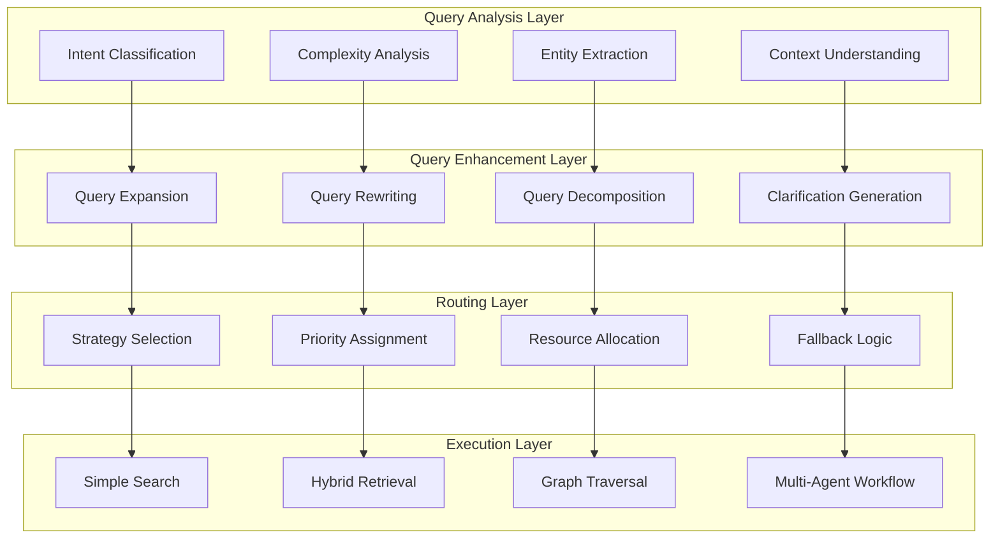

# Query Optimization and Routing
## System Design Document v1.0

**Document ID**: `CH3-QUERY-001`
**Author**: Search Engineering Team
**Reviewers**: Principal Engineers, AI Research Team
**Status**: `TECHNICAL REVIEW` → `IMPLEMENTATION APPROVED`
**Last Updated**: 2025-01-06

---

## 1. Executive Summary

### 1.1 Problem Statement
Enterprise RAG systems require intelligent query processing to:
- **Optimize Retrieval Quality**: Transform user queries for maximum relevance and recall
- **Route Intelligently**: Direct queries to appropriate retrieval strategies based on intent and complexity
- **Handle Ambiguity**: Resolve unclear queries through context and clarification
- **Scale Efficiently**: Process 10K+ concurrent queries with sub-200ms latency
- **Learn Continuously**: Adapt query understanding based on user feedback and success patterns

### 1.2 Solution Architecture
**Intelligent Query Processing Engine** implementing **Understand → Expand → Route → Execute** pattern:



### 1.3 Performance Targets
- **Query Understanding**: Intent classification accuracy > 92%
- **Response Quality**: User satisfaction improvement > 25%
- **Processing Speed**: Query analysis < 50ms, total pipeline < 500ms
- **Resource Efficiency**: 80% reduction in unnecessary complex routing

---

## 2. Query Understanding & Classification

### 2.1 Intent Classification System

#### **Production Intent Classifier**
```python
from transformers import AutoTokenizer, AutoModelForSequenceClassification
import torch
from typing import Dict, List, Optional
import numpy as np

class EnterpriseIntentClassifier:
    """Production-grade query intent classification"""

    def __init__(self):
        # Load fine-tuned intent classification model
        self.tokenizer = AutoTokenizer.from_pretrained("microsoft/DialoGPT-medium")
        self.model = AutoModelForSequenceClassification.from_pretrained(
            "models/enterprise-intent-classifier-v2.1",  # Custom trained model
            num_labels=len(self.intent_labels)
        )

        self.device = torch.device("cuda" if torch.cuda.is_available() else "cpu")
        self.model.to(self.device)
        self.model.eval()

        # Enterprise-specific intent categories
        self.intent_labels = {
            0: "factual_lookup",      # "What is X?", "When did Y happen?"
            1: "procedural_guide",    # "How to do X?", "Steps for Y"
            2: "analytical_query",    # "Compare X and Y", "Analyze Z"
            3: "navigational_search", # "Find document about X"
            4: "troubleshooting",     # "X is broken", "Error with Y"
            5: "policy_compliance",   # "Is X allowed?", "What's the rule for Y?"
            6: "research_synthesis",  # "Tell me about X field", "Latest trends in Y"
            7: "contextual_followup", # "More details", "What about Z?"
            8: "ambiguous_unclear"    # Requires clarification
        }

        # Intent-specific routing strategies
        self.routing_strategies = {
            "factual_lookup": "direct_retrieval",
            "procedural_guide": "structured_search",
            "analytical_query": "multi_source_synthesis",
            "navigational_search": "metadata_search",
            "troubleshooting": "solution_oriented",
            "policy_compliance": "authoritative_sources",
            "research_synthesis": "comprehensive_analysis",
            "contextual_followup": "context_aware_search",
            "ambiguous_unclear": "clarification_flow"
        }

    async def classify_query_intent(self, query: str, context: Optional[Dict] = None) -> Dict:
        """Classify query intent with confidence scoring"""

        # Preprocess query
        processed_query = self._preprocess_query(query, context)

        # Tokenize
        inputs = self.tokenizer(
            processed_query,
            return_tensors="pt",
            truncation=True,
            padding=True,
            max_length=512
        ).to(self.device)

        # Predict
        with torch.no_grad():
            outputs = self.model(**inputs)
            logits = outputs.logits
            probabilities = torch.softmax(logits, dim=-1)

        # Get top predictions
        top_probs, top_indices = torch.topk(probabilities, k=3)

        predictions = []
        for prob, idx in zip(top_probs[0], top_indices[0]):
            intent_label = self.intent_labels[idx.item()]
            predictions.append({
                "intent": intent_label,
                "confidence": prob.item(),
                "routing_strategy": self.routing_strategies[intent_label]
            })

        # Additional context-based adjustments
        primary_prediction = predictions[0]
        adjusted_prediction = await self._apply_contextual_adjustments(
            primary_prediction, query, context
        )

        return {
            "primary_intent": adjusted_prediction,
            "alternative_intents": predictions[1:],
            "confidence_threshold_met": adjusted_prediction["confidence"] > 0.7,
            "requires_clarification": adjusted_prediction["intent"] == "ambiguous_unclear"
        }

    def _preprocess_query(self, query: str, context: Optional[Dict] = None) -> str:
        """Preprocess query with context integration"""

        processed = query.strip().lower()

        # Add context if available
        if context:
            # Previous conversation context
            if "conversation_history" in context:
                recent_queries = context["conversation_history"][-3:]  # Last 3 queries
                context_text = " ".join([q["query"] for q in recent_queries])
                processed = f"Context: {context_text} Current: {processed}"

            # User role context
            if "user_role" in context:
                processed = f"User role: {context['user_role']} Query: {processed}"

            # Department context
            if "department" in context:
                processed = f"Department: {context['department']} Query: {processed}"

        return processed

    async def _apply_contextual_adjustments(self, prediction: Dict, query: str,
                                          context: Optional[Dict] = None) -> Dict:
        """Apply business logic adjustments to predictions"""

        adjusted = prediction.copy()

        # Confidence adjustments based on query characteristics
        if len(query.split()) < 3:
            adjusted["confidence"] *= 0.8  # Short queries are less reliable

        # Domain-specific adjustments
        if context and "department" in context:
            dept = context["department"]

            # Legal department bias towards compliance queries
            if dept == "legal" and "policy" in query.lower():
                if prediction["intent"] != "policy_compliance":
                    adjusted["intent"] = "policy_compliance"
                    adjusted["confidence"] = min(0.9, adjusted["confidence"] + 0.2)

            # Engineering department bias towards troubleshooting
            elif dept == "engineering" and any(word in query.lower()
                                             for word in ["error", "bug", "issue", "problem"]):
                if prediction["intent"] != "troubleshooting":
                    adjusted["intent"] = "troubleshooting"
                    adjusted["confidence"] = min(0.9, adjusted["confidence"] + 0.15)

        # Time-sensitive query detection
        time_indicators = ["latest", "recent", "current", "new", "today"]
        if any(indicator in query.lower() for indicator in time_indicators):
            adjusted["time_sensitive"] = True
            adjusted["freshness_weight"] = 0.8
        else:
            adjusted["time_sensitive"] = False
            adjusted["freshness_weight"] = 0.2

        return adjusted
```

### 2.2 Query Complexity Analysis

#### **Multi-Dimensional Complexity Scoring**
```python
import spacy
import re
from dataclasses import dataclass
from typing import Tuple

@dataclass
class QueryComplexityMetrics:
    """Query complexity analysis results"""
    overall_score: float          # 0.0 to 1.0
    linguistic_complexity: float  # Grammar, syntax complexity
    semantic_complexity: float    # Concept difficulty
    structural_complexity: float  # Multi-part, conditional queries
    domain_complexity: float      # Technical depth required
    reasoning_complexity: float   # Logical reasoning required

class QueryComplexityAnalyzer:
    """Analyze query complexity for routing decisions"""

    def __init__(self):
        # Load spaCy model for linguistic analysis
        self.nlp = spacy.load("en_core_web_lg")

        # Domain complexity indicators
        self.technical_terms = self._load_technical_terminology()
        self.reasoning_indicators = [
            "because", "therefore", "however", "although", "whereas",
            "compare", "contrast", "analyze", "evaluate", "synthesize"
        ]

        # Complexity weights
        self.complexity_weights = {
            "linguistic": 0.15,
            "semantic": 0.25,
            "structural": 0.20,
            "domain": 0.25,
            "reasoning": 0.15
        }

    def analyze_complexity(self, query: str) -> QueryComplexityMetrics:
        """Comprehensive query complexity analysis"""

        doc = self.nlp(query)

        # Linguistic complexity
        linguistic_score = self._calculate_linguistic_complexity(doc)

        # Semantic complexity
        semantic_score = self._calculate_semantic_complexity(doc)

        # Structural complexity
        structural_score = self._calculate_structural_complexity(query, doc)

        # Domain complexity
        domain_score = self._calculate_domain_complexity(doc)

        # Reasoning complexity
        reasoning_score = self._calculate_reasoning_complexity(query, doc)

        # Overall weighted score
        overall_score = (
            self.complexity_weights["linguistic"] * linguistic_score +
            self.complexity_weights["semantic"] * semantic_score +
            self.complexity_weights["structural"] * structural_score +
            self.complexity_weights["domain"] * domain_score +
            self.complexity_weights["reasoning"] * reasoning_score
        )

        return QueryComplexityMetrics(
            overall_score=overall_score,
            linguistic_complexity=linguistic_score,
            semantic_complexity=semantic_score,
            structural_complexity=structural_score,
            domain_complexity=domain_score,
            reasoning_complexity=reasoning_score
        )

    def _calculate_linguistic_complexity(self, doc) -> float:
        """Calculate linguistic complexity based on grammar and syntax"""

        factors = []

        # Sentence length (normalized)
        sentence_length = len([token for token in doc if not token.is_space])
        length_score = min(1.0, sentence_length / 30.0)  # 30+ words = max complexity
        factors.append(length_score)

        # Syntactic complexity (dependency tree depth)
        max_depth = 0
        for token in doc:
            depth = self._get_dependency_depth(token)
            max_depth = max(max_depth, depth)

        depth_score = min(1.0, max_depth / 8.0)  # 8+ levels = max complexity
        factors.append(depth_score)

        # Part-of-speech diversity
        pos_tags = set([token.pos_ for token in doc if not token.is_space])
        pos_diversity = len(pos_tags) / 10.0  # Normalize by typical max POS variety
        factors.append(min(1.0, pos_diversity))

        # Named entity complexity
        entity_types = set([ent.label_ for ent in doc.ents])
        entity_complexity = len(entity_types) / 8.0  # Normalize by typical max entity types
        factors.append(min(1.0, entity_complexity))

        return sum(factors) / len(factors)

    def _calculate_semantic_complexity(self, doc) -> float:
        """Calculate semantic complexity based on concepts and abstractions"""

        factors = []

        # Abstract vs. concrete concepts
        abstract_words = sum(1 for token in doc if self._is_abstract_concept(token))
        abstract_ratio = abstract_words / len([t for t in doc if not t.is_space])
        factors.append(abstract_ratio)

        # Technical terminology density
        technical_words = sum(1 for token in doc if token.text.lower() in self.technical_terms)
        technical_ratio = technical_words / len([t for t in doc if not t.is_space])
        factors.append(min(1.0, technical_ratio * 3))  # Scale technical density

        # Semantic similarity between concepts (requires concept coherence)
        concept_coherence = self._calculate_concept_coherence(doc)
        factors.append(1.0 - concept_coherence)  # Lower coherence = higher complexity

        return sum(factors) / len(factors)

    def _calculate_structural_complexity(self, query: str, doc) -> float:
        """Calculate structural complexity based on query structure"""

        factors = []

        # Multi-part questions
        question_markers = ["what", "how", "when", "where", "why", "which", "who"]
        question_count = sum(1 for marker in question_markers if marker in query.lower())
        multi_question_score = min(1.0, (question_count - 1) / 3.0)  # 4+ questions = max
        factors.append(multi_question_score)

        # Conditional structures
        conditional_patterns = ["if", "unless", "provided that", "assuming", "given that"]
        conditional_count = sum(1 for pattern in conditional_patterns if pattern in query.lower())
        conditional_score = min(1.0, conditional_count / 2.0)
        factors.append(conditional_score)

        # Comparative structures
        comparative_words = ["than", "compared to", "versus", "rather than", "instead of"]
        comparative_count = sum(1 for word in comparative_words if word in query.lower())
        comparative_score = min(1.0, comparative_count / 2.0)
        factors.append(comparative_score)

        # Conjunctions indicating complexity
        complex_conjunctions = ["although", "however", "nevertheless", "whereas", "while"]
        conjunction_count = sum(1 for conj in complex_conjunctions if conj in query.lower())
        conjunction_score = min(1.0, conjunction_count / 2.0)
        factors.append(conjunction_score)

        return sum(factors) / len(factors)

    def _calculate_domain_complexity(self, doc) -> float:
        """Calculate domain-specific complexity"""

        factors = []

        # Technical jargon presence
        jargon_count = sum(1 for token in doc if token.text.lower() in self.technical_terms)
        jargon_density = jargon_count / len([t for t in doc if not t.is_space])
        factors.append(min(1.0, jargon_density * 2))

        # Domain-specific entities
        domain_entities = [ent for ent in doc.ents if ent.label_ in ["ORG", "PRODUCT", "EVENT"]]
        entity_complexity = len(domain_entities) / 5.0  # Normalize
        factors.append(min(1.0, entity_complexity))

        # Specialized vocabulary
        specialized_ratio = self._calculate_specialized_vocabulary_ratio(doc)
        factors.append(specialized_ratio)

        return sum(factors) / len(factors)

    def _calculate_reasoning_complexity(self, query: str, doc) -> float:
        """Calculate reasoning complexity required"""

        factors = []

        # Analytical reasoning indicators
        analytical_words = sum(1 for word in self.reasoning_indicators
                             if word in query.lower())
        analytical_score = min(1.0, analytical_words / 3.0)
        factors.append(analytical_score)

        # Causal reasoning patterns
        causal_patterns = ["cause", "effect", "result", "lead to", "due to", "because of"]
        causal_count = sum(1 for pattern in causal_patterns if pattern in query.lower())
        causal_score = min(1.0, causal_count / 2.0)
        factors.append(causal_score)

        # Inference requirements
        inference_words = ["imply", "suggest", "indicate", "infer", "conclude"]
        inference_count = sum(1 for word in inference_words if word in query.lower())
        inference_score = min(1.0, inference_count / 2.0)
        factors.append(inference_score)

        return sum(factors) / len(factors)

    def _get_dependency_depth(self, token) -> int:
        """Calculate dependency tree depth for a token"""
        depth = 0
        current = token
        while current.head != current:
            depth += 1
            current = current.head
            if depth > 20:  # Prevent infinite loops
                break
        return depth

    def _is_abstract_concept(self, token) -> bool:
        """Check if token represents abstract concept"""
        abstract_pos = ["NOUN", "ADJ"]
        if token.pos_ not in abstract_pos:
            return False

        # Simple heuristic: abstract words often end in certain suffixes
        abstract_suffixes = ["-tion", "-ity", "-ness", "-ment", "-ism", "-ship"]
        return any(token.text.endswith(suffix.replace("-", "")) for suffix in abstract_suffixes)

    def _calculate_concept_coherence(self, doc) -> float:
        """Calculate semantic coherence between concepts in query"""
        # Simplified implementation using word vectors
        vectors = [token.vector for token in doc if token.has_vector and not token.is_stop]

        if len(vectors) < 2:
            return 1.0  # Single concept = high coherence

        # Calculate average pairwise similarity
        similarities = []
        for i in range(len(vectors)):
            for j in range(i + 1, len(vectors)):
                sim = np.dot(vectors[i], vectors[j]) / (
                    np.linalg.norm(vectors[i]) * np.linalg.norm(vectors[j])
                )
                similarities.append(sim)

        return np.mean(similarities) if similarities else 0.5

    def _calculate_specialized_vocabulary_ratio(self, doc) -> float:
        """Calculate ratio of specialized/technical vocabulary"""
        # This would typically use a domain-specific vocabulary database
        specialized_count = sum(1 for token in doc
                              if token.text.lower() in self.technical_terms)
        total_content_words = len([t for t in doc if not t.is_stop and not t.is_punct])

        return specialized_count / max(total_content_words, 1)

    def _load_technical_terminology(self) -> set:
        """Load technical terminology database"""
        # In production, this would load from a comprehensive database
        return {
            # Software Engineering
            "api", "microservice", "container", "kubernetes", "deployment",
            "authentication", "authorization", "oauth", "jwt", "ssl", "tls",
            "database", "postgresql", "mongodb", "redis", "elasticsearch",

            # Business
            "roi", "kpi", "sla", "slo", "compliance", "governance",
            "stakeholder", "milestone", "deliverable", "requirement",

            # AI/ML
            "algorithm", "neural", "embedding", "transformer", "inference",
            "training", "validation", "hyperparameter", "optimization",

            # Legal/Compliance
            "gdpr", "hipaa", "sox", "audit", "regulation", "liability",
            "indemnification", "confidentiality", "intellectual property"
        }
```

---

## 3. Query Enhancement & Expansion

### 3.1 Intelligent Query Rewriting

#### **Multi-Strategy Query Enhancement**
```python
from typing import List, Dict, Optional, Tuple
import asyncio
from transformers import T5ForConditionalGeneration, T5Tokenizer

class QueryEnhancementEngine:
    """Advanced query enhancement and rewriting system"""

    def __init__(self):
        # Load query rewriting model
        self.rewriter_model = T5ForConditionalGeneration.from_pretrained(
            "models/enterprise-query-rewriter-v1.3"
        )
        self.rewriter_tokenizer = T5Tokenizer.from_pretrained("t5-base")

        # Query expansion strategies
        self.expansion_strategies = {
            "synonym_expansion": self._synonym_expansion,
            "acronym_expansion": self._acronym_expansion,
            "context_injection": self._context_injection,
            "domain_specialization": self._domain_specialization,
            "temporal_expansion": self._temporal_expansion
        }

        # Enterprise knowledge bases
        self.acronym_database = self._load_acronym_database()
        self.synonym_database = self._load_enterprise_synonyms()
        self.domain_ontologies = self._load_domain_ontologies()

    async def enhance_query(self, query: str, context: Dict,
                          enhancement_strategy: str = "adaptive") -> Dict:
        """Comprehensive query enhancement"""

        # Analyze query for enhancement opportunities
        analysis = await self._analyze_enhancement_opportunities(query, context)

        if enhancement_strategy == "adaptive":
            # Select best strategies based on analysis
            selected_strategies = self._select_optimal_strategies(analysis)
        else:
            selected_strategies = [enhancement_strategy]

        # Apply enhancement strategies
        enhanced_variants = []
        for strategy in selected_strategies:
            if strategy in self.expansion_strategies:
                variant = await self.expansion_strategies[strategy](query, context)
                enhanced_variants.append({
                    "strategy": strategy,
                    "enhanced_query": variant,
                    "confidence": analysis.get(f"{strategy}_confidence", 0.5)
                })

        # Generate neural rewrite if beneficial
        if analysis["neural_rewrite_beneficial"]:
            neural_variant = await self._neural_query_rewrite(query, context)
            enhanced_variants.append({
                "strategy": "neural_rewrite",
                "enhanced_query": neural_variant,
                "confidence": analysis["neural_rewrite_confidence"]
            })

        # Rank and select best variants
        ranked_variants = self._rank_query_variants(query, enhanced_variants)

        return {
            "original_query": query,
            "enhancement_analysis": analysis,
            "enhanced_variants": ranked_variants,
            "recommended_query": ranked_variants[0]["enhanced_query"] if ranked_variants else query
        }

    async def _synonym_expansion(self, query: str, context: Dict) -> str:
        """Expand query with enterprise-specific synonyms"""

        words = query.lower().split()
        expanded_words = []

        for word in words:
            expanded_words.append(word)

            # Add enterprise synonyms
            if word in self.synonym_database:
                synonyms = self.synonym_database[word][:2]  # Top 2 synonyms
                expanded_words.extend(synonyms)

        # Construct expanded query maintaining readability
        if len(expanded_words) > len(words):
            # Use OR logic for synonyms
            return self._construct_or_query(query, expanded_words)

        return query

    async def _acronym_expansion(self, query: str, context: Dict) -> str:
        """Expand acronyms with full forms"""

        expanded_query = query

        for acronym, full_form in self.acronym_database.items():
            if acronym.upper() in query.upper():
                # Replace acronym with both acronym and full form
                pattern = re.compile(re.escape(acronym), re.IGNORECASE)
                replacement = f"{acronym} ({full_form})"
                expanded_query = pattern.sub(replacement, expanded_query)

        return expanded_query

    async def _context_injection(self, query: str, context: Dict) -> str:
        """Inject relevant context into query"""

        context_elements = []

        # User department context
        if "department" in context:
            dept = context["department"]
            context_elements.append(f"in {dept} department")

        # Project context
        if "current_project" in context:
            project = context["current_project"]
            context_elements.append(f"related to {project}")

        # Time context
        if "time_period" in context:
            time_period = context["time_period"]
            context_elements.append(f"for {time_period}")

        if context_elements:
            context_string = " ".join(context_elements)
            return f"{query} {context_string}"

        return query

    async def _domain_specialization(self, query: str, context: Dict) -> str:
        """Specialize query for specific domain"""

        if "domain" not in context:
            return query

        domain = context["domain"]

        if domain in self.domain_ontologies:
            ontology = self.domain_ontologies[domain]

            # Add domain-specific terminology
            domain_terms = self._extract_relevant_domain_terms(query, ontology)
            if domain_terms:
                domain_context = " ".join(domain_terms)
                return f"{query} domain:{domain} {domain_context}"

        return query

    async def _temporal_expansion(self, query: str, context: Dict) -> str:
        """Add temporal context to queries"""

        # Detect temporal needs
        temporal_indicators = ["latest", "recent", "current", "new", "updated"]

        if any(indicator in query.lower() for indicator in temporal_indicators):
            current_year = datetime.now().year
            return f"{query} after:{current_year-1}"  # Last year onwards

        return query

    async def _neural_query_rewrite(self, query: str, context: Dict) -> str:
        """Neural model-based query rewriting"""

        # Prepare input for T5 model
        input_text = f"rewrite query: {query}"

        # Add context if available
        if context.get("conversation_history"):
            recent_context = context["conversation_history"][-2:]  # Last 2 exchanges
            context_text = " | ".join([ex["query"] for ex in recent_context])
            input_text = f"context: {context_text} rewrite query: {query}"

        # Tokenize and generate
        inputs = self.rewriter_tokenizer.encode(
            input_text,
            return_tensors="pt",
            max_length=512,
            truncation=True
        )

        with torch.no_grad():
            outputs = self.rewriter_model.generate(
                inputs,
                max_length=128,
                num_beams=3,
                early_stopping=True,
                temperature=0.7
            )

        rewritten = self.rewriter_tokenizer.decode(outputs[0], skip_special_tokens=True)

        # Quality check - ensure rewrite is meaningful
        if self._is_valid_rewrite(query, rewritten):
            return rewritten

        return query

    async def _analyze_enhancement_opportunities(self, query: str, context: Dict) -> Dict:
        """Analyze query for enhancement opportunities"""

        analysis = {
            "query_length": len(query.split()),
            "has_acronyms": self._detect_acronyms(query),
            "has_technical_terms": self._detect_technical_terms(query),
            "temporal_context_needed": self._needs_temporal_context(query),
            "domain_context_available": context.get("domain") is not None,
            "conversation_context_available": bool(context.get("conversation_history")),
            "synonym_expansion_beneficial": False,
            "neural_rewrite_beneficial": False
        }

        # Determine beneficial strategies
        if analysis["query_length"] < 5:  # Short queries benefit from expansion
            analysis["synonym_expansion_beneficial"] = True

        if analysis["has_acronyms"] or analysis["has_technical_terms"]:
            analysis["acronym_expansion_beneficial"] = True

        if len(query.split()) > 10 or "?" in query:  # Complex queries may benefit from rewriting
            analysis["neural_rewrite_beneficial"] = True

        # Confidence scoring
        analysis["synonym_expansion_confidence"] = 0.8 if analysis["synonym_expansion_beneficial"] else 0.3
        analysis["neural_rewrite_confidence"] = 0.7 if analysis["neural_rewrite_beneficial"] else 0.2

        return analysis

    def _select_optimal_strategies(self, analysis: Dict) -> List[str]:
        """Select optimal enhancement strategies based on analysis"""

        strategies = []

        # Always try acronym expansion if acronyms detected
        if analysis["has_acronyms"]:
            strategies.append("acronym_expansion")

        # Context injection if context available
        if analysis["domain_context_available"] or analysis["conversation_context_available"]:
            strategies.append("context_injection")

        # Synonym expansion for short queries
        if analysis["synonym_expansion_beneficial"]:
            strategies.append("synonym_expansion")

        # Temporal expansion if needed
        if analysis["temporal_context_needed"]:
            strategies.append("temporal_expansion")

        # Neural rewrite for complex queries
        if analysis["neural_rewrite_beneficial"]:
            strategies.append("neural_rewrite")

        # Default to synonym expansion if no specific strategy identified
        if not strategies:
            strategies.append("synonym_expansion")

        return strategies[:3]  # Limit to top 3 strategies

    def _rank_query_variants(self, original: str, variants: List[Dict]) -> List[Dict]:
        """Rank query variants by expected effectiveness"""

        for variant in variants:
            score = variant["confidence"]

            # Boost score for certain strategies
            if variant["strategy"] == "acronym_expansion":
                score *= 1.2  # Acronym expansion usually very beneficial

            if variant["strategy"] == "context_injection":
                score *= 1.1  # Context usually helpful

            # Penalize overly long queries
            if len(variant["enhanced_query"].split()) > len(original.split()) * 2:
                score *= 0.8

            variant["final_score"] = score

        return sorted(variants, key=lambda x: x["final_score"], reverse=True)

    def _detect_acronyms(self, query: str) -> bool:
        """Detect if query contains acronyms"""
        words = query.split()
        acronym_pattern = re.compile(r'^[A-Z]{2,}$')
        return any(acronym_pattern.match(word) for word in words)

    def _detect_technical_terms(self, query: str) -> bool:
        """Detect technical terminology in query"""
        technical_indicators = [
            "api", "database", "server", "deployment", "authentication",
            "algorithm", "framework", "architecture", "configuration"
        ]
        return any(term in query.lower() for term in technical_indicators)

    def _needs_temporal_context(self, query: str) -> bool:
        """Check if query needs temporal context"""
        temporal_words = ["latest", "recent", "current", "new", "updated", "when"]
        return any(word in query.lower() for word in temporal_words)

    def _load_acronym_database(self) -> Dict[str, str]:
        """Load enterprise acronym database"""
        return {
            "API": "Application Programming Interface",
            "SLA": "Service Level Agreement",
            "KPI": "Key Performance Indicator",
            "ROI": "Return on Investment",
            "GDPR": "General Data Protection Regulation",
            "SSO": "Single Sign-On",
            "CI/CD": "Continuous Integration/Continuous Deployment",
            "RBAC": "Role-Based Access Control",
            "SOC": "System and Organization Controls",
            "DR": "Disaster Recovery"
        }

    def _load_enterprise_synonyms(self) -> Dict[str, List[str]]:
        """Load enterprise synonym database"""
        return {
            "employee": ["staff", "personnel", "worker", "team member"],
            "customer": ["client", "user", "consumer", "stakeholder"],
            "project": ["initiative", "program", "effort", "undertaking"],
            "document": ["file", "record", "report", "specification"],
            "system": ["platform", "service", "application", "tool"],
            "process": ["procedure", "workflow", "method", "protocol"],
            "issue": ["problem", "bug", "defect", "incident"],
            "requirement": ["specification", "criteria", "standard", "guideline"]
        }

    def _load_domain_ontologies(self) -> Dict[str, List[str]]:
        """Load domain-specific ontologies"""
        return {
            "engineering": ["development", "deployment", "testing", "architecture", "design"],
            "legal": ["compliance", "regulation", "contract", "liability", "governance"],
            "hr": ["policy", "benefit", "performance", "recruitment", "training"],
            "finance": ["budget", "expense", "revenue", "accounting", "reporting"],
            "marketing": ["campaign", "brand", "customer", "analytics", "conversion"]
        }
```

---

## 4. Intelligent Routing System

### 4.1 Strategy Selection Engine

#### **Multi-Criteria Routing Decision**
```python
from enum import Enum
from dataclasses import dataclass
from typing import Dict, List, Optional, Any
import asyncio

class RetrievalStrategy(Enum):
    """Available retrieval strategies"""
    SIMPLE_SEARCH = "simple_search"
    HYBRID_RETRIEVAL = "hybrid_retrieval"
    GRAPH_TRAVERSAL = "graph_traversal"
    MULTI_AGENT_WORKFLOW = "multi_agent_workflow"
    CLARIFICATION_FLOW = "clarification_flow"

@dataclass
class RoutingDecision:
    """Routing decision with rationale"""
    strategy: RetrievalStrategy
    confidence: float
    reasoning: str
    fallback_strategy: RetrievalStrategy
    resource_requirements: Dict[str, Any]
    expected_latency: float
    expected_quality: float

class IntelligentRoutingEngine:
    """Advanced query routing system"""

    def __init__(self):
        self.strategy_configs = self._load_strategy_configurations()
        self.performance_tracker = PerformanceTracker()
        self.resource_monitor = ResourceMonitor()

        # Routing decision tree weights
        self.routing_weights = {
            "query_complexity": 0.3,
            "resource_availability": 0.25,
            "user_priority": 0.2,
            "historical_performance": 0.15,
            "business_context": 0.1
        }

        # Strategy performance baselines
        self.strategy_baselines = {
            RetrievalStrategy.SIMPLE_SEARCH: {
                "avg_latency": 150,  # ms
                "avg_quality": 0.75,
                "resource_cost": 1.0
            },
            RetrievalStrategy.HYBRID_RETRIEVAL: {
                "avg_latency": 400,
                "avg_quality": 0.85,
                "resource_cost": 3.0
            },
            RetrievalStrategy.GRAPH_TRAVERSAL: {
                "avg_latency": 800,
                "avg_quality": 0.90,
                "resource_cost": 5.0
            },
            RetrievalStrategy.MULTI_AGENT_WORKFLOW: {
                "avg_latency": 1200,
                "avg_quality": 0.92,
                "resource_cost": 8.0
            }
        }

    async def route_query(self, query: str, intent_analysis: Dict,
                         complexity_metrics: QueryComplexityMetrics,
                         context: Dict) -> RoutingDecision:
        """Make intelligent routing decision"""

        # Gather routing factors
        routing_factors = await self._gather_routing_factors(
            query, intent_analysis, complexity_metrics, context
        )

        # Score each strategy
        strategy_scores = {}
        for strategy in RetrievalStrategy:
            if strategy != RetrievalStrategy.CLARIFICATION_FLOW:  # Special case
                score = await self._score_strategy(strategy, routing_factors)
                strategy_scores[strategy] = score

        # Handle clarification flow
        if intent_analysis.get("requires_clarification", False):
            return RoutingDecision(
                strategy=RetrievalStrategy.CLARIFICATION_FLOW,
                confidence=0.9,
                reasoning="Query requires clarification",
                fallback_strategy=max(strategy_scores.keys(), key=lambda k: strategy_scores[k]),
                resource_requirements={"clarification_service": True},
                expected_latency=200,
                expected_quality=0.95
            )

        # Select best strategy
        best_strategy = max(strategy_scores.keys(), key=lambda k: strategy_scores[k])
        best_score = strategy_scores[best_strategy]

        # Select fallback strategy
        remaining_strategies = [s for s in strategy_scores.keys() if s != best_strategy]
        fallback_strategy = max(remaining_strategies, key=lambda k: strategy_scores[k])

        # Generate reasoning
        reasoning = self._generate_routing_reasoning(
            best_strategy, routing_factors, strategy_scores
        )

        # Calculate resource requirements
        resource_requirements = self._calculate_resource_requirements(
            best_strategy, routing_factors
        )

        # Estimate performance
        baseline = self.strategy_baselines[best_strategy]
        expected_latency = baseline["avg_latency"] * routing_factors["complexity_multiplier"]
        expected_quality = baseline["avg_quality"] * routing_factors["quality_multiplier"]

        return RoutingDecision(
            strategy=best_strategy,
            confidence=best_score,
            reasoning=reasoning,
            fallback_strategy=fallback_strategy,
            resource_requirements=resource_requirements,
            expected_latency=expected_latency,
            expected_quality=expected_quality
        )

    async def _gather_routing_factors(self, query: str, intent_analysis: Dict,
                                    complexity_metrics: QueryComplexityMetrics,
                                    context: Dict) -> Dict:
        """Gather all factors needed for routing decision"""

        # Query characteristics
        query_factors = {
            "complexity_score": complexity_metrics.overall_score,
            "intent": intent_analysis["primary_intent"]["intent"],
            "confidence": intent_analysis["primary_intent"]["confidence"],
            "time_sensitive": intent_analysis["primary_intent"].get("time_sensitive", False)
        }

        # User context
        user_factors = {
            "user_priority": context.get("user_priority", "medium"),
            "department": context.get("department", "general"),
            "user_role": context.get("user_role", "standard"),
            "session_context": bool(context.get("conversation_history"))
        }

        # System state
        system_factors = await self._get_system_state_factors()

        # Historical performance
        historical_factors = await self._get_historical_performance_factors(
            query, intent_analysis, context
        )

        # Business context
        business_factors = {
            "peak_hours": self._is_peak_hours(),
            "maintenance_window": self._is_maintenance_window(),
            "cost_optimization_mode": context.get("cost_optimization", False)
        }

        return {
            "query": query_factors,
            "user": user_factors,
            "system": system_factors,
            "historical": historical_factors,
            "business": business_factors,
            "complexity_multiplier": 1.0 + complexity_metrics.overall_score,
            "quality_multiplier": 1.0 - (0.1 * (1.0 - intent_analysis["primary_intent"]["confidence"]))
        }

    async def _score_strategy(self, strategy: RetrievalStrategy, factors: Dict) -> float:
        """Score a strategy based on routing factors"""

        score = 0.0

        # Base score from strategy capability
        base_scores = {
            RetrievalStrategy.SIMPLE_SEARCH: 0.6,
            RetrievalStrategy.HYBRID_RETRIEVAL: 0.8,
            RetrievalStrategy.GRAPH_TRAVERSAL: 0.9,
            RetrievalStrategy.MULTI_AGENT_WORKFLOW: 0.95
        }
        score += base_scores[strategy] * self.routing_weights["query_complexity"]

        # Adjust for query complexity
        complexity_score = factors["query"]["complexity_score"]
        if strategy == RetrievalStrategy.SIMPLE_SEARCH and complexity_score < 0.3:
            score += 0.2  # Bonus for simple queries
        elif strategy == RetrievalStrategy.MULTI_AGENT_WORKFLOW and complexity_score > 0.7:
            score += 0.3  # Bonus for complex queries

        # Adjust for resource availability
        resource_availability = factors["system"]["resource_availability"]
        resource_costs = {
            RetrievalStrategy.SIMPLE_SEARCH: 0.1,
            RetrievalStrategy.HYBRID_RETRIEVAL: 0.3,
            RetrievalStrategy.GRAPH_TRAVERSAL: 0.6,
            RetrievalStrategy.MULTI_AGENT_WORKFLOW: 1.0
        }

        if resource_availability < resource_costs[strategy]:
            score *= 0.5  # Penalize if insufficient resources

        score += (resource_availability - resource_costs[strategy]) * self.routing_weights["resource_availability"]

        # Adjust for user priority
        user_priority = factors["user"]["user_priority"]
        priority_multipliers = {"low": 0.8, "medium": 1.0, "high": 1.3, "critical": 1.5}
        score *= priority_multipliers.get(user_priority, 1.0)

        # Adjust for historical performance
        historical_success_rate = factors["historical"]["success_rate"]
        score += historical_success_rate * self.routing_weights["historical_performance"]

        # Adjust for business context
        if factors["business"]["peak_hours"] and strategy in [
            RetrievalStrategy.GRAPH_TRAVERSAL, RetrievalStrategy.MULTI_AGENT_WORKFLOW
        ]:
            score *= 0.7  # Reduce expensive strategies during peak hours

        if factors["business"]["cost_optimization_mode"]:
            cost_penalty = resource_costs[strategy] * 0.2
            score -= cost_penalty

        # Time sensitivity adjustment
        if factors["query"]["time_sensitive"]:
            latency_penalties = {
                RetrievalStrategy.SIMPLE_SEARCH: 0.0,
                RetrievalStrategy.HYBRID_RETRIEVAL: 0.1,
                RetrievalStrategy.GRAPH_TRAVERSAL: 0.3,
                RetrievalStrategy.MULTI_AGENT_WORKFLOW: 0.5
            }
            score -= latency_penalties[strategy]

        return max(0.0, min(1.0, score))  # Clamp to [0, 1]

    async def _get_system_state_factors(self) -> Dict:
        """Get current system state factors"""

        # Get resource availability
        cpu_usage = await self.resource_monitor.get_cpu_usage()
        memory_usage = await self.resource_monitor.get_memory_usage()
        gpu_usage = await self.resource_monitor.get_gpu_usage()
        queue_depth = await self.resource_monitor.get_queue_depth()

        # Calculate overall resource availability (0.0 to 1.0)
        resource_availability = (
            (1.0 - cpu_usage) * 0.3 +
            (1.0 - memory_usage) * 0.3 +
            (1.0 - gpu_usage) * 0.2 +
            max(0.0, 1.0 - queue_depth / 100) * 0.2  # Normalize queue depth
        )

        return {
            "resource_availability": resource_availability,
            "cpu_usage": cpu_usage,
            "memory_usage": memory_usage,
            "gpu_usage": gpu_usage,
            "queue_depth": queue_depth,
            "healthy": resource_availability > 0.3
        }

    async def _get_historical_performance_factors(self, query: str, intent_analysis: Dict,
                                                context: Dict) -> Dict:
        """Get historical performance factors for similar queries"""

        # Get performance data for similar queries
        similar_queries = await self.performance_tracker.find_similar_queries(
            query, intent_analysis["primary_intent"]["intent"]
        )

        if not similar_queries:
            return {"success_rate": 0.8, "avg_quality": 0.8, "strategy_preferences": {}}

        # Calculate aggregate metrics
        success_rate = sum(q["success"] for q in similar_queries) / len(similar_queries)
        avg_quality = sum(q["quality_score"] for q in similar_queries) / len(similar_queries)

        # Calculate strategy preferences
        strategy_performance = {}
        for query_data in similar_queries:
            strategy = query_data["strategy"]
            if strategy not in strategy_performance:
                strategy_performance[strategy] = []
            strategy_performance[strategy].append(query_data["quality_score"])

        strategy_preferences = {}
        for strategy, scores in strategy_performance.items():
            strategy_preferences[strategy] = sum(scores) / len(scores)

        return {
            "success_rate": success_rate,
            "avg_quality": avg_quality,
            "strategy_preferences": strategy_preferences,
            "sample_size": len(similar_queries)
        }

    def _generate_routing_reasoning(self, strategy: RetrievalStrategy,
                                  factors: Dict, scores: Dict) -> str:
        """Generate human-readable routing reasoning"""

        reasoning_parts = []

        # Primary reason
        complexity = factors["query"]["complexity_score"]
        if complexity < 0.3:
            reasoning_parts.append("Query is simple and straightforward")
        elif complexity > 0.7:
            reasoning_parts.append("Query is complex and requires advanced processing")
        else:
            reasoning_parts.append("Query has moderate complexity")

        # Resource considerations
        if factors["system"]["resource_availability"] < 0.5:
            reasoning_parts.append("Limited system resources available")
        elif factors["system"]["resource_availability"] > 0.8:
            reasoning_parts.append("Abundant system resources available")

        # User priority
        user_priority = factors["user"]["user_priority"]
        if user_priority in ["high", "critical"]:
            reasoning_parts.append(f"User has {user_priority} priority")

        # Time sensitivity
        if factors["query"]["time_sensitive"]:
            reasoning_parts.append("Query is time-sensitive")

        # Strategy justification
        strategy_justifications = {
            RetrievalStrategy.SIMPLE_SEARCH: "Simple search is sufficient",
            RetrievalStrategy.HYBRID_RETRIEVAL: "Hybrid retrieval provides good balance of speed and quality",
            RetrievalStrategy.GRAPH_TRAVERSAL: "Graph traversal needed for relationship queries",
            RetrievalStrategy.MULTI_AGENT_WORKFLOW: "Multi-agent workflow required for complex analysis"
        }

        reasoning_parts.append(strategy_justifications[strategy])

        return ". ".join(reasoning_parts) + "."

    def _calculate_resource_requirements(self, strategy: RetrievalStrategy,
                                       factors: Dict) -> Dict:
        """Calculate specific resource requirements for strategy"""

        base_requirements = {
            RetrievalStrategy.SIMPLE_SEARCH: {
                "cpu_cores": 1,
                "memory_gb": 2,
                "gpu_memory_gb": 0,
                "estimated_duration": 200
            },
            RetrievalStrategy.HYBRID_RETRIEVAL: {
                "cpu_cores": 2,
                "memory_gb": 4,
                "gpu_memory_gb": 2,
                "estimated_duration": 500
            },
            RetrievalStrategy.GRAPH_TRAVERSAL: {
                "cpu_cores": 4,
                "memory_gb": 8,
                "gpu_memory_gb": 4,
                "estimated_duration": 1000
            },
            RetrievalStrategy.MULTI_AGENT_WORKFLOW: {
                "cpu_cores": 8,
                "memory_gb": 16,
                "gpu_memory_gb": 8,
                "estimated_duration": 1500
            }
        }

        requirements = base_requirements[strategy].copy()

        # Adjust for query complexity
        complexity_multiplier = factors["complexity_multiplier"]
        requirements["estimated_duration"] = int(
            requirements["estimated_duration"] * complexity_multiplier
        )

        # Add strategy-specific requirements
        if strategy == RetrievalStrategy.GRAPH_TRAVERSAL:
            requirements["graph_db_access"] = True

        if strategy == RetrievalStrategy.MULTI_AGENT_WORKFLOW:
            requirements["agent_orchestrator"] = True
            requirements["multiple_llm_instances"] = True

        return requirements

    def _is_peak_hours(self) -> bool:
        """Check if current time is during peak usage hours"""
        current_hour = datetime.now().hour
        return 9 <= current_hour <= 17  # 9 AM to 5 PM

    def _is_maintenance_window(self) -> bool:
        """Check if current time is during maintenance window"""
        current_hour = datetime.now().hour
        return 2 <= current_hour <= 4  # 2 AM to 4 AM

    def _load_strategy_configurations(self) -> Dict:
        """Load configuration for each strategy"""
        return {
            RetrievalStrategy.SIMPLE_SEARCH: {
                "max_concurrent": 100,
                "timeout": 5000,
                "cache_enabled": True
            },
            RetrievalStrategy.HYBRID_RETRIEVAL: {
                "max_concurrent": 50,
                "timeout": 10000,
                "cache_enabled": True,
                "reranking_enabled": True
            },
            RetrievalStrategy.GRAPH_TRAVERSAL: {
                "max_concurrent": 20,
                "timeout": 15000,
                "cache_enabled": True,
                "max_traversal_depth": 3
            },
            RetrievalStrategy.MULTI_AGENT_WORKFLOW: {
                "max_concurrent": 10,
                "timeout": 30000,
                "cache_enabled": False,
                "max_agents": 5
            }
        }
```

---

## 5. Multi-Agent Workflow Integration

### 5.1 LangGraph Workflow Engine

#### **Enterprise Multi-Agent Orchestration**
```python
from langgraph import StateGraph, END
from langgraph.prebuilt import ToolExecutor
from typing import Dict, List, Any, Optional
import asyncio

class MultiAgentRAGWorkflow:
    """Enterprise multi-agent RAG workflow using LangGraph"""

    def __init__(self):
        self.workflow_graph = self._build_workflow_graph()
        self.agent_pool = self._initialize_agent_pool()
        self.execution_tracker = ExecutionTracker()

    def _build_workflow_graph(self) -> StateGraph:
        """Build the multi-agent workflow graph"""

        # Define workflow state
        class WorkflowState:
            def __init__(self):
                self.query: str = ""
                self.user_context: Dict = {}
                self.analysis_results: Dict = {}
                self.retrieval_results: List[Dict] = []
                self.synthesis_results: Dict = {}
                self.final_answer: str = ""
                self.confidence_score: float = 0.0
                self.sources: List[Dict] = []
                self.workflow_metadata: Dict = {}

        # Create state graph
        workflow = StateGraph(WorkflowState)

        # Add nodes (agents)
        workflow.add_node("query_analyzer", self._query_analyzer_agent)
        workflow.add_node("retrieval_coordinator", self._retrieval_coordinator_agent)
        workflow.add_node("domain_specialist", self._domain_specialist_agent)
        workflow.add_node("fact_checker", self._fact_checker_agent)
        workflow.add_node("synthesis_agent", self._synthesis_agent)
        workflow.add_node("quality_validator", self._quality_validator_agent)

        # Define workflow edges
        workflow.add_edge("query_analyzer", "retrieval_coordinator")
        workflow.add_edge("retrieval_coordinator", "domain_specialist")
        workflow.add_edge("domain_specialist", "fact_checker")
        workflow.add_edge("fact_checker", "synthesis_agent")
        workflow.add_edge("synthesis_agent", "quality_validator")

        # Conditional edges for workflow control
        workflow.add_conditional_edges(
            "quality_validator",
            self._quality_decision_function,
            {
                "accept": END,
                "retry_retrieval": "retrieval_coordinator",
                "retry_synthesis": "synthesis_agent",
                "escalate": "human_review"
            }
        )

        workflow.add_node("human_review", self._human_review_agent)
        workflow.add_edge("human_review", END)

        # Set entry point
        workflow.set_entry_point("query_analyzer")

        return workflow.compile()

    async def execute_workflow(self, query: str, context: Dict) -> Dict:
        """Execute multi-agent workflow"""

        # Initialize workflow state
        initial_state = {
            "query": query,
            "user_context": context,
            "analysis_results": {},
            "retrieval_results": [],
            "synthesis_results": {},
            "final_answer": "",
            "confidence_score": 0.0,
            "sources": [],
            "workflow_metadata": {
                "start_time": datetime.now(),
                "execution_id": str(uuid.uuid4())
            }
        }

        # Execute workflow
        try:
            final_state = await self.workflow_graph.ainvoke(initial_state)

            # Track execution
            await self.execution_tracker.record_execution(
                query=query,
                context=context,
                final_state=final_state,
                success=True
            )

            return {
                "answer": final_state["final_answer"],
                "confidence": final_state["confidence_score"],
                "sources": final_state["sources"],
                "workflow_metadata": final_state["workflow_metadata"]
            }

        except Exception as e:
            # Track failed execution
            await self.execution_tracker.record_execution(
                query=query,
                context=context,
                final_state=None,
                success=False,
                error=str(e)
            )
            raise

    async def _query_analyzer_agent(self, state: Dict) -> Dict:
        """Query analysis agent"""

        query = state["query"]
        context = state["user_context"]

        # Perform comprehensive query analysis
        analysis = {
            "intent": await self._analyze_intent(query),
            "complexity": await self._analyze_complexity(query),
            "domain": await self._identify_domain(query, context),
            "required_expertise": await self._identify_required_expertise(query),
            "information_needs": await self._extract_information_needs(query)
        }

        state["analysis_results"] = analysis
        state["workflow_metadata"]["query_analysis_completed"] = datetime.now()

        return state

    async def _retrieval_coordinator_agent(self, state: Dict) -> Dict:
        """Retrieval coordination agent"""

        analysis = state["analysis_results"]
        query = state["query"]

        # Plan retrieval strategy based on analysis
        retrieval_plan = await self._create_retrieval_plan(analysis)

        # Execute multiple retrieval strategies in parallel
        retrieval_tasks = []
        for strategy in retrieval_plan["strategies"]:
            task = self._execute_retrieval_strategy(query, strategy, analysis)
            retrieval_tasks.append(task)

        # Gather results
        retrieval_results = await asyncio.gather(*retrieval_tasks)

        # Consolidate results
        consolidated_results = await self._consolidate_retrieval_results(retrieval_results)

        state["retrieval_results"] = consolidated_results
        state["workflow_metadata"]["retrieval_completed"] = datetime.now()

        return state

    async def _domain_specialist_agent(self, state: Dict) -> Dict:
        """Domain specialist agent"""

        domain = state["analysis_results"]["domain"]
        retrieval_results = state["retrieval_results"]

        # Apply domain-specific processing
        if domain == "legal":
            processed_results = await self._apply_legal_processing(retrieval_results)
        elif domain == "technical":
            processed_results = await self._apply_technical_processing(retrieval_results)
        elif domain == "financial":
            processed_results = await self._apply_financial_processing(retrieval_results)
        else:
            processed_results = await self._apply_general_processing(retrieval_results)

        state["retrieval_results"] = processed_results
        state["workflow_metadata"]["domain_processing_completed"] = datetime.now()

        return state

    async def _fact_checker_agent(self, state: Dict) -> Dict:
        """Fact checking agent"""

        retrieval_results = state["retrieval_results"]

        # Perform fact checking
        fact_check_results = []
        for result in retrieval_results:
            fact_check = await self._verify_factual_accuracy(result)
            fact_check_results.append({
                **result,
                "fact_check": fact_check
            })

        # Filter out low-confidence results
        verified_results = [
            result for result in fact_check_results
            if result["fact_check"]["confidence"] > 0.7
        ]

        state["retrieval_results"] = verified_results
        state["workflow_metadata"]["fact_checking_completed"] = datetime.now()

        return state

    async def _synthesis_agent(self, state: Dict) -> Dict:
        """Synthesis agent"""

        query = state["query"]
        retrieval_results = state["retrieval_results"]
        analysis = state["analysis_results"]

        # Synthesize comprehensive answer
        synthesis_result = await self._synthesize_answer(
            query=query,
            sources=retrieval_results,
            intent=analysis["intent"],
            information_needs=analysis["information_needs"]
        )

        state["synthesis_results"] = synthesis_result
        state["final_answer"] = synthesis_result["answer"]
        state["confidence_score"] = synthesis_result["confidence"]
        state["sources"] = synthesis_result["sources"]
        state["workflow_metadata"]["synthesis_completed"] = datetime.now()

        return state

    async def _quality_validator_agent(self, state: Dict) -> Dict:
        """Quality validation agent"""

        final_answer = state["final_answer"]
        sources = state["sources"]
        query = state["query"]

        # Comprehensive quality validation
        quality_metrics = await self._validate_answer_quality(
            query=query,
            answer=final_answer,
            sources=sources
        )

        state["workflow_metadata"]["quality_metrics"] = quality_metrics
        state["workflow_metadata"]["quality_validation_completed"] = datetime.now()

        return state

    def _quality_decision_function(self, state: Dict) -> str:
        """Decide next step based on quality validation"""

        quality_metrics = state["workflow_metadata"]["quality_metrics"]

        # Decision logic
        if quality_metrics["overall_score"] >= 0.8:
            return "accept"
        elif quality_metrics["retrieval_quality"] < 0.6:
            return "retry_retrieval"
        elif quality_metrics["synthesis_quality"] < 0.7:
            return "retry_synthesis"
        else:
            return "escalate"

    async def _human_review_agent(self, state: Dict) -> Dict:
        """Human review agent (placeholder for human-in-the-loop)"""

        # In production, this would trigger human review process
        # For now, we'll mark for manual review
        state["workflow_metadata"]["requires_human_review"] = True
        state["workflow_metadata"]["human_review_reason"] = "Quality threshold not met"

        return state

    async def _create_retrieval_plan(self, analysis: Dict) -> Dict:
        """Create retrieval plan based on analysis"""

        strategies = ["hybrid_search"]  # Default

        # Add strategies based on analysis
        if analysis["complexity"]["overall_score"] > 0.7:
            strategies.append("graph_traversal")

        if analysis["domain"] in ["legal", "technical"]:
            strategies.append("domain_specific_search")

        if analysis["intent"] == "comparative_analysis":
            strategies.append("multi_perspective_search")

        return {
            "strategies": strategies,
            "parallel_execution": True,
            "max_results_per_strategy": 20
        }

    async def _execute_retrieval_strategy(self, query: str, strategy: str,
                                        analysis: Dict) -> List[Dict]:
        """Execute specific retrieval strategy"""

        if strategy == "hybrid_search":
            return await self._hybrid_search(query)
        elif strategy == "graph_traversal":
            return await self._graph_traversal_search(query, analysis)
        elif strategy == "domain_specific_search":
            return await self._domain_specific_search(query, analysis["domain"])
        elif strategy == "multi_perspective_search":
            return await self._multi_perspective_search(query)
        else:
            return await self._hybrid_search(query)  # Fallback

    async def _synthesize_answer(self, query: str, sources: List[Dict],
                               intent: str, information_needs: List[str]) -> Dict:
        """Synthesize comprehensive answer from sources"""

        # Prepare context
        context_chunks = [source["content"] for source in sources[:10]]  # Top 10 sources
        context = "\n\n".join(context_chunks)

        # Generate answer based on intent
        if intent == "analytical_query":
            answer = await self._generate_analytical_answer(query, context, sources)
        elif intent == "procedural_guide":
            answer = await self._generate_procedural_answer(query, context, sources)
        else:
            answer = await self._generate_general_answer(query, context, sources)

        # Calculate confidence
        confidence = await self._calculate_synthesis_confidence(answer, sources)

        # Prepare source citations
        citations = self._prepare_citations(sources)

        return {
            "answer": answer,
            "confidence": confidence,
            "sources": citations,
            "synthesis_method": intent
        }

    def _initialize_agent_pool(self) -> Dict:
        """Initialize pool of specialized agents"""
        return {
            "query_analyzer": QueryAnalyzerAgent(),
            "retrieval_coordinator": RetrievalCoordinatorAgent(),
            "domain_specialist": DomainSpecialistAgent(),
            "fact_checker": FactCheckerAgent(),
            "synthesis_agent": SynthesisAgent(),
            "quality_validator": QualityValidatorAgent()
        }
```

---

## Appendix: Production Configuration

### A.1 Query Processing Pipeline Configuration
```yaml
# config/query_processing.yml
query_processing:
  # Intent Classification
  intent_classification:
    model_path: "models/enterprise-intent-classifier-v2.1"
    confidence_threshold: 0.7
    max_alternatives: 3
    context_window: 512

  # Complexity Analysis
  complexity_analysis:
    spacy_model: "en_core_web_lg"
    weights:
      linguistic: 0.15
      semantic: 0.25
      structural: 0.20
      domain: 0.25
      reasoning: 0.15

  # Query Enhancement
  query_enhancement:
    rewriter_model: "models/enterprise-query-rewriter-v1.3"
    strategies:
      - "synonym_expansion"
      - "acronym_expansion"
      - "context_injection"
      - "temporal_expansion"
    max_variants: 5

  # Routing Engine
  routing:
    weights:
      query_complexity: 0.3
      resource_availability: 0.25
      user_priority: 0.2
      historical_performance: 0.15
      business_context: 0.1

    strategy_configs:
      simple_search:
        max_concurrent: 100
        timeout: 5000
      hybrid_retrieval:
        max_concurrent: 50
        timeout: 10000
      graph_traversal:
        max_concurrent: 20
        timeout: 15000
      multi_agent_workflow:
        max_concurrent: 10
        timeout: 30000

  # Multi-Agent Workflows
  multi_agent:
    langgraph:
      max_agents: 5
      execution_timeout: 30000
      quality_threshold: 0.8
      retry_attempts: 2

    agents:
      query_analyzer:
        enabled: true
        timeout: 5000
      retrieval_coordinator:
        enabled: true
        timeout: 10000
      domain_specialist:
        enabled: true
        timeout: 8000
      fact_checker:
        enabled: true
        timeout: 6000
      synthesis_agent:
        enabled: true
        timeout: 12000
      quality_validator:
        enabled: true
        timeout: 4000
```

---

**Document Control**
- Version: 1.0
- Classification: Internal Use
- Next Review: 2025-04-06
- Distribution: Search Engineering Team, AI Research Team