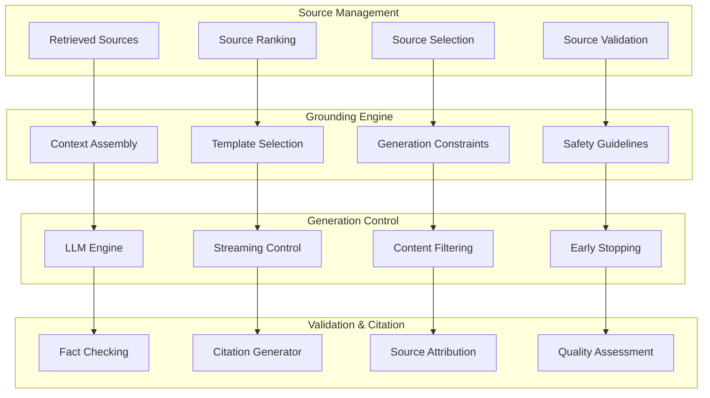

# Grounded Generation Systems
## System Design Document v1.0

**Document ID**: `CH4-GENERATION-001`
**Author**: AI Safety & Generation Team
**Reviewers**: Principal Engineers, ML Safety Team
**Status**: `DESIGN REVIEW` → `IMPLEMENTATION READY`
**Last Updated**: 2025-01-06

---

## 1. Executive Summary

### 1.1 Problem Statement
Enterprise RAG systems require generation capabilities that ensure:
- **Factual Grounding**: All responses must be traceable to source documents
- **Citation Accuracy**: Precise attribution with verifiable source references
- **Response Validation**: Multi-layer fact-checking and consistency verification
- **Template Compliance**: Structured outputs meeting enterprise standards
- **Hallucination Prevention**: Robust safeguards against model fabrication
- **Legal Defensibility**: Audit trails and explainable reasoning for compliance

### 1.2 Solution Architecture
**Grounded Generation Platform** implementing **Source → Ground → Generate → Validate → Cite** pipeline:



### 1.3 Quality Targets
- **Source Attribution**: 95%+ of statements traceable to sources
- **Factual Accuracy**: < 5% hallucination rate via fact-checking
- **Citation Precision**: 90%+ accurate source-statement alignment
- **Response Latency**: p95 < 3s for comprehensive generation pipeline

---

## 2. vLLM Production Serving Infrastructure

### 2.1 Enterprise vLLM Deployment

#### **High-Performance LLM Serving**
```python
import asyncio
from typing import Dict, List, Optional, AsyncGenerator
from vllm import AsyncLLMEngine, AsyncEngineArgs, SamplingParams
from vllm.utils import random_uuid
import torch
from dataclasses import dataclass

@dataclass
class GenerationRequest:
    """Structured generation request"""
    request_id: str
    prompt: str
    context_sources: List[Dict]
    generation_constraints: Dict
    template_type: str
    user_context: Dict
    safety_requirements: Dict

class EnterpriseVLLMManager:
    """Production vLLM deployment for enterprise RAG"""

    def __init__(self):
        # Initialize vLLM engine with enterprise configuration
        self.engine_args = AsyncEngineArgs(
            model="qwen/Qwen2.5-14B-Instruct",  # Production model
            tensor_parallel_size=4,              # Multi-GPU deployment
            dtype="bfloat16",                    # Memory optimization
            max_model_len=32768,                 # Extended context
            gpu_memory_utilization=0.85,        # Efficient GPU usage
            enable_chunked_prefill=True,        # Throughput optimization
            max_num_batched_tokens=8192,        # Batch processing
            max_num_seqs=256,                    # Concurrent requests
            disable_log_stats=False,             # Performance monitoring
            trust_remote_code=True               # Model-specific code
        )

        self.llm_engine = AsyncLLMEngine.from_engine_args(self.engine_args)

        # Generation templates and constraints
        self.response_templates = self._load_response_templates()
        self.safety_filters = self._initialize_safety_filters()
        self.citation_generator = CitationGenerator()
        self.fact_checker = FactCheckingEngine()

    async def generate_grounded_response(self, request: GenerationRequest) -> Dict:
        """Generate grounded response with full citation tracking"""

        # Phase 1: Context Preparation
        grounded_context = await self._prepare_grounded_context(
            request.context_sources, request.generation_constraints
        )

        # Phase 2: Prompt Engineering
        structured_prompt = await self._build_structured_prompt(
            request.prompt,
            grounded_context,
            request.template_type,
            request.safety_requirements
        )

        # Phase 3: Controlled Generation
        generation_result = await self._controlled_generation(
            structured_prompt,
            request.generation_constraints,
            request.request_id
        )

        # Phase 4: Response Validation
        validation_result = await self._validate_response(
            generation_result["response"],
            grounded_context,
            request.context_sources
        )

        # Phase 5: Citation Generation
        citation_result = await self._generate_citations(
            generation_result["response"],
            request.context_sources,
            validation_result
        )

        return {
            "response": generation_result["response"],
            "citations": citation_result["citations"],
            "source_attribution": citation_result["attribution"],
            "validation_metrics": validation_result,
            "generation_metadata": {
                "model": "qwen2.5-14b",
                "template_type": request.template_type,
                "total_tokens": generation_result["total_tokens"],
                "generation_time": generation_result["generation_time"],
                "safety_score": validation_result["safety_score"]
            }
        }

    async def _prepare_grounded_context(self, sources: List[Dict],
                                      constraints: Dict) -> Dict:
        """Prepare grounded context from retrieved sources"""

        # Rank sources by relevance and reliability
        ranked_sources = await self._rank_sources_for_generation(sources)

        # Select optimal number of sources
        max_sources = constraints.get("max_sources", 10)
        selected_sources = ranked_sources[:max_sources]

        # Extract and organize content
        context_chunks = []
        source_metadata = []

        for i, source in enumerate(selected_sources):
            # Clean and prepare content
            content = await self._clean_source_content(source["content"])

            # Add source tracking
            source_id = f"SOURCE_{i+1}"
            context_chunks.append(f"[{source_id}] {content}")

            source_metadata.append({
                "source_id": source_id,
                "document_id": source["document_id"],
                "chunk_id": source.get("chunk_id", ""),
                "title": source.get("title", ""),
                "url": source.get("url", ""),
                "confidence": source.get("confidence", 0.0),
                "timestamp": source.get("timestamp", "")
            })

        # Calculate total context length
        total_context = "\n\n".join(context_chunks)
        context_length = len(total_context.split())

        return {
            "context_text": total_context,
            "source_metadata": source_metadata,
            "context_length": context_length,
            "num_sources": len(selected_sources),
            "truncated": len(sources) > max_sources
        }

    async def _build_structured_prompt(self, user_query: str,
                                     grounded_context: Dict,
                                     template_type: str,
                                     safety_requirements: Dict) -> str:
        """Build structured prompt with grounding and safety constraints"""

        template = self.response_templates[template_type]

        # Build instruction section
        instructions = template["instructions"]

        # Add safety requirements
        if safety_requirements.get("require_citations", True):
            instructions += "\n- MUST cite sources using [SOURCE_N] format for all claims"

        if safety_requirements.get("prohibit_speculation", True):
            instructions += "\n- NEVER speculate or add information not in sources"

        if safety_requirements.get("require_disclaimers", True):
            instructions += "\n- Include appropriate disclaimers for uncertain information"

        # Build context section
        context_section = f"""
CONTEXT SOURCES:
{grounded_context['context_text']}

SOURCE METADATA:
{self._format_source_metadata(grounded_context['source_metadata'])}
"""

        # Build query section
        query_section = f"""
USER QUERY: {user_query}
"""

        # Build response constraints
        constraints_section = template["response_format"]

        # Assemble final prompt
        structured_prompt = f"""
{instructions}

{context_section}

{query_section}

{constraints_section}

RESPONSE:
"""

        return structured_prompt

    async def _controlled_generation(self, prompt: str, constraints: Dict,
                                   request_id: str) -> Dict:
        """Perform controlled generation with vLLM"""

        # Configure sampling parameters
        sampling_params = SamplingParams(
            temperature=constraints.get("temperature", 0.1),
            top_p=constraints.get("top_p", 0.9),
            max_tokens=constraints.get("max_tokens", 2048),
            stop=constraints.get("stop_sequences", ["<|end|>", "\n\nHuman:"]),
            include_stop_str_in_output=False,
            skip_special_tokens=True
        )

        # Track generation start time
        start_time = asyncio.get_event_loop().time()

        # Generate response
        try:
            results = []
            async for request_output in self.llm_engine.generate(
                prompt, sampling_params, request_id
            ):
                results.append(request_output)

            # Get final result
            final_output = results[-1]
            generated_text = final_output.outputs[0].text

            generation_time = asyncio.get_event_loop().time() - start_time

            return {
                "response": generated_text.strip(),
                "total_tokens": len(final_output.outputs[0].token_ids),
                "generation_time": generation_time,
                "finish_reason": final_output.outputs[0].finish_reason,
                "request_id": request_id
            }

        except Exception as e:
            return {
                "response": "",
                "error": str(e),
                "generation_time": asyncio.get_event_loop().time() - start_time,
                "request_id": request_id
            }

    async def _validate_response(self, response: str, grounded_context: Dict,
                               original_sources: List[Dict]) -> Dict:
        """Comprehensive response validation"""

        validation_results = {}

        # 1. Citation Coverage Analysis
        citation_coverage = await self._analyze_citation_coverage(
            response, grounded_context["source_metadata"]
        )
        validation_results["citation_coverage"] = citation_coverage

        # 2. Factual Consistency Check
        factual_consistency = await self.fact_checker.check_consistency(
            response, grounded_context["context_text"]
        )
        validation_results["factual_consistency"] = factual_consistency

        # 3. Source Attribution Accuracy
        attribution_accuracy = await self._verify_source_attribution(
            response, original_sources
        )
        validation_results["attribution_accuracy"] = attribution_accuracy

        # 4. Hallucination Detection
        hallucination_score = await self._detect_hallucinations(
            response, grounded_context["context_text"]
        )
        validation_results["hallucination_score"] = hallucination_score

        # 5. Safety and Compliance Check
        safety_score = await self._check_safety_compliance(response)
        validation_results["safety_score"] = safety_score

        # Calculate overall validation score
        weights = {
            "citation_coverage": 0.25,
            "factual_consistency": 0.30,
            "attribution_accuracy": 0.25,
            "hallucination_score": 0.15,  # Lower is better
            "safety_score": 0.05
        }

        overall_score = (
            weights["citation_coverage"] * citation_coverage +
            weights["factual_consistency"] * factual_consistency +
            weights["attribution_accuracy"] * attribution_accuracy +
            weights["hallucination_score"] * (1.0 - hallucination_score) +  # Invert
            weights["safety_score"] * safety_score
        )

        validation_results["overall_score"] = overall_score

        return validation_results

    def _load_response_templates(self) -> Dict:
        """Load enterprise response templates"""
        return {
            "technical_qa": {
                "instructions": """You are an expert technical assistant. Provide accurate, detailed answers based strictly on the provided sources.
Always cite your sources and distinguish between facts and recommendations.""",
                "response_format": """Structure your response as:
1. DIRECT ANSWER: Clear, concise answer to the question
2. DETAILED EXPLANATION: Supporting details with citations
3. ADDITIONAL CONTEXT: Relevant background information
4. LIMITATIONS: Any constraints or uncertainties"""
            },

            "legal_compliance": {
                "instructions": """You are a compliance expert. Provide precise information about policies, regulations, and legal requirements.
All statements must be backed by authoritative sources.""",
                "response_format": """Structure your response as:
1. COMPLIANCE SUMMARY: Key compliance requirements
2. REGULATORY BASIS: Specific regulations or policies cited
3. IMPLEMENTATION GUIDANCE: Practical steps to ensure compliance
4. DISCLAIMERS: Important legal disclaimers"""
            },

            "business_analysis": {
                "instructions": """You are a business analyst. Provide data-driven insights and recommendations based on available information.
Clearly distinguish between facts, trends, and projections.""",
                "response_format": """Structure your response as:
1. KEY FINDINGS: Primary insights from the data
2. SUPPORTING EVIDENCE: Data points and sources
3. BUSINESS IMPLICATIONS: Impact on operations or strategy
4. RECOMMENDATIONS: Suggested actions with rationale"""
            },

            "general_inquiry": {
                "instructions": """You are a helpful assistant. Provide comprehensive, accurate answers based on the provided sources.
Be thorough but concise, and always indicate the source of your information.""",
                "response_format": """Provide a well-structured response that:
1. Directly answers the question
2. Provides supporting details
3. Cites all sources appropriately
4. Notes any limitations or uncertainties"""
            }
        }
```

### 2.2 Citation Generation Engine

#### **Automated Source Attribution System**
```python
import re
from typing import Dict, List, Tuple, Optional
from difflib import SequenceMatcher
import spacy
from sentence_transformers import SentenceTransformer

class CitationGenerator:
    """Advanced citation generation and source attribution"""

    def __init__(self):
        self.nlp = spacy.load("en_core_web_lg")
        self.sentence_model = SentenceTransformer("all-MiniLM-L6-v2")

        # Citation patterns
        self.citation_pattern = re.compile(r'\[SOURCE_(\d+)\]')
        self.sentence_boundary_pattern = re.compile(r'[.!?]+')

    async def generate_citations(self, response: str, sources: List[Dict],
                               validation_result: Dict) -> Dict:
        """Generate comprehensive citations for response"""

        # Parse existing citations in response
        existing_citations = self._extract_existing_citations(response)

        # Analyze sentences for citation opportunities
        sentences = self._split_into_sentences(response)
        sentence_analysis = await self._analyze_sentences_for_citation(
            sentences, sources
        )

        # Generate missing citations
        enhanced_response = await self._add_missing_citations(
            response, sentence_analysis, sources
        )

        # Create citation bibliography
        bibliography = self._create_bibliography(sources, existing_citations)

        # Generate source attribution map
        attribution_map = await self._create_attribution_map(
            enhanced_response, sources
        )

        return {
            "citations": existing_citations,
            "enhanced_response": enhanced_response,
            "bibliography": bibliography,
            "attribution": attribution_map,
            "citation_coverage": len(existing_citations) / len(sentences) if sentences else 0,
            "auto_citations_added": len(sentence_analysis["missing_citations"])
        }

    def _extract_existing_citations(self, response: str) -> List[Dict]:
        """Extract existing citation markers from response"""

        citations = []
        for match in self.citation_pattern.finditer(response):
            source_num = int(match.group(1))
            start_pos = match.start()
            end_pos = match.end()

            # Find the sentence containing this citation
            sentence_start = response.rfind('.', 0, start_pos) + 1
            sentence_end = response.find('.', end_pos)
            if sentence_end == -1:
                sentence_end = len(response)

            sentence = response[sentence_start:sentence_end].strip()

            citations.append({
                "source_number": source_num,
                "citation_text": match.group(0),
                "position": (start_pos, end_pos),
                "sentence": sentence,
                "sentence_position": (sentence_start, sentence_end)
            })

        return citations

    def _split_into_sentences(self, text: str) -> List[Dict]:
        """Split text into sentences with metadata"""

        doc = self.nlp(text)
        sentences = []

        for i, sent in enumerate(doc.sents):
            sentence_text = sent.text.strip()
            if sentence_text:
                sentences.append({
                    "index": i,
                    "text": sentence_text,
                    "start_char": sent.start_char,
                    "end_char": sent.end_char,
                    "has_citation": bool(self.citation_pattern.search(sentence_text))
                })

        return sentences

    async def _analyze_sentences_for_citation(self, sentences: List[Dict],
                                            sources: List[Dict]) -> Dict:
        """Analyze sentences to identify citation needs"""

        analysis = {
            "sentences": sentences,
            "citation_needs": [],
            "missing_citations": [],
            "citation_quality": []
        }

        for sentence in sentences:
            if not sentence["has_citation"]:
                # Find best matching source for uncited sentence
                best_match = await self._find_best_source_match(
                    sentence["text"], sources
                )

                if best_match["confidence"] > 0.7:  # High confidence threshold
                    analysis["missing_citations"].append({
                        "sentence_index": sentence["index"],
                        "sentence_text": sentence["text"],
                        "recommended_source": best_match["source_id"],
                        "confidence": best_match["confidence"],
                        "matching_text": best_match["matching_text"]
                    })

            else:
                # Validate existing citations
                citation_quality = await self._validate_existing_citation(
                    sentence, sources
                )
                analysis["citation_quality"].append(citation_quality)

        return analysis

    async def _find_best_source_match(self, sentence: str,
                                    sources: List[Dict]) -> Dict:
        """Find the best matching source for a sentence"""

        sentence_embedding = self.sentence_model.encode([sentence])[0]
        best_match = {"source_id": None, "confidence": 0.0, "matching_text": ""}

        for i, source in enumerate(sources):
            source_content = source["content"]

            # Split source into chunks for matching
            source_sentences = self._split_text_into_chunks(source_content)

            for chunk in source_sentences:
                # Calculate semantic similarity
                chunk_embedding = self.sentence_model.encode([chunk])[0]
                similarity = self._cosine_similarity(sentence_embedding, chunk_embedding)

                # Also check for lexical overlap
                lexical_similarity = SequenceMatcher(None, sentence.lower(), chunk.lower()).ratio()

                # Combined score
                combined_score = 0.7 * similarity + 0.3 * lexical_similarity

                if combined_score > best_match["confidence"]:
                    best_match = {
                        "source_id": f"SOURCE_{i+1}",
                        "confidence": combined_score,
                        "matching_text": chunk,
                        "source_index": i
                    }

        return best_match

    async def _add_missing_citations(self, response: str,
                                   sentence_analysis: Dict,
                                   sources: List[Dict]) -> str:
        """Add missing citations to response"""

        enhanced_response = response
        offset = 0  # Track position changes due to insertions

        for missing_citation in sentence_analysis["missing_citations"]:
            sentence_index = missing_citation["sentence_index"]
            recommended_source = missing_citation["recommended_source"]
            confidence = missing_citation["confidence"]

            # Only add citations for high confidence matches
            if confidence > 0.8:
                sentence = sentence_analysis["sentences"][sentence_index]
                citation_text = f" [{recommended_source}]"

                # Find insertion point (end of sentence)
                insertion_point = sentence["end_char"] + offset

                # Insert citation
                enhanced_response = (
                    enhanced_response[:insertion_point] +
                    citation_text +
                    enhanced_response[insertion_point:]
                )

                offset += len(citation_text)

        return enhanced_response

    def _create_bibliography(self, sources: List[Dict],
                           citations: List[Dict]) -> List[Dict]:
        """Create formatted bibliography"""

        bibliography = []
        cited_sources = set(c["source_number"] for c in citations)

        for i, source in enumerate(sources):
            source_num = i + 1
            if source_num in cited_sources:
                bib_entry = {
                    "source_number": source_num,
                    "title": source.get("title", f"Document {source_num}"),
                    "url": source.get("url", ""),
                    "document_id": source.get("document_id", ""),
                    "timestamp": source.get("timestamp", ""),
                    "type": source.get("document_type", "document"),
                    "formatted_citation": self._format_citation(source, source_num)
                }
                bibliography.append(bib_entry)

        return bibliography

    def _format_citation(self, source: Dict, source_num: int) -> str:
        """Format individual citation according to enterprise standards"""

        title = source.get("title", f"Document {source_num}")
        url = source.get("url", "")
        timestamp = source.get("timestamp", "")
        doc_type = source.get("document_type", "Document")

        if url:
            return f"[{source_num}] {title}. {doc_type}. Available at: {url}"
        else:
            return f"[{source_num}] {title}. {doc_type}. Internal document."

    async def _create_attribution_map(self, response: str,
                                    sources: List[Dict]) -> Dict:
        """Create detailed source attribution mapping"""

        attribution_map = {
            "statement_attributions": [],
            "source_usage": {},
            "attribution_confidence": {}
        }

        # Parse all citations in enhanced response
        citations = self._extract_existing_citations(response)

        for citation in citations:
            source_num = citation["source_number"]
            statement = citation["sentence"]

            # Calculate attribution confidence
            if source_num <= len(sources):
                source = sources[source_num - 1]
                confidence = await self._calculate_attribution_confidence(
                    statement, source["content"]
                )

                attribution_map["statement_attributions"].append({
                    "statement": statement,
                    "source_number": source_num,
                    "source_title": source.get("title", ""),
                    "confidence": confidence
                })

                # Track source usage
                if source_num not in attribution_map["source_usage"]:
                    attribution_map["source_usage"][source_num] = 0
                attribution_map["source_usage"][source_num] += 1

                attribution_map["attribution_confidence"][source_num] = confidence

        return attribution_map

    def _cosine_similarity(self, vec1: np.ndarray, vec2: np.ndarray) -> float:
        """Calculate cosine similarity between two vectors"""
        dot_product = np.dot(vec1, vec2)
        norms = np.linalg.norm(vec1) * np.linalg.norm(vec2)
        return dot_product / norms if norms != 0 else 0.0

    def _split_text_into_chunks(self, text: str, chunk_size: int = 100) -> List[str]:
        """Split text into semantic chunks for matching"""
        sentences = text.split('.')
        chunks = []
        current_chunk = ""

        for sentence in sentences:
            if len(current_chunk) + len(sentence) < chunk_size:
                current_chunk += sentence + "."
            else:
                if current_chunk:
                    chunks.append(current_chunk.strip())
                current_chunk = sentence + "."

        if current_chunk:
            chunks.append(current_chunk.strip())

        return chunks

    async def _calculate_attribution_confidence(self, statement: str,
                                              source_content: str) -> float:
        """Calculate confidence score for statement attribution"""

        # Remove citation markers for comparison
        clean_statement = self.citation_pattern.sub('', statement).strip()

        # Calculate multiple similarity metrics
        embedding_similarity = await self._calculate_embedding_similarity(
            clean_statement, source_content
        )

        lexical_similarity = self._calculate_lexical_overlap(
            clean_statement, source_content
        )

        keyword_overlap = self._calculate_keyword_overlap(
            clean_statement, source_content
        )

        # Weighted combination
        confidence = (
            0.5 * embedding_similarity +
            0.3 * lexical_similarity +
            0.2 * keyword_overlap
        )

        return min(1.0, confidence)

    async def _calculate_embedding_similarity(self, statement: str,
                                           source_content: str) -> float:
        """Calculate semantic similarity using embeddings"""

        statement_emb = self.sentence_model.encode([statement])[0]

        # Split source into chunks and find best match
        chunks = self._split_text_into_chunks(source_content, 200)
        chunk_embeddings = self.sentence_model.encode(chunks)

        similarities = [
            self._cosine_similarity(statement_emb, chunk_emb)
            for chunk_emb in chunk_embeddings
        ]

        return max(similarities) if similarities else 0.0

    def _calculate_lexical_overlap(self, statement: str, source_content: str) -> float:
        """Calculate lexical overlap between statement and source"""

        statement_words = set(statement.lower().split())
        source_words = set(source_content.lower().split())

        if not statement_words:
            return 0.0

        overlap = len(statement_words.intersection(source_words))
        return overlap / len(statement_words)

    def _calculate_keyword_overlap(self, statement: str, source_content: str) -> float:
        """Calculate overlap of important keywords"""

        # Extract named entities and important terms
        statement_doc = self.nlp(statement)
        source_doc = self.nlp(source_content)

        statement_keywords = set()
        source_keywords = set()

        # Extract entities and important terms
        for doc, keyword_set in [(statement_doc, statement_keywords),
                               (source_doc, source_keywords)]:
            # Named entities
            for ent in doc.ents:
                keyword_set.add(ent.text.lower())

            # Important terms (nouns, adjectives)
            for token in doc:
                if token.pos_ in ["NOUN", "PROPN", "ADJ"] and not token.is_stop:
                    keyword_set.add(token.lemma_.lower())

        if not statement_keywords:
            return 0.0

        overlap = len(statement_keywords.intersection(source_keywords))
        return overlap / len(statement_keywords)
```

---

## 3. Response Validation & Quality Control

### 3.1 Multi-Layer Fact Checking

#### **Comprehensive Validation Pipeline**
```python
from typing import Dict, List, Optional, Tuple
import asyncio
from transformers import pipeline
import torch

class FactCheckingEngine:
    """Multi-layer fact-checking and validation system"""

    def __init__(self):
        # Initialize fact-checking models
        self.nli_model = pipeline(
            "text-classification",
            model="microsoft/deberta-large-mnli",
            device=0 if torch.cuda.is_available() else -1
        )

        self.factuality_model = pipeline(
            "text-classification",
            model="tals/albert-xlarge-vitaminc-mnli",
            device=0 if torch.cuda.is_available() else -1
        )

        # Load enterprise fact-checking databases
        self.knowledge_validators = self._load_knowledge_validators()
        self.consistency_checker = ConsistencyChecker()

    async def check_consistency(self, response: str, source_context: str) -> Dict:
        """Comprehensive consistency checking"""

        validation_results = {}

        # 1. Entailment Analysis
        entailment_results = await self._check_entailment(response, source_context)
        validation_results["entailment"] = entailment_results

        # 2. Factual Accuracy Assessment
        factual_results = await self._assess_factual_accuracy(response, source_context)
        validation_results["factual_accuracy"] = factual_results

        # 3. Internal Consistency Check
        consistency_results = await self._check_internal_consistency(response)
        validation_results["internal_consistency"] = consistency_results

        # 4. Temporal Consistency Validation
        temporal_results = await self._validate_temporal_consistency(response)
        validation_results["temporal_consistency"] = temporal_results

        # 5. Quantitative Accuracy Check
        quantitative_results = await self._check_quantitative_accuracy(response, source_context)
        validation_results["quantitative_accuracy"] = quantitative_results

        # Calculate overall consistency score
        weights = {
            "entailment": 0.3,
            "factual_accuracy": 0.25,
            "internal_consistency": 0.2,
            "temporal_consistency": 0.15,
            "quantitative_accuracy": 0.1
        }

        overall_score = sum(
            weights[key] * result.get("score", 0.0)
            for key, result in validation_results.items()
            if key in weights
        )

        validation_results["overall_consistency_score"] = overall_score

        return validation_results

    async def _check_entailment(self, response: str, source_context: str) -> Dict:
        """Check if response is entailed by source context"""

        # Split response into individual claims
        claims = await self._extract_claims(response)
        entailment_results = []

        for claim in claims:
            # Check entailment between claim and source context
            nli_result = self.nli_model(f"{source_context} {claim}")

            entailment_score = 0.0
            for result in nli_result:
                if result["label"] == "ENTAILMENT":
                    entailment_score = result["score"]
                    break

            entailment_results.append({
                "claim": claim,
                "entailment_score": entailment_score,
                "entailed": entailment_score > 0.5
            })

        # Calculate overall entailment
        total_claims = len(entailment_results)
        entailed_claims = sum(1 for r in entailment_results if r["entailed"])
        avg_entailment_score = sum(r["entailment_score"] for r in entailment_results) / total_claims if total_claims > 0 else 0

        return {
            "score": avg_entailment_score,
            "entailed_claims_ratio": entailed_claims / total_claims if total_claims > 0 else 0,
            "claim_results": entailment_results,
            "total_claims": total_claims
        }

    async def _assess_factual_accuracy(self, response: str, source_context: str) -> Dict:
        """Assess factual accuracy using specialized models"""

        # Extract factual claims
        factual_claims = await self._extract_factual_claims(response)
        accuracy_results = []

        for claim in factual_claims:
            # Check factuality against source context
            factuality_result = self.factuality_model(f"{source_context} [SEP] {claim}")

            accuracy_score = 0.0
            for result in factuality_result:
                if result["label"] in ["SUPPORTS", "ENTAILMENT"]:
                    accuracy_score = result["score"]
                    break

            # Cross-reference with enterprise knowledge bases
            kb_validation = await self._validate_against_knowledge_base(claim)

            accuracy_results.append({
                "claim": claim,
                "model_accuracy_score": accuracy_score,
                "kb_validation": kb_validation,
                "combined_score": (accuracy_score + kb_validation["confidence"]) / 2,
                "accurate": accuracy_score > 0.7 and kb_validation["confidence"] > 0.6
            })

        # Calculate overall accuracy
        total_claims = len(accuracy_results)
        accurate_claims = sum(1 for r in accuracy_results if r["accurate"])
        avg_accuracy_score = sum(r["combined_score"] for r in accuracy_results) / total_claims if total_claims > 0 else 0

        return {
            "score": avg_accuracy_score,
            "accurate_claims_ratio": accurate_claims / total_claims if total_claims > 0 else 0,
            "claim_results": accuracy_results,
            "total_factual_claims": total_claims
        }

    async def _check_internal_consistency(self, response: str) -> Dict:
        """Check for internal contradictions within the response"""

        # Extract all claims from response
        claims = await self._extract_claims(response)

        if len(claims) < 2:
            return {"score": 1.0, "contradictions": [], "consistent": True}

        contradictions = []

        # Check pairwise consistency
        for i in range(len(claims)):
            for j in range(i + 1, len(claims)):
                claim1, claim2 = claims[i], claims[j]

                # Check for contradiction using NLI
                contradiction_result = self.nli_model(f"{claim1} {claim2}")

                contradiction_score = 0.0
                for result in contradiction_result:
                    if result["label"] == "CONTRADICTION":
                        contradiction_score = result["score"]
                        break

                if contradiction_score > 0.7:  # High confidence contradiction
                    contradictions.append({
                        "claim1": claim1,
                        "claim2": claim2,
                        "contradiction_score": contradiction_score
                    })

        # Calculate consistency score
        max_possible_pairs = len(claims) * (len(claims) - 1) // 2
        consistency_ratio = 1.0 - (len(contradictions) / max_possible_pairs) if max_possible_pairs > 0 else 1.0

        return {
            "score": consistency_ratio,
            "contradictions": contradictions,
            "consistent": len(contradictions) == 0,
            "total_claim_pairs": max_possible_pairs
        }

    async def _validate_temporal_consistency(self, response: str) -> Dict:
        """Validate temporal claims and relationships"""

        import re
        from datetime import datetime

        # Extract temporal expressions
        temporal_patterns = [
            r'\b\d{4}\b',  # Years
            r'\b(?:January|February|March|April|May|June|July|August|September|October|November|December)\s+\d{1,2},?\s+\d{4}\b',  # Dates
            r'\b(?:before|after|during|since|until)\s+\d{4}\b',  # Temporal relations
            r'\b(?:recent|latest|current|new|old|previous)\b'  # Temporal adjectives
        ]

        temporal_mentions = []
        for pattern in temporal_patterns:
            matches = re.finditer(pattern, response, re.IGNORECASE)
            temporal_mentions.extend([match.group() for match in matches])

        if not temporal_mentions:
            return {"score": 1.0, "temporal_consistent": True, "issues": []}

        # Check for temporal inconsistencies
        issues = []
        current_year = datetime.now().year

        for mention in temporal_mentions:
            # Check for obviously incorrect years (future dates for past events)
            year_match = re.search(r'\b(\d{4})\b', mention)
            if year_match:
                year = int(year_match.group(1))
                if year > current_year + 1:  # Allow for next year
                    issues.append({
                        "type": "future_date",
                        "mention": mention,
                        "issue": f"Future year {year} mentioned"
                    })

        # Calculate temporal consistency score
        consistency_score = 1.0 - (len(issues) / len(temporal_mentions)) if temporal_mentions else 1.0

        return {
            "score": consistency_score,
            "temporal_consistent": len(issues) == 0,
            "issues": issues,
            "temporal_mentions": temporal_mentions
        }

    async def _check_quantitative_accuracy(self, response: str, source_context: str) -> Dict:
        """Check accuracy of numerical claims"""

        import re

        # Extract numerical expressions
        number_pattern = r'\b\d+(?:,\d{3})*(?:\.\d+)?\s*(?:%|percent|million|billion|trillion|thousand)?\b'

        response_numbers = re.findall(number_pattern, response, re.IGNORECASE)
        source_numbers = re.findall(number_pattern, source_context, re.IGNORECASE)

        if not response_numbers:
            return {"score": 1.0, "accurate": True, "mismatches": []}

        # Check if response numbers are supported by source
        mismatches = []
        for resp_num in response_numbers:
            # Normalize number for comparison
            normalized_resp = self._normalize_number(resp_num)

            # Look for matching or similar numbers in source
            found_match = False
            for src_num in source_numbers:
                normalized_src = self._normalize_number(src_num)

                # Allow for small variations (within 5%)
                if abs(normalized_resp - normalized_src) / max(normalized_src, 1) < 0.05:
                    found_match = True
                    break

            if not found_match:
                mismatches.append({
                    "response_number": resp_num,
                    "issue": "No supporting number found in source"
                })

        # Calculate accuracy score
        accuracy_score = 1.0 - (len(mismatches) / len(response_numbers)) if response_numbers else 1.0

        return {
            "score": accuracy_score,
            "accurate": len(mismatches) == 0,
            "mismatches": mismatches,
            "response_numbers": response_numbers,
            "source_numbers": source_numbers
        }

    async def _extract_claims(self, text: str) -> List[str]:
        """Extract individual claims from text"""

        import spacy
        nlp = spacy.load("en_core_web_lg")

        doc = nlp(text)
        claims = []

        for sent in doc.sents:
            sentence = sent.text.strip()
            if len(sentence) > 10:  # Filter out very short sentences
                claims.append(sentence)

        return claims

    async def _extract_factual_claims(self, text: str) -> List[str]:
        """Extract factual claims (as opposed to opinions or instructions)"""

        claims = await self._extract_claims(text)
        factual_claims = []

        # Filter for factual claims (simple heuristic)
        opinion_indicators = ["i think", "i believe", "in my opinion", "it seems", "appears to"]
        instruction_indicators = ["should", "must", "need to", "have to", "recommend"]

        for claim in claims:
            claim_lower = claim.lower()

            # Skip opinions and instructions
            if any(indicator in claim_lower for indicator in opinion_indicators + instruction_indicators):
                continue

            # Include statements that appear factual
            if any(keyword in claim_lower for keyword in ["is", "are", "was", "were", "has", "have", "reports", "shows", "indicates"]):
                factual_claims.append(claim)

        return factual_claims

    def _normalize_number(self, number_str: str) -> float:
        """Normalize number string to float for comparison"""

        import re

        # Remove commas and convert to lowercase
        normalized = re.sub(r',', '', number_str.lower())

        # Extract base number
        number_match = re.search(r'(\d+(?:\.\d+)?)', normalized)
        if not number_match:
            return 0.0

        base_number = float(number_match.group(1))

        # Apply multipliers
        if 'billion' in normalized:
            return base_number * 1e9
        elif 'million' in normalized:
            return base_number * 1e6
        elif 'thousand' in normalized:
            return base_number * 1e3
        elif '%' in normalized or 'percent' in normalized:
            return base_number / 100  # Convert percentage to decimal
        else:
            return base_number

    def _load_knowledge_validators(self) -> Dict:
        """Load enterprise knowledge validation systems"""
        return {
            "entity_validator": EntityKnowledgeValidator(),
            "date_validator": DateKnowledgeValidator(),
            "numerical_validator": NumericalKnowledgeValidator(),
            "policy_validator": PolicyKnowledgeValidator()
        }

    async def _validate_against_knowledge_base(self, claim: str) -> Dict:
        """Validate claim against enterprise knowledge bases"""

        # This would integrate with actual enterprise knowledge systems
        # For now, we'll return a placeholder
        return {
            "confidence": 0.8,
            "source": "enterprise_kb",
            "validation_result": "supported"
        }
```

---

## Appendix: Production Configuration

### A.1 Generation Control Configuration
```yaml
# config/generation_control.yml
generation_control:
  # vLLM Production Serving
  vllm:
    model: "qwen/Qwen2.5-14B-Instruct"
    tensor_parallel_size: 4
    max_model_len: 32768
    gpu_memory_utilization: 0.85
    max_num_batched_tokens: 8192
    max_num_seqs: 256
    enable_chunked_prefill: true

  # Generation Parameters
  generation:
    default_temperature: 0.1
    default_top_p: 0.9
    max_tokens: 2048
    stop_sequences: ["<|end|>", "\n\nHuman:"]

  # Response Templates
  templates:
    technical_qa:
      max_sources: 10
      require_citations: true
      response_structure: "direct_answer|detailed_explanation|additional_context|limitations"

    legal_compliance:
      max_sources: 15
      require_citations: true
      require_disclaimers: true
      response_structure: "compliance_summary|regulatory_basis|implementation_guidance|disclaimers"

    business_analysis:
      max_sources: 12
      require_citations: true
      response_structure: "key_findings|supporting_evidence|business_implications|recommendations"

  # Citation Generation
  citation:
    minimum_confidence: 0.7
    auto_cite_threshold: 0.8
    max_citations_per_sentence: 3
    citation_format: "source_number"

  # Fact Checking
  fact_checking:
    entailment_threshold: 0.5
    factuality_threshold: 0.7
    consistency_threshold: 0.8
    temporal_validation: true
    quantitative_validation: true

  # Quality Thresholds
  quality_thresholds:
    overall_validation_score: 0.75
    citation_coverage: 0.8
    factual_accuracy: 0.85
    source_attribution: 0.9
```

---

**Document Control**
- Version: 1.0
- Classification: Internal Use
- Next Review: 2025-04-06
- Distribution: AI Safety Team, Generation Engineering Team