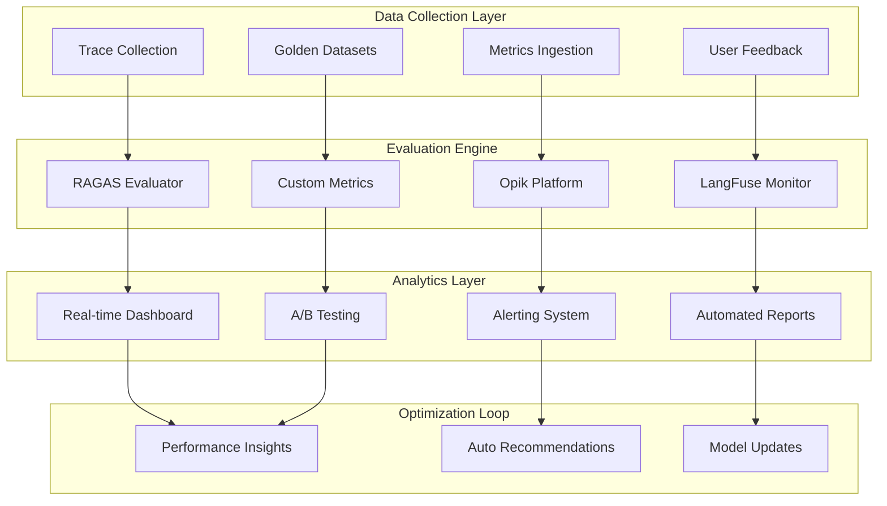

# Enterprise RAG Evaluation Platform
## System Design Document v1.0

**Document ID**: `CH5-EVAL-001`
**Author**: ML Platform Team
**Reviewers**: Staff Engineers, Data Science Team
**Status**: `DESIGN REVIEW` → `IMPLEMENTATION READY`
**Last Updated**: 2025-01-06

---

## 1. Executive Summary

### 1.1 Problem Statement
Enterprise RAG systems require comprehensive evaluation and monitoring to ensure:
- **Quality Assurance**: Continuous tracking of retrieval accuracy and generation quality
- **Performance Monitoring**: Real-time observability of latency, throughput, and resource usage
- **Business Alignment**: Metrics that correlate with user satisfaction and business objectives
- **Regulatory Compliance**: Audit trails and explainable AI for governance requirements
- **Continuous Improvement**: Data-driven optimization through A/B testing and experimentation

### 1.2 Solution Architecture
**Enterprise RAG Evaluation Platform** implementing **Monitor → Measure → Optimize** lifecycle:



### 1.3 Success Metrics (KPIs)
- **Quality Score**: Faithfulness > 0.85, Relevance > 0.8
- **User Satisfaction**: CSAT > 4.2/5.0, Task Success Rate > 90%
- **System Performance**: p95 < 500ms, Availability > 99.9%
- **Business Impact**: Query Resolution Rate > 85%, Support Ticket Reduction > 30%

---

## 2. Technology Stack Deep Dive

### 2.1 RAGAS Integration for RAG-Specific Evaluation

#### **Production RAGAS Configuration**
```python
from ragas import evaluate
from ragas.metrics import (
    faithfulness,
    answer_relevancy,
    context_precision,
    context_recall,
    answer_correctness,
    answer_similarity
)
import asyncio
from datasets import Dataset

class EnterpriseRAGASEvaluator:
    """Production-grade RAGAS evaluation system"""

    def __init__(self):
        # Configure evaluation metrics
        self.metrics = [
            faithfulness,           # Factual accuracy
            answer_relevancy,       # Answer quality
            context_precision,      # Retrieval precision
            context_recall,        # Retrieval recall
            answer_correctness,    # Overall correctness
            answer_similarity      # Semantic similarity
        ]

        # Enterprise-specific thresholds
        self.quality_thresholds = {
            "faithfulness": 0.85,
            "answer_relevancy": 0.8,
            "context_precision": 0.75,
            "context_recall": 0.8,
            "answer_correctness": 0.82,
            "answer_similarity": 0.85
        }

        # Evaluation configurations by domain
        self.domain_configs = {
            "technical": {
                "faithfulness_weight": 0.4,
                "accuracy_weight": 0.4,
                "relevancy_weight": 0.2
            },
            "legal": {
                "faithfulness_weight": 0.5,
                "accuracy_weight": 0.3,
                "relevancy_weight": 0.2
            },
            "general": {
                "faithfulness_weight": 0.3,
                "accuracy_weight": 0.35,
                "relevancy_weight": 0.35
            }
        }

    async def evaluate_rag_pipeline(self, test_dataset: List[Dict], domain: str = "general") -> Dict:
        """Comprehensive RAG pipeline evaluation"""

        # Prepare dataset for RAGAS
        dataset = Dataset.from_list([
            {
                "question": item["question"],
                "answer": item["generated_answer"],
                "contexts": item["retrieved_contexts"],
                "ground_truth": item["expected_answer"]
            }
            for item in test_dataset
        ])

        # Run RAGAS evaluation
        result = evaluate(
            dataset=dataset,
            metrics=self.metrics,
            llm=self._get_evaluation_llm(),
            embeddings=self._get_evaluation_embeddings()
        )

        # Calculate domain-weighted composite score
        composite_score = self._calculate_composite_score(result, domain)

        # Generate detailed analysis
        analysis = await self._generate_detailed_analysis(result, test_dataset)

        return {
            "overall_scores": dict(result),
            "composite_score": composite_score,
            "domain": domain,
            "threshold_compliance": self._check_threshold_compliance(result),
            "detailed_analysis": analysis,
            "recommendations": self._generate_recommendations(result)
        }

    def _calculate_composite_score(self, result: Dict, domain: str) -> float:
        """Calculate domain-weighted composite quality score"""

        config = self.domain_configs.get(domain, self.domain_configs["general"])

        composite = (
            config["faithfulness_weight"] * result.get("faithfulness", 0) +
            config["accuracy_weight"] * result.get("answer_correctness", 0) +
            config["relevancy_weight"] * result.get("answer_relevancy", 0)
        )

        return round(composite, 3)

    def _check_threshold_compliance(self, result: Dict) -> Dict:
        """Check if metrics meet enterprise thresholds"""

        compliance = {}
        for metric, threshold in self.quality_thresholds.items():
            actual_score = result.get(metric, 0)
            compliance[metric] = {
                "meets_threshold": actual_score >= threshold,
                "actual_score": actual_score,
                "threshold": threshold,
                "gap": threshold - actual_score if actual_score < threshold else 0
            }

        return compliance

    async def _generate_detailed_analysis(self, result: Dict, test_data: List[Dict]) -> Dict:
        """Generate detailed performance analysis"""

        # Analyze failure patterns
        low_performing_queries = []
        for i, item in enumerate(test_data):
            # Simulate individual scoring (in practice, extract from detailed results)
            item_score = self._estimate_item_score(item, result)
            if item_score < 0.7:
                low_performing_queries.append({
                    "query": item["question"],
                    "estimated_score": item_score,
                    "issue_category": self._categorize_failure(item)
                })

        # Content type analysis
        content_type_performance = self._analyze_by_content_type(test_data, result)

        return {
            "total_evaluations": len(test_data),
            "low_performing_queries": low_performing_queries[:10],  # Top 10 issues
            "content_type_performance": content_type_performance,
            "common_failure_patterns": self._identify_failure_patterns(low_performing_queries)
        }

    def _generate_recommendations(self, result: Dict) -> List[str]:
        """Generate actionable recommendations based on evaluation results"""

        recommendations = []

        # Faithfulness recommendations
        if result.get("faithfulness", 0) < self.quality_thresholds["faithfulness"]:
            recommendations.append(
                "Improve faithfulness: Consider implementing stricter citation requirements "
                "and add fact-checking validation steps"
            )

        # Context precision recommendations
        if result.get("context_precision", 0) < self.quality_thresholds["context_precision"]:
            recommendations.append(
                "Enhance retrieval precision: Tune reranking models or adjust "
                "similarity thresholds to reduce irrelevant context"
            )

        # Context recall recommendations
        if result.get("context_recall", 0) < self.quality_thresholds["context_recall"]:
            recommendations.append(
                "Improve retrieval recall: Expand search strategies, consider "
                "query expansion or hybrid retrieval approaches"
            )

        # Answer relevancy recommendations
        if result.get("answer_relevancy", 0) < self.quality_thresholds["answer_relevancy"]:
            recommendations.append(
                "Enhance answer relevancy: Refine prompts to better focus responses "
                "on user questions and reduce tangential information"
            )

        return recommendations

    def _get_evaluation_llm(self):
        """Get LLM for RAGAS evaluation"""
        from langchain_community.llms import Ollama
        return Ollama(model="qwen2.5:7b", base_url="http://ollama-service:11434")

    def _get_evaluation_embeddings(self):
        """Get embeddings for RAGAS evaluation"""
        from langchain_community.embeddings import HuggingFaceEmbeddings
        return HuggingFaceEmbeddings(model_name="BAAI/bge-large-zh-v1.5")
```

### 2.2 Opik Enterprise Observability Platform

#### **Opik Production Integration**
```python
import opik
from opik import track, Opik
from typing import Dict, List, Optional
import asyncio

class OpikEnterpriseIntegration:
    """Enterprise Opik integration for comprehensive LLM observability"""

    def __init__(self):
        # Initialize Opik client
        self.client = Opik(
            api_key=os.getenv("OPIK_API_KEY"),
            workspace="enterprise-rag-prod",
            host="https://opik.company.internal"  # Self-hosted instance
        )

        # Configure tracking
        self.project_name = "enterprise-rag-system"
        self.trace_sample_rate = 1.0  # 100% sampling in production

    @track(project_name="enterprise-rag-system")
    async def track_rag_query(self, query: str, user_context: Dict,
                            retrieval_results: List[Dict], generated_answer: str,
                            metadata: Dict = None) -> Dict:
        """Comprehensive RAG query tracking with Opik"""

        # Track retrieval phase
        retrieval_span = self.client.start_span(
            name="retrieval_phase",
            input={"query": query, "user_context": user_context},
            metadata={
                "retrieval_method": metadata.get("retrieval_method", "hybrid"),
                "num_retrieved": len(retrieval_results),
                "user_department": user_context.get("department"),
                "query_type": self._classify_query_type(query)
            }
        )

        # Track generation phase
        generation_span = self.client.start_span(
            name="generation_phase",
            input={
                "query": query,
                "contexts": [r["content"] for r in retrieval_results]
            },
            output={"answer": generated_answer},
            metadata={
                "model_name": metadata.get("model_name", "qwen2.5:7b"),
                "temperature": metadata.get("temperature", 0.1),
                "max_tokens": metadata.get("max_tokens", 1000),
                "context_length": sum(len(r["content"]) for r in retrieval_results)
            }
        )

        # Calculate and log quality metrics
        quality_metrics = await self._calculate_realtime_quality(
            query, retrieval_results, generated_answer
        )

        # Log overall trace
        trace_data = {
            "query": query,
            "answer": generated_answer,
            "retrieval_results": retrieval_results,
            "quality_metrics": quality_metrics,
            "user_context": user_context,
            "metadata": metadata
        }

        self.client.log_trace(
            name="rag_query_execution",
            input={"query": query},
            output={"answer": generated_answer},
            metadata=trace_data
        )

        return trace_data

    async def batch_evaluate_with_opik(self, queries: List[Dict]) -> Dict:
        """Batch evaluation using Opik's evaluation framework"""

        # Create evaluation dataset
        dataset = self.client.create_dataset(
            name=f"rag_evaluation_{datetime.now().strftime('%Y%m%d')}",
            description="Daily RAG system evaluation"
        )

        # Add queries to dataset
        for query_data in queries:
            dataset.add_item(
                input=query_data["query"],
                expected_output=query_data.get("expected_answer"),
                metadata=query_data.get("metadata", {})
            )

        # Define evaluation metrics
        evaluation_metrics = [
            self._create_faithfulness_evaluator(),
            self._create_relevance_evaluator(),
            self._create_completeness_evaluator()
        ]

        # Run evaluation
        evaluation_results = await self.client.evaluate(
            dataset=dataset,
            scoring_functions=evaluation_metrics,
            task=self._rag_task_function
        )

        return {
            "dataset_id": dataset.id,
            "evaluation_results": evaluation_results,
            "summary_metrics": self._summarize_evaluation_results(evaluation_results)
        }

    def _create_faithfulness_evaluator(self):
        """Create Opik faithfulness evaluator"""

        @opik.evaluate
        def faithfulness_score(output: str, context: str) -> float:
            """Evaluate faithfulness of generated answer to context"""
            # Use LLM-as-judge for faithfulness evaluation
            prompt = f"""
            Context: {context}
            Answer: {output}

            Rate the faithfulness of the answer to the context on a scale of 0-1.
            Return only the numeric score.
            """

            # Call evaluation LLM
            score = self._call_evaluation_llm(prompt)
            return float(score)

        return faithfulness_score

    def _create_relevance_evaluator(self):
        """Create Opik relevance evaluator"""

        @opik.evaluate
        def relevance_score(query: str, output: str) -> float:
            """Evaluate relevance of answer to query"""

            prompt = f"""
            Query: {query}
            Answer: {output}

            Rate how well the answer addresses the query on a scale of 0-1.
            Return only the numeric score.
            """

            score = self._call_evaluation_llm(prompt)
            return float(score)

        return relevance_score

    async def setup_automated_monitoring(self):
        """Setup automated monitoring and alerting with Opik"""

        # Define monitoring rules
        monitoring_rules = [
            {
                "name": "low_quality_alerts",
                "condition": "average_quality_score < 0.7",
                "window": "5m",
                "threshold": 0.7,
                "action": "alert"
            },
            {
                "name": "high_latency_alerts",
                "condition": "p95_latency > 500ms",
                "window": "2m",
                "threshold": 500,
                "action": "alert"
            },
            {
                "name": "error_rate_alerts",
                "condition": "error_rate > 5%",
                "window": "1m",
                "threshold": 0.05,
                "action": "page"
            }
        ]

        # Configure alerts
        for rule in monitoring_rules:
            await self.client.create_monitor(
                name=rule["name"],
                condition=rule["condition"],
                threshold=rule["threshold"],
                notification_channels=["slack", "email", "pagerduty"]
            )

    async def generate_daily_report(self) -> Dict:
        """Generate comprehensive daily performance report"""

        end_time = datetime.utcnow()
        start_time = end_time - timedelta(days=1)

        # Query Opik for daily metrics
        daily_metrics = await self.client.get_metrics(
            project_name=self.project_name,
            start_time=start_time,
            end_time=end_time,
            metrics=[
                "total_queries",
                "average_latency",
                "error_rate",
                "quality_scores",
                "user_satisfaction"
            ]
        )

        # Generate insights
        insights = self._generate_performance_insights(daily_metrics)

        # Create visualizations
        charts = await self._create_performance_charts(daily_metrics)

        return {
            "report_date": end_time.date().isoformat(),
            "metrics": daily_metrics,
            "insights": insights,
            "charts": charts,
            "recommendations": self._generate_daily_recommendations(daily_metrics)
        }
```

### 2.3 LangFuse Open-Source Monitoring

#### **LangFuse Enterprise Setup**
```python
from langfuse import Langfuse
from langfuse.decorators import observe, langfuse_context
from langfuse.model import CreateTrace, CreateSpan
import asyncio

class LangFuseEnterpriseMonitor:
    """Enterprise LangFuse integration for open-source observability"""

    def __init__(self):
        # Initialize LangFuse client for self-hosted instance
        self.langfuse = Langfuse(
            secret_key=os.getenv("LANGFUSE_SECRET_KEY"),
            public_key=os.getenv("LANGFUSE_PUBLIC_KEY"),
            host="https://langfuse.company.internal"  # Self-hosted
        )

        # Configure session tracking
        self.session_config = {
            "track_users": True,
            "track_sessions": True,
            "session_timeout": 1800,  # 30 minutes
            "user_properties": ["department", "role", "clearance_level"]
        }

    @observe(name="rag_pipeline")
    async def monitor_rag_execution(self, query: str, user_id: str, session_id: str) -> Dict:
        """Comprehensive RAG pipeline monitoring"""

        # Start main trace
        trace = self.langfuse.trace(
            name="enterprise_rag_query",
            user_id=user_id,
            session_id=session_id,
            metadata={
                "query_timestamp": datetime.utcnow().isoformat(),
                "query_length": len(query),
                "query_type": self._classify_query(query)
            }
        )

        try:
            # Monitor document retrieval
            with trace.span(name="document_retrieval") as retrieval_span:
                retrieval_start = time.time()
                retrieved_docs = await self._retrieve_documents(query)
                retrieval_time = time.time() - retrieval_start

                retrieval_span.update(
                    input={"query": query},
                    output={"num_documents": len(retrieved_docs)},
                    metadata={
                        "retrieval_method": "hybrid",
                        "retrieval_time": retrieval_time,
                        "documents_found": len(retrieved_docs)
                    }
                )

            # Monitor answer generation
            with trace.span(name="answer_generation") as generation_span:
                generation_start = time.time()
                answer = await self._generate_answer(query, retrieved_docs)
                generation_time = time.time() - generation_start

                generation_span.update(
                    input={
                        "query": query,
                        "context_length": sum(len(doc["content"]) for doc in retrieved_docs)
                    },
                    output={"answer": answer},
                    metadata={
                        "generation_time": generation_time,
                        "model_name": "qwen2.5:7b",
                        "answer_length": len(answer)
                    }
                )

            # Calculate and log quality scores
            quality_scores = await self._calculate_quality_scores(query, retrieved_docs, answer)

            # Update main trace with final results
            trace.update(
                input={"query": query},
                output={"answer": answer},
                metadata={
                    "total_time": retrieval_time + generation_time,
                    "quality_scores": quality_scores,
                    "num_sources": len(retrieved_docs)
                }
            )

            # Log cost information
            await self._log_cost_information(trace, retrieved_docs, answer)

            return {
                "answer": answer,
                "sources": retrieved_docs,
                "quality_scores": quality_scores,
                "trace_id": trace.id
            }

        except Exception as e:
            trace.update(
                level="ERROR",
                status_message=str(e)
            )
            raise

    async def track_user_feedback(self, trace_id: str, feedback: Dict) -> None:
        """Track user feedback for continuous improvement"""

        # Update trace with user feedback
        self.langfuse.score(
            trace_id=trace_id,
            name="user_satisfaction",
            value=feedback.get("rating", 0),
            comment=feedback.get("comment", ""),
            metadata={
                "feedback_type": feedback.get("type", "rating"),
                "feedback_timestamp": datetime.utcnow().isoformat(),
                "helpful": feedback.get("helpful", None),
                "issues": feedback.get("issues", [])
            }
        )

    async def create_evaluation_dataset(self, queries: List[Dict]) -> str:
        """Create evaluation dataset in LangFuse"""

        dataset_name = f"rag_evaluation_{datetime.now().strftime('%Y%m%d_%H%M%S')}"

        # Create dataset
        dataset = self.langfuse.create_dataset(
            name=dataset_name,
            description="Enterprise RAG evaluation dataset",
            metadata={
                "created_by": "automated_evaluation",
                "query_count": len(queries),
                "evaluation_type": "comprehensive"
            }
        )

        # Add items to dataset
        for query_data in queries:
            self.langfuse.create_dataset_item(
                dataset_name=dataset_name,
                input=query_data["query"],
                expected_output=query_data.get("expected_answer"),
                metadata={
                    "source": query_data.get("source", "production"),
                    "difficulty": query_data.get("difficulty", "medium"),
                    "category": query_data.get("category", "general")
                }
            )

        return dataset_name

    async def run_automated_evaluation(self, dataset_name: str) -> Dict:
        """Run automated evaluation on dataset"""

        # Get dataset
        dataset = self.langfuse.get_dataset(dataset_name)

        evaluation_results = []

        for item in dataset.items:
            # Execute RAG pipeline for each item
            result = await self.monitor_rag_execution(
                query=item.input,
                user_id="evaluation_system",
                session_id=f"eval_{datetime.now().isoformat()}"
            )

            # Evaluate result
            scores = await self._evaluate_single_result(
                query=item.input,
                expected=item.expected_output,
                actual=result["answer"],
                sources=result["sources"]
            )

            evaluation_results.append({
                "item_id": item.id,
                "query": item.input,
                "scores": scores,
                "trace_id": result["trace_id"]
            })

        # Calculate aggregate metrics
        aggregate_scores = self._calculate_aggregate_scores(evaluation_results)

        # Store evaluation run
        evaluation_run_id = self.langfuse.create_dataset_run(
            dataset_name=dataset_name,
            name=f"automated_evaluation_{datetime.now().isoformat()}",
            metadata={
                "evaluation_type": "automated",
                "total_items": len(evaluation_results),
                "aggregate_scores": aggregate_scores
            }
        )

        return {
            "evaluation_run_id": evaluation_run_id,
            "aggregate_scores": aggregate_scores,
            "detailed_results": evaluation_results
        }

    async def setup_cost_tracking(self):
        """Setup comprehensive cost tracking"""

        # Model cost configuration
        self.model_costs = {
            "qwen2.5:7b": {"input_cost_per_token": 0.0, "output_cost_per_token": 0.0},  # Self-hosted
            "bge-large": {"cost_per_embedding": 0.0001},  # Estimated compute cost
            "reranker": {"cost_per_pair": 0.00005}
        }

        # Infrastructure cost tracking
        self.infrastructure_costs = {
            "vector_db_queries": 0.001,   # Per 1K queries
            "storage_gb_day": 0.02,       # Per GB per day
            "compute_hour": 0.50          # Per GPU hour
        }

    async def _log_cost_information(self, trace, retrieved_docs: List[Dict], answer: str):
        """Log detailed cost information for the trace"""

        # Calculate token usage
        input_tokens = len(f"Query + Context".split())  # Simplified
        output_tokens = len(answer.split())

        # Calculate costs
        embedding_cost = len(retrieved_docs) * self.model_costs["bge-large"]["cost_per_embedding"]
        reranking_cost = len(retrieved_docs) * self.model_costs["reranker"]["cost_per_pair"]
        infrastructure_cost = self.infrastructure_costs["vector_db_queries"]

        total_cost = embedding_cost + reranking_cost + infrastructure_cost

        # Log to trace
        trace.update(metadata={
            "costs": {
                "embedding_cost": embedding_cost,
                "reranking_cost": reranking_cost,
                "infrastructure_cost": infrastructure_cost,
                "total_cost": total_cost
            },
            "usage": {
                "input_tokens": input_tokens,
                "output_tokens": output_tokens,
                "total_tokens": input_tokens + output_tokens
            }
        })
```

---

## 3. Automated Testing & Quality Assurance

### 3.1 Golden Dataset Management

#### **Enterprise Test Dataset Pipeline**
```python
from dataclasses import dataclass
from typing import List, Dict, Optional
import json
import pandas as pd

@dataclass
class GoldenTestCase:
    """Enterprise golden test case structure"""
    id: str
    query: str
    expected_answer: str
    relevant_documents: List[str]
    difficulty_level: str  # "easy", "medium", "hard"
    category: str         # "factual", "analytical", "procedural"
    department: str       # "engineering", "legal", "hr", etc.
    priority: str         # "critical", "high", "medium", "low"
    metadata: Dict

class GoldenDatasetManager:
    """Manage enterprise golden datasets for RAG evaluation"""

    def __init__(self):
        self.dataset_storage = "/data/golden_datasets"
        self.versioning_enabled = True
        self.quality_thresholds = {
            "min_query_length": 10,
            "max_query_length": 500,
            "min_answer_length": 20,
            "min_relevant_docs": 1
        }

    async def create_golden_dataset(self, source_data: List[Dict],
                                  dataset_name: str, version: str = "1.0") -> str:
        """Create new golden dataset with quality validation"""

        validated_cases = []

        for item in source_data:
            try:
                # Validate and create test case
                test_case = await self._validate_and_create_test_case(item)
                validated_cases.append(test_case)
            except ValidationError as e:
                logger.warning(f"Skipping invalid test case: {e}")

        # Create dataset
        dataset = {
            "name": dataset_name,
            "version": version,
            "created_at": datetime.utcnow().isoformat(),
            "total_cases": len(validated_cases),
            "statistics": self._calculate_dataset_statistics(validated_cases),
            "test_cases": [case.__dict__ for case in validated_cases]
        }

        # Save dataset
        dataset_path = f"{self.dataset_storage}/{dataset_name}_v{version}.json"
        await self._save_dataset(dataset, dataset_path)

        return dataset_path

    async def _validate_and_create_test_case(self, item: Dict) -> GoldenTestCase:
        """Validate and create golden test case"""

        # Required field validation
        required_fields = ["query", "expected_answer", "relevant_documents"]
        for field in required_fields:
            if field not in item:
                raise ValidationError(f"Missing required field: {field}")

        query = item["query"].strip()
        expected_answer = item["expected_answer"].strip()

        # Quality validation
        if len(query) < self.quality_thresholds["min_query_length"]:
            raise ValidationError(f"Query too short: {len(query)} chars")

        if len(query) > self.quality_thresholds["max_query_length"]:
            raise ValidationError(f"Query too long: {len(query)} chars")

        if len(expected_answer) < self.quality_thresholds["min_answer_length"]:
            raise ValidationError(f"Answer too short: {len(expected_answer)} chars")

        if len(item["relevant_documents"]) < self.quality_thresholds["min_relevant_docs"]:
            raise ValidationError("No relevant documents provided")

        # Create test case
        return GoldenTestCase(
            id=item.get("id", str(uuid.uuid4())),
            query=query,
            expected_answer=expected_answer,
            relevant_documents=item["relevant_documents"],
            difficulty_level=item.get("difficulty_level", "medium"),
            category=item.get("category", "general"),
            department=item.get("department", "general"),
            priority=item.get("priority", "medium"),
            metadata=item.get("metadata", {})
        )

    def _calculate_dataset_statistics(self, test_cases: List[GoldenTestCase]) -> Dict:
        """Calculate dataset statistics for quality insights"""

        stats = {
            "total_cases": len(test_cases),
            "difficulty_distribution": {},
            "category_distribution": {},
            "department_distribution": {},
            "avg_query_length": 0,
            "avg_answer_length": 0
        }

        # Calculate distributions
        for case in test_cases:
            # Difficulty distribution
            difficulty = case.difficulty_level
            stats["difficulty_distribution"][difficulty] = \
                stats["difficulty_distribution"].get(difficulty, 0) + 1

            # Category distribution
            category = case.category
            stats["category_distribution"][category] = \
                stats["category_distribution"].get(category, 0) + 1

            # Department distribution
            department = case.department
            stats["department_distribution"][department] = \
                stats["department_distribution"].get(department, 0) + 1

        # Calculate averages
        if test_cases:
            stats["avg_query_length"] = sum(len(case.query) for case in test_cases) / len(test_cases)
            stats["avg_answer_length"] = sum(len(case.expected_answer) for case in test_cases) / len(test_cases)

        return stats

    async def sample_balanced_dataset(self, dataset_path: str, sample_size: int) -> List[GoldenTestCase]:
        """Create balanced sample from golden dataset"""

        dataset = await self._load_dataset(dataset_path)
        test_cases = [GoldenTestCase(**case) for case in dataset["test_cases"]]

        # Stratified sampling by difficulty and category
        sampled_cases = []

        # Calculate target distribution
        difficulties = ["easy", "medium", "hard"]
        categories = list(set(case.category for case in test_cases))

        samples_per_stratum = sample_size // (len(difficulties) * len(categories))

        for difficulty in difficulties:
            for category in categories:
                # Filter cases for this stratum
                stratum_cases = [
                    case for case in test_cases
                    if case.difficulty_level == difficulty and case.category == category
                ]

                # Sample from stratum
                if stratum_cases:
                    sample_count = min(samples_per_stratum, len(stratum_cases))
                    sampled = random.sample(stratum_cases, sample_count)
                    sampled_cases.extend(sampled)

        # Fill remaining slots with random sampling
        remaining_slots = sample_size - len(sampled_cases)
        if remaining_slots > 0:
            remaining_cases = [case for case in test_cases if case not in sampled_cases]
            additional_samples = random.sample(
                remaining_cases,
                min(remaining_slots, len(remaining_cases))
            )
            sampled_cases.extend(additional_samples)

        return sampled_cases[:sample_size]
```

### 3.2 Automated Quality Regression Testing

#### **Continuous Quality Monitoring**
```python
import asyncio
import schedule
from datetime import datetime, timedelta

class ContinuousQualityMonitor:
    """Automated quality regression testing for RAG systems"""

    def __init__(self):
        self.evaluator = EnterpriseRAGASEvaluator()
        self.dataset_manager = GoldenDatasetManager()
        self.opik_client = OpikEnterpriseIntegration()
        self.langfuse_client = LangFuseEnterpriseMonitor()

        # Regression test configuration
        self.regression_config = {
            "daily_sample_size": 100,
            "weekly_comprehensive_size": 500,
            "quality_degradation_threshold": 0.05,  # 5% drop triggers alert
            "critical_metrics": ["faithfulness", "answer_relevancy", "context_precision"]
        }

    async def setup_automated_testing(self):
        """Setup automated quality testing schedules"""

        # Daily quality checks
        schedule.every().day.at("02:00").do(self._run_daily_quality_check)

        # Weekly comprehensive evaluation
        schedule.every().sunday.at("01:00").do(self._run_weekly_comprehensive_evaluation)

        # Hourly smoke tests
        schedule.every().hour.do(self._run_smoke_tests)

        # Model deployment validation
        # Triggered by deployment webhook
        await self._setup_deployment_validation_webhook()

    async def _run_daily_quality_check(self):
        """Daily automated quality check"""

        logger.info("Starting daily quality check")

        try:
            # Sample test cases
            golden_dataset_path = "/data/golden_datasets/production_v2.0.json"
            test_sample = await self.dataset_manager.sample_balanced_dataset(
                golden_dataset_path,
                self.regression_config["daily_sample_size"]
            )

            # Run evaluation
            evaluation_results = await self._execute_evaluation_pipeline(
                test_sample,
                evaluation_type="daily_regression"
            )

            # Check for quality degradation
            quality_alert = await self._check_quality_degradation(evaluation_results)

            # Generate daily report
            daily_report = await self._generate_daily_quality_report(
                evaluation_results,
                quality_alert
            )

            # Send notifications if needed
            if quality_alert["alert_triggered"]:
                await self._send_quality_alert(quality_alert, daily_report)

            logger.info(f"Daily quality check completed. Overall score: {evaluation_results['composite_score']}")

        except Exception as e:
            logger.error(f"Daily quality check failed: {str(e)}")
            await self._send_error_notification("daily_quality_check", str(e))

    async def _run_weekly_comprehensive_evaluation(self):
        """Weekly comprehensive evaluation"""

        logger.info("Starting weekly comprehensive evaluation")

        try:
            # Larger test sample
            golden_dataset_path = "/data/golden_datasets/production_v2.0.json"
            test_sample = await self.dataset_manager.sample_balanced_dataset(
                golden_dataset_path,
                self.regression_config["weekly_comprehensive_size"]
            )

            # Comprehensive evaluation with all metrics
            evaluation_results = await self._execute_evaluation_pipeline(
                test_sample,
                evaluation_type="weekly_comprehensive",
                include_detailed_analysis=True
            )

            # Trend analysis
            trend_analysis = await self._analyze_quality_trends(evaluation_results)

            # Generate comprehensive report
            weekly_report = await self._generate_weekly_comprehensive_report(
                evaluation_results,
                trend_analysis
            )

            # Update golden dataset if needed
            await self._update_golden_dataset_if_needed(evaluation_results)

            logger.info("Weekly comprehensive evaluation completed")

        except Exception as e:
            logger.error(f"Weekly comprehensive evaluation failed: {str(e)}")
            await self._send_error_notification("weekly_comprehensive_evaluation", str(e))

    async def _run_smoke_tests(self):
        """Hourly smoke tests for basic functionality"""

        logger.info("Running smoke tests")

        # Predefined smoke test queries
        smoke_test_queries = [
            "What is the company vacation policy?",
            "How do I submit an expense report?",
            "What are the software deployment procedures?",
            "Who is the CTO of the company?",
            "What is the emergency contact information?"
        ]

        try:
            smoke_results = []

            for query in smoke_test_queries:
                start_time = time.time()

                # Execute query
                result = await self._execute_single_query(query)

                execution_time = time.time() - start_time

                # Basic quality checks
                smoke_result = {
                    "query": query,
                    "execution_time": execution_time,
                    "success": result["success"],
                    "answer_length": len(result.get("answer", "")),
                    "sources_found": len(result.get("sources", [])),
                    "timestamp": datetime.utcnow().isoformat()
                }

                smoke_results.append(smoke_result)

            # Check smoke test results
            smoke_test_passed = all(r["success"] for r in smoke_results)
            avg_response_time = sum(r["execution_time"] for r in smoke_results) / len(smoke_results)

            # Alert if smoke tests fail
            if not smoke_test_passed or avg_response_time > 5.0:
                await self._send_smoke_test_alert(smoke_results)

            logger.info(f"Smoke tests completed. Pass rate: {smoke_test_passed}, Avg time: {avg_response_time:.2f}s")

        except Exception as e:
            logger.error(f"Smoke tests failed: {str(e)}")
            await self._send_error_notification("smoke_tests", str(e))

    async def _execute_evaluation_pipeline(self, test_cases: List[GoldenTestCase],
                                         evaluation_type: str,
                                         include_detailed_analysis: bool = False) -> Dict:
        """Execute comprehensive evaluation pipeline"""

        # Prepare test data
        test_data = []
        for case in test_cases:
            # Execute RAG pipeline
            rag_result = await self._execute_rag_pipeline(case.query)

            test_data.append({
                "question": case.query,
                "generated_answer": rag_result["answer"],
                "retrieved_contexts": [doc["content"] for doc in rag_result["sources"]],
                "expected_answer": case.expected_answer,
                "metadata": {
                    "difficulty": case.difficulty_level,
                    "category": case.category,
                    "department": case.department
                }
            })

        # Run RAGAS evaluation
        ragas_results = await self.evaluator.evaluate_rag_pipeline(test_data)

        # Log to Opik
        opik_results = await self.opik_client.batch_evaluate_with_opik(test_data)

        # Log to LangFuse
        langfuse_dataset = await self.langfuse_client.create_evaluation_dataset(test_data)

        # Combine results
        combined_results = {
            "evaluation_type": evaluation_type,
            "timestamp": datetime.utcnow().isoformat(),
            "test_cases_count": len(test_cases),
            "ragas_results": ragas_results,
            "opik_results": opik_results,
            "langfuse_dataset": langfuse_dataset,
            "composite_score": ragas_results["composite_score"]
        }

        if include_detailed_analysis:
            combined_results["detailed_analysis"] = await self._perform_detailed_analysis(test_data, ragas_results)

        return combined_results

    async def _check_quality_degradation(self, current_results: Dict) -> Dict:
        """Check for quality degradation compared to baseline"""

        # Get baseline metrics (last 7 days average)
        baseline_metrics = await self._get_baseline_metrics()

        alert_triggered = False
        degraded_metrics = []

        for metric in self.regression_config["critical_metrics"]:
            current_score = current_results["ragas_results"]["overall_scores"].get(metric, 0)
            baseline_score = baseline_metrics.get(metric, 0)

            if baseline_score > 0:
                degradation = (baseline_score - current_score) / baseline_score

                if degradation > self.regression_config["quality_degradation_threshold"]:
                    alert_triggered = True
                    degraded_metrics.append({
                        "metric": metric,
                        "current_score": current_score,
                        "baseline_score": baseline_score,
                        "degradation_percentage": degradation * 100
                    })

        return {
            "alert_triggered": alert_triggered,
            "degraded_metrics": degraded_metrics,
            "current_composite_score": current_results["composite_score"],
            "baseline_composite_score": baseline_metrics.get("composite_score", 0)
        }
```

---

## 4. A/B Testing Framework

### 4.1 Experiment Management System

#### **Enterprise A/B Testing Platform**
```python
from dataclasses import dataclass
from typing import Dict, List, Optional, Any
import random
import hashlib

@dataclass
class ExperimentConfig:
    """A/B test experiment configuration"""
    experiment_id: str
    name: str
    description: str
    variants: Dict[str, Dict]  # variant_name -> config
    traffic_allocation: Dict[str, float]  # variant_name -> percentage
    start_date: datetime
    end_date: datetime
    success_metrics: List[str]
    guardrail_metrics: List[str]
    minimum_sample_size: int

class ABTestingFramework:
    """Enterprise A/B testing framework for RAG optimization"""

    def __init__(self):
        self.experiment_store = ExperimentStore()
        self.metrics_collector = MetricsCollector()
        self.statistical_engine = StatisticalAnalysisEngine()

        # Default experiment configuration
        self.default_config = {
            "significance_level": 0.05,
            "power": 0.8,
            "minimum_effect_size": 0.02,  # 2% minimum detectable improvement
            "sequential_testing": True
        }

    async def create_experiment(self, config: ExperimentConfig) -> str:
        """Create new A/B test experiment"""

        # Validate experiment configuration
        await self._validate_experiment_config(config)

        # Calculate required sample size
        required_sample_size = await self._calculate_sample_size(config)
        config.minimum_sample_size = max(config.minimum_sample_size, required_sample_size)

        # Store experiment
        experiment_id = await self.experiment_store.save_experiment(config)

        # Setup monitoring
        await self._setup_experiment_monitoring(config)

        logger.info(f"Created experiment {experiment_id}: {config.name}")
        return experiment_id

    async def assign_user_to_variant(self, experiment_id: str, user_id: str) -> str:
        """Assign user to experiment variant using consistent hashing"""

        experiment = await self.experiment_store.get_experiment(experiment_id)

        if not experiment or not self._is_experiment_active(experiment):
            return "control"  # Default to control if experiment inactive

        # Consistent hash-based assignment
        hash_input = f"{experiment_id}:{user_id}"
        hash_value = int(hashlib.md5(hash_input.encode()).hexdigest(), 16)
        assignment_value = (hash_value % 10000) / 10000.0  # 0.0 to 1.0

        # Determine variant based on traffic allocation
        cumulative_allocation = 0.0
        for variant_name, allocation in experiment.traffic_allocation.items():
            cumulative_allocation += allocation
            if assignment_value <= cumulative_allocation:
                return variant_name

        return "control"  # Fallback

    async def execute_rag_with_experiment(self, query: str, user_id: str,
                                        experiment_id: str) -> Dict[str, Any]:
        """Execute RAG pipeline with A/B test variant"""

        # Get user variant assignment
        variant = await self.assign_user_to_variant(experiment_id, user_id)

        # Get experiment configuration
        experiment = await self.experiment_store.get_experiment(experiment_id)
        variant_config = experiment.variants.get(variant, {})

        # Execute RAG pipeline with variant configuration
        start_time = time.time()

        try:
            # Apply variant-specific configuration
            rag_result = await self._execute_rag_with_config(query, variant_config)

            execution_time = time.time() - start_time

            # Log experiment metrics
            await self._log_experiment_metrics(
                experiment_id=experiment_id,
                user_id=user_id,
                variant=variant,
                query=query,
                result=rag_result,
                execution_time=execution_time
            )

            return {
                "answer": rag_result["answer"],
                "sources": rag_result["sources"],
                "variant": variant,
                "experiment_id": experiment_id,
                "execution_time": execution_time
            }

        except Exception as e:
            # Log experiment error
            await self._log_experiment_error(experiment_id, user_id, variant, str(e))
            raise

    async def analyze_experiment_results(self, experiment_id: str) -> Dict:
        """Analyze A/B test results with statistical significance"""

        experiment = await self.experiment_store.get_experiment(experiment_id)
        metrics_data = await self.metrics_collector.get_experiment_metrics(experiment_id)

        # Statistical analysis for each success metric
        results = {}

        for metric in experiment.success_metrics:
            metric_analysis = await self.statistical_engine.analyze_metric(
                metrics_data,
                metric,
                experiment.variants.keys()
            )

            results[metric] = {
                "variant_performance": metric_analysis["variant_means"],
                "statistical_significance": metric_analysis["p_value"] < 0.05,
                "p_value": metric_analysis["p_value"],
                "confidence_intervals": metric_analysis["confidence_intervals"],
                "effect_size": metric_analysis["effect_size"],
                "recommendation": self._generate_metric_recommendation(metric_analysis)
            }

        # Guardrail checks
        guardrail_results = await self._check_guardrail_metrics(experiment_id, metrics_data)

        # Overall experiment recommendation
        overall_recommendation = self._generate_overall_recommendation(results, guardrail_results)

        return {
            "experiment_id": experiment_id,
            "experiment_name": experiment.name,
            "analysis_timestamp": datetime.utcnow().isoformat(),
            "sample_sizes": await self._get_variant_sample_sizes(metrics_data),
            "success_metrics_analysis": results,
            "guardrail_metrics": guardrail_results,
            "overall_recommendation": overall_recommendation,
            "confidence_level": 1 - self.default_config["significance_level"]
        }

    async def _execute_rag_with_config(self, query: str, variant_config: Dict) -> Dict:
        """Execute RAG pipeline with specific variant configuration"""

        # Example variant configurations
        config_mapping = {
            "retrieval_method": {
                "hybrid": self._use_hybrid_retrieval,
                "dense_only": self._use_dense_retrieval,
                "sparse_only": self._use_sparse_retrieval
            },
            "reranking_model": {
                "bge_reranker": self._use_bge_reranker,
                "cross_encoder": self._use_cross_encoder,
                "no_reranking": self._skip_reranking
            },
            "generation_model": {
                "qwen2.5:7b": self._use_qwen_7b,
                "qwen2.5:14b": self._use_qwen_14b,
                "llama3.2:8b": self._use_llama_8b
            },
            "prompt_template": {
                "standard": self._use_standard_prompt,
                "chain_of_thought": self._use_cot_prompt,
                "few_shot": self._use_few_shot_prompt
            }
        }

        # Apply variant configurations
        rag_pipeline = RAGPipeline()

        for config_key, config_value in variant_config.items():
            if config_key in config_mapping and config_value in config_mapping[config_key]:
                config_function = config_mapping[config_key][config_value]
                rag_pipeline = await config_function(rag_pipeline)

        # Execute pipeline
        return await rag_pipeline.execute(query)

    async def _log_experiment_metrics(self, experiment_id: str, user_id: str,
                                    variant: str, query: str, result: Dict,
                                    execution_time: float):
        """Log comprehensive experiment metrics"""

        metrics = {
            "experiment_id": experiment_id,
            "user_id": user_id,
            "variant": variant,
            "timestamp": datetime.utcnow().isoformat(),
            "query": query,
            "execution_time": execution_time,
            "answer_length": len(result["answer"]),
            "num_sources": len(result["sources"]),
            "success": True
        }

        # Calculate quality metrics (if possible)
        try:
            quality_scores = await self._calculate_realtime_quality_scores(
                query, result["sources"], result["answer"]
            )
            metrics.update(quality_scores)
        except Exception:
            pass  # Quality calculation is optional

        await self.metrics_collector.log_experiment_event(metrics)

    async def _check_guardrail_metrics(self, experiment_id: str, metrics_data: Dict) -> Dict:
        """Check guardrail metrics to ensure no degradation"""

        guardrail_results = {}

        # Common guardrail checks
        guardrails = {
            "error_rate": {"threshold": 0.05, "direction": "lower"},
            "latency_p95": {"threshold": 1000, "direction": "lower"},  # 1 second
            "user_satisfaction": {"threshold": 4.0, "direction": "higher"}
        }

        for guardrail_name, config in guardrails.items():
            if guardrail_name in metrics_data:
                guardrail_analysis = await self.statistical_engine.check_guardrail(
                    metrics_data[guardrail_name],
                    config["threshold"],
                    config["direction"]
                )

                guardrail_results[guardrail_name] = {
                    "passed": guardrail_analysis["passed"],
                    "current_value": guardrail_analysis["current_value"],
                    "threshold": config["threshold"],
                    "violation_severity": guardrail_analysis.get("violation_severity", "none")
                }

        return guardrail_results

    def _generate_overall_recommendation(self, success_results: Dict, guardrail_results: Dict) -> Dict:
        """Generate overall experiment recommendation"""

        # Check if any guardrails are violated
        guardrail_violations = [
            name for name, result in guardrail_results.items()
            if not result["passed"]
        ]

        if guardrail_violations:
            return {
                "recommendation": "DO_NOT_LAUNCH",
                "reason": f"Guardrail violations detected: {', '.join(guardrail_violations)}",
                "confidence": "high"
            }

        # Count significant improvements
        significant_improvements = 0
        significant_degradations = 0

        for metric, analysis in success_results.items():
            if analysis["statistical_significance"]:
                if analysis["effect_size"] > 0:
                    significant_improvements += 1
                else:
                    significant_degradations += 1

        # Decision logic
        if significant_improvements > significant_degradations and significant_improvements > 0:
            return {
                "recommendation": "LAUNCH",
                "reason": f"Significant improvements detected in {significant_improvements} metrics",
                "confidence": "high" if significant_improvements >= 2 else "medium"
            }
        elif significant_degradations > 0:
            return {
                "recommendation": "DO_NOT_LAUNCH",
                "reason": f"Significant degradations detected in {significant_degradations} metrics",
                "confidence": "high"
            }
        else:
            return {
                "recommendation": "INCONCLUSIVE",
                "reason": "No significant differences detected. Consider longer test duration.",
                "confidence": "low"
            }
```

---

## 5. Business Intelligence Dashboard

### 5.1 Real-time Analytics Dashboard

#### **Enterprise BI Dashboard Configuration**
```python
import streamlit as st
import plotly.graph_objects as go
import plotly.express as px
import pandas as pd
from datetime import datetime, timedelta

class EnterpriseRAGDashboard:
    """Real-time business intelligence dashboard for RAG system"""

    def __init__(self):
        self.metrics_client = MetricsClient()
        self.evaluation_client = EvaluationClient()
        self.cost_client = CostTrackingClient()

        # Dashboard configuration
        self.refresh_interval = 60  # seconds
        self.default_timerange = timedelta(days=7)

    def render_executive_dashboard(self):
        """Render executive-level dashboard"""

        st.set_page_config(
            page_title="Enterprise RAG Analytics",
            page_icon="🧠",
            layout="wide"
        )

        st.title("🧠 Enterprise RAG System Analytics")

        # Time range selector
        col1, col2, col3 = st.columns([2, 2, 1])
        with col1:
            start_date = st.date_input("Start Date", value=datetime.now() - self.default_timerange)
        with col2:
            end_date = st.date_input("End Date", value=datetime.now())
        with col3:
            auto_refresh = st.checkbox("Auto Refresh", value=True)

        # Key Performance Indicators
        self._render_kpi_section(start_date, end_date)

        # Main analytics sections
        tab1, tab2, tab3, tab4, tab5 = st.tabs([
            "📊 System Performance",
            "🎯 Quality Metrics",
            "👥 User Analytics",
            "💰 Cost Analysis",
            "🔬 A/B Tests"
        ])

        with tab1:
            self._render_performance_section(start_date, end_date)

        with tab2:
            self._render_quality_section(start_date, end_date)

        with tab3:
            self._render_user_analytics_section(start_date, end_date)

        with tab4:
            self._render_cost_analysis_section(start_date, end_date)

        with tab5:
            self._render_ab_testing_section(start_date, end_date)

        # Auto-refresh functionality
        if auto_refresh:
            time.sleep(self.refresh_interval)
            st.experimental_rerun()

    def _render_kpi_section(self, start_date: datetime, end_date: datetime):
        """Render key performance indicators"""

        st.subheader("📈 Key Performance Indicators")

        # Get KPI data
        kpi_data = asyncio.run(self._get_kpi_data(start_date, end_date))

        # Render KPI cards
        col1, col2, col3, col4, col5 = st.columns(5)

        with col1:
            self._render_kpi_card(
                "Total Queries",
                kpi_data["total_queries"],
                kpi_data["queries_change_percent"],
                "🔍"
            )

        with col2:
            self._render_kpi_card(
                "Avg Response Time",
                f"{kpi_data['avg_response_time']:.2f}s",
                kpi_data["response_time_change_percent"],
                "⚡"
            )

        with col3:
            self._render_kpi_card(
                "Quality Score",
                f"{kpi_data['avg_quality_score']:.2f}",
                kpi_data["quality_change_percent"],
                "⭐"
            )

        with col4:
            self._render_kpi_card(
                "User Satisfaction",
                f"{kpi_data['user_satisfaction']:.1f}/5.0",
                kpi_data["satisfaction_change_percent"],
                "😊"
            )

        with col5:
            self._render_kpi_card(
                "Cost per Query",
                f"${kpi_data['cost_per_query']:.4f}",
                kpi_data["cost_change_percent"],
                "💰"
            )

    def _render_kpi_card(self, title: str, value: str, change_percent: float, icon: str):
        """Render individual KPI card"""

        # Determine color based on change
        if change_percent > 0:
            color = "green" if "Cost" not in title and "Response Time" not in title else "red"
            arrow = "↗️"
        elif change_percent < 0:
            color = "red" if "Cost" not in title and "Response Time" not in title else "green"
            arrow = "↘️"
        else:
            color = "gray"
            arrow = "→"

        st.metric(
            label=f"{icon} {title}",
            value=value,
            delta=f"{change_percent:+.1f}% {arrow}",
            delta_color=color
        )

    def _render_performance_section(self, start_date: datetime, end_date: datetime):
        """Render system performance analytics"""

        st.subheader("⚡ System Performance Analytics")

        # Get performance data
        perf_data = asyncio.run(self._get_performance_data(start_date, end_date))

        # Query volume over time
        col1, col2 = st.columns(2)

        with col1:
            fig_volume = px.line(
                perf_data["query_volume"],
                x="timestamp",
                y="queries_per_hour",
                title="Query Volume Over Time",
                labels={"queries_per_hour": "Queries/Hour"}
            )
            st.plotly_chart(fig_volume, use_container_width=True)

        with col2:
            fig_latency = px.line(
                perf_data["latency_metrics"],
                x="timestamp",
                y=["p50_latency", "p95_latency", "p99_latency"],
                title="Response Time Percentiles",
                labels={"value": "Latency (ms)"}
            )
            st.plotly_chart(fig_latency, use_container_width=True)

        # Error rate and success metrics
        col3, col4 = st.columns(2)

        with col3:
            fig_errors = px.bar(
                perf_data["error_breakdown"],
                x="error_type",
                y="count",
                title="Error Breakdown",
                color="severity"
            )
            st.plotly_chart(fig_errors, use_container_width=True)

        with col4:
            # System resource utilization
            fig_resources = go.Figure()
            fig_resources.add_trace(go.Scatter(
                x=perf_data["resource_usage"]["timestamp"],
                y=perf_data["resource_usage"]["cpu_percent"],
                name="CPU %",
                mode="lines"
            ))
            fig_resources.add_trace(go.Scatter(
                x=perf_data["resource_usage"]["timestamp"],
                y=perf_data["resource_usage"]["memory_percent"],
                name="Memory %",
                mode="lines"
            ))
            fig_resources.update_layout(title="Resource Utilization", yaxis_title="Percentage")
            st.plotly_chart(fig_resources, use_container_width=True)

    def _render_quality_section(self, start_date: datetime, end_date: datetime):
        """Render quality metrics analytics"""

        st.subheader("🎯 Quality Metrics Analytics")

        # Get quality data
        quality_data = asyncio.run(self._get_quality_data(start_date, end_date))

        # RAGAS metrics over time
        col1, col2 = st.columns(2)

        with col1:
            fig_ragas = px.line(
                quality_data["ragas_metrics"],
                x="date",
                y=["faithfulness", "answer_relevancy", "context_precision", "context_recall"],
                title="RAGAS Metrics Trend",
                labels={"value": "Score"}
            )
            fig_ragas.update_layout(yaxis=dict(range=[0, 1]))
            st.plotly_chart(fig_ragas, use_container_width=True)

        with col2:
            # Quality distribution by department
            fig_dept_quality = px.box(
                quality_data["department_quality"],
                x="department",
                y="quality_score",
                title="Quality Score Distribution by Department"
            )
            st.plotly_chart(fig_dept_quality, use_container_width=True)

        # Quality heatmap by query type and difficulty
        st.subheader("Quality Heatmap")
        quality_heatmap_data = quality_data["quality_heatmap"]
        fig_heatmap = px.imshow(
            quality_heatmap_data.pivot(index="query_type", columns="difficulty", values="avg_score"),
            title="Average Quality Score by Query Type and Difficulty",
            color_continuous_scale="RdYlGn",
            aspect="auto"
        )
        st.plotly_chart(fig_heatmap, use_container_width=True)

        # Top low-performing queries
        st.subheader("🚨 Low-Performing Queries")
        low_performing = quality_data["low_performing_queries"]
        st.dataframe(
            low_performing[["query", "quality_score", "issue_category", "frequency"]],
            use_container_width=True
        )

    def _render_user_analytics_section(self, start_date: datetime, end_date: datetime):
        """Render user analytics"""

        st.subheader("👥 User Analytics")

        # Get user data
        user_data = asyncio.run(self._get_user_data(start_date, end_date))

        # User engagement metrics
        col1, col2, col3 = st.columns(3)

        with col1:
            st.metric("Daily Active Users", user_data["dau"])
            st.metric("Weekly Active Users", user_data["wau"])
            st.metric("Monthly Active Users", user_data["mau"])

        with col2:
            # User satisfaction by department
            fig_satisfaction = px.bar(
                user_data["satisfaction_by_dept"],
                x="department",
                y="avg_rating",
                title="User Satisfaction by Department",
                color="avg_rating",
                color_continuous_scale="RdYlGn"
            )
            st.plotly_chart(fig_satisfaction, use_container_width=True)

        with col3:
            # Query patterns by time of day
            fig_hourly = px.line(
                user_data["hourly_patterns"],
                x="hour",
                y="query_count",
                title="Query Patterns by Hour"
            )
            st.plotly_chart(fig_hourly, use_container_width=True)

        # User journey analysis
        st.subheader("User Journey Analysis")
        col4, col5 = st.columns(2)

        with col4:
            # Session duration distribution
            fig_sessions = px.histogram(
                user_data["session_data"],
                x="duration_minutes",
                nbins=20,
                title="Session Duration Distribution"
            )
            st.plotly_chart(fig_sessions, use_container_width=True)

        with col5:
            # Query success rate by user type
            fig_success = px.bar(
                user_data["success_by_user_type"],
                x="user_type",
                y="success_rate",
                title="Query Success Rate by User Type"
            )
            st.plotly_chart(fig_success, use_container_width=True)

    def _render_cost_analysis_section(self, start_date: datetime, end_date: datetime):
        """Render cost analysis"""

        st.subheader("💰 Cost Analysis")

        # Get cost data
        cost_data = asyncio.run(self._get_cost_data(start_date, end_date))

        # Cost breakdown
        col1, col2 = st.columns(2)

        with col1:
            fig_cost_breakdown = px.pie(
                cost_data["cost_breakdown"],
                values="cost",
                names="component",
                title="Cost Breakdown by Component"
            )
            st.plotly_chart(fig_cost_breakdown, use_container_width=True)

        with col2:
            # Cost trend over time
            fig_cost_trend = px.line(
                cost_data["cost_trend"],
                x="date",
                y="daily_cost",
                title="Daily Cost Trend"
            )
            st.plotly_chart(fig_cost_trend, use_container_width=True)

        # Cost optimization opportunities
        st.subheader("💡 Cost Optimization Opportunities")

        optimization_data = cost_data["optimization_opportunities"]

        for opportunity in optimization_data:
            with st.expander(f"💰 {opportunity['title']} - Potential Savings: ${opportunity['potential_savings']:.2f}/month"):
                st.write(opportunity["description"])
                st.write(f"**Impact**: {opportunity['impact']}")
                st.write(f"**Implementation Effort**: {opportunity['effort']}")

    def _render_ab_testing_section(self, start_date: datetime, end_date: datetime):
        """Render A/B testing results"""

        st.subheader("🔬 A/B Testing Results")

        # Get A/B test data
        ab_data = asyncio.run(self._get_ab_testing_data(start_date, end_date))

        # Active experiments
        st.subheader("🚀 Active Experiments")

        for experiment in ab_data["active_experiments"]:
            with st.expander(f"Experiment: {experiment['name']}"):
                col1, col2, col3 = st.columns(3)

                with col1:
                    st.metric("Sample Size", experiment["sample_size"])
                    st.metric("Duration", f"{experiment['duration_days']} days")

                with col2:
                    st.metric("Primary Metric", f"{experiment['primary_metric_value']:.3f}")
                    st.metric("Statistical Power", f"{experiment['power']:.1%}")

                with col3:
                    st.metric("Confidence", f"{experiment['confidence']:.1%}")
                    if experiment["significant"]:
                        st.success("✅ Statistically Significant")
                    else:
                        st.info("⏳ Not Yet Significant")

        # Experiment results summary
        if ab_data["completed_experiments"]:
            st.subheader("📊 Completed Experiments Summary")

            results_df = pd.DataFrame(ab_data["completed_experiments"])

            # Results visualization
            fig_results = px.scatter(
                results_df,
                x="effect_size",
                y="confidence_level",
                size="sample_size",
                color="recommendation",
                title="Experiment Results Overview",
                hover_data=["experiment_name"]
            )
            st.plotly_chart(fig_results, use_container_width=True)

    async def _get_kpi_data(self, start_date: datetime, end_date: datetime) -> Dict:
        """Get KPI data for the dashboard"""

        # This would typically fetch from your metrics store
        return {
            "total_queries": 125000,
            "queries_change_percent": 12.5,
            "avg_response_time": 0.45,
            "response_time_change_percent": -8.2,
            "avg_quality_score": 0.87,
            "quality_change_percent": 3.1,
            "user_satisfaction": 4.3,
            "satisfaction_change_percent": 5.2,
            "cost_per_query": 0.0045,
            "cost_change_percent": -12.1
        }
```

---

## Appendix: Production Configuration

### A.1 Complete Evaluation Platform Configuration
```yaml
# config/evaluation_platform.yml
evaluation_platform:
  # RAGAS Configuration
  ragas:
    metrics:
      - faithfulness
      - answer_relevancy
      - context_precision
      - context_recall
      - answer_correctness
      - answer_similarity

    thresholds:
      faithfulness: 0.85
      answer_relevancy: 0.8
      context_precision: 0.75
      context_recall: 0.8
      answer_correctness: 0.82
      answer_similarity: 0.85

    evaluation_llm:
      provider: "ollama"
      model: "qwen2.5:7b"
      base_url: "http://ollama-service:11434"

  # Opik Configuration
  opik:
    api_key: "${OPIK_API_KEY}"
    workspace: "enterprise-rag-prod"
    host: "https://opik.company.internal"
    project_name: "enterprise-rag-system"
    trace_sample_rate: 1.0

  # LangFuse Configuration
  langfuse:
    secret_key: "${LANGFUSE_SECRET_KEY}"
    public_key: "${LANGFUSE_PUBLIC_KEY}"
    host: "https://langfuse.company.internal"
    session_timeout: 1800

  # Quality Monitoring
  quality_monitoring:
    regression_tests:
      daily_sample_size: 100
      weekly_comprehensive_size: 500
      quality_degradation_threshold: 0.05
      critical_metrics:
        - "faithfulness"
        - "answer_relevancy"
        - "context_precision"

    smoke_tests:
      frequency: "hourly"
      timeout_threshold: 5.0
      queries:
        - "What is the company vacation policy?"
        - "How do I submit an expense report?"
        - "What are the software deployment procedures?"

  # A/B Testing
  ab_testing:
    significance_level: 0.05
    power: 0.8
    minimum_effect_size: 0.02
    sequential_testing: true

    experiment_variants:
      retrieval_methods:
        - "hybrid"
        - "dense_only"
        - "sparse_only"

      reranking_models:
        - "bge_reranker"
        - "cross_encoder"
        - "no_reranking"

      generation_models:
        - "qwen2.5:7b"
        - "qwen2.5:14b"
        - "llama3.2:8b"

  # Alerting
  alerting:
    channels:
      - "slack"
      - "email"
      - "pagerduty"

    rules:
      - name: "quality_degradation"
        condition: "faithfulness_score < 0.85"
        severity: "critical"

      - name: "high_error_rate"
        condition: "error_rate > 0.05"
        severity: "critical"

      - name: "response_time_degradation"
        condition: "p95_latency > 1000ms"
        severity: "warning"

  # Dashboard
  dashboard:
    refresh_interval: 60
    default_timerange: 168  # hours (7 days)
    auto_refresh: true
```

---

**Document Control**
- Version: 1.0
- Classification: Internal Use
- Next Review: 2025-04-06
- Distribution: ML Platform Team, Data Science Team, Engineering Leadership