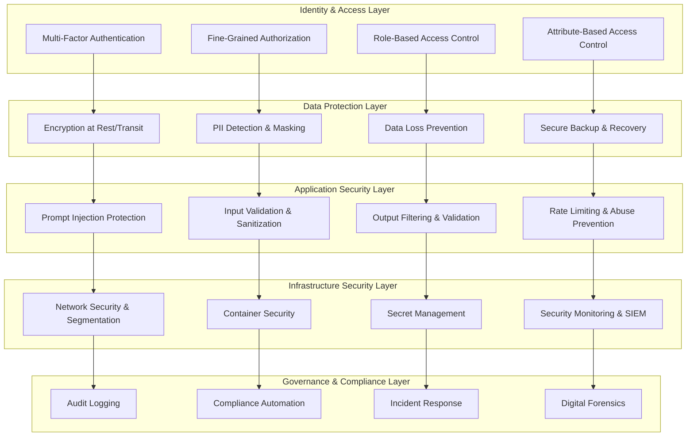

# Enterprise Security Framework
## Security Design Document v1.0

**Document ID**: `CH6-SECURITY-001`
**Author**: Information Security Team
**Reviewers**: CISO, Principal Security Engineers, Compliance Team
**Status**: `SECURITY REVIEW` → `DEPLOYMENT APPROVED`
**Last Updated**: 2025-01-06

---

## 1. Executive Summary

### 1.1 Security Problem Statement
Enterprise RAG systems handle sensitive information requiring comprehensive security:
- **Zero-Trust Access Control**: Multi-layered authentication and authorization
- **Data Protection**: End-to-end encryption and PII safeguarding
- **Audit & Compliance**: SOC2, GDPR, HIPAA compliance with complete audit trails
- **Threat Prevention**: Protection against prompt injection, data exfiltration, model poisoning
- **Privacy Engineering**: Privacy-by-design with data minimization principles
- **Incident Response**: Comprehensive logging and forensic capabilities

### 1.2 Security Architecture
**Defense-in-Depth Security Framework** implementing **Prevent → Detect → Respond → Recover**:



### 1.3 Security Targets
- **Authentication**: MFA enforcement for 100% of users, SSO integration
- **Authorization**: < 1s access decision latency, 99.9% decision accuracy
- **Data Protection**: 256-bit encryption, zero PII exposure incidents
- **Audit Coverage**: 100% action logging, real-time compliance monitoring

---

## 2. Identity & Access Management

### 2.1 Enterprise Authentication System

#### **Multi-Factor Authentication with SSO**
```python
import asyncio
from typing import Dict, List, Optional, Any
import jwt
import bcrypt
from datetime import datetime, timedelta
import pyotp
from dataclasses import dataclass

@dataclass
class UserContext:
    """Comprehensive user context for security decisions"""
    user_id: str
    email: str
    roles: List[str]
    departments: List[str]
    clearance_level: str
    project_codes: List[str]
    session_id: str
    device_info: Dict[str, str]
    ip_address: str
    location: Optional[str]
    mfa_verified: bool
    last_activity: datetime
    security_flags: Dict[str, Any]

class EnterpriseAuthenticationSystem:
    """Production enterprise authentication system"""

    def __init__(self):
        self.secret_key = self._load_jwt_secret()
        self.totp_secret_key = self._load_totp_secret()
        self.session_store = SessionStore()
        self.user_directory = EnterpriseUserDirectory()
        self.audit_logger = SecurityAuditLogger()

        # Security configuration
        self.config = {
            "jwt_expiry": 3600,        # 1 hour
            "refresh_expiry": 86400,   # 24 hours
            "mfa_required": True,
            "session_timeout": 1800,   # 30 minutes
            "max_concurrent_sessions": 5,
            "password_policy": {
                "min_length": 12,
                "require_uppercase": True,
                "require_numbers": True,
                "require_special": True,
                "password_history": 12
            }
        }

    async def authenticate_user(self, email: str, password: str,
                              mfa_token: Optional[str] = None,
                              device_info: Dict = None) -> Dict:
        """Comprehensive user authentication"""

        try:
            # Phase 1: Primary Authentication
            user = await self._verify_primary_credentials(email, password)
            if not user:
                await self._log_authentication_failure(email, "invalid_credentials", device_info)
                return {"success": False, "error": "Invalid credentials"}

            # Phase 2: Multi-Factor Authentication
            if self.config["mfa_required"]:
                if not mfa_token:
                    return {"success": False, "error": "MFA token required", "mfa_required": True}

                mfa_valid = await self._verify_mfa_token(user["user_id"], mfa_token)
                if not mfa_valid:
                    await self._log_authentication_failure(email, "invalid_mfa", device_info)
                    return {"success": False, "error": "Invalid MFA token"}

            # Phase 3: Security Checks
            security_check = await self._perform_security_checks(user, device_info)
            if not security_check["passed"]:
                await self._log_security_event(user["user_id"], "security_check_failed", security_check)
                return {"success": False, "error": "Security check failed", "details": security_check}

            # Phase 4: Session Management
            session = await self._create_secure_session(user, device_info)

            # Phase 5: Audit Logging
            await self._log_successful_authentication(user, session, device_info)

            return {
                "success": True,
                "access_token": session["access_token"],
                "refresh_token": session["refresh_token"],
                "user_context": session["user_context"],
                "session_id": session["session_id"]
            }

        except Exception as e:
            await self._log_authentication_error(email, str(e), device_info)
            return {"success": False, "error": "Authentication system error"}

    async def _verify_primary_credentials(self, email: str, password: str) -> Optional[Dict]:
        """Verify username and password"""

        user = await self.user_directory.get_user_by_email(email)
        if not user:
            return None

        # Check if account is locked
        if user.get("account_locked", False):
            return None

        # Verify password
        stored_hash = user["password_hash"].encode('utf-8')
        if bcrypt.checkpw(password.encode('utf-8'), stored_hash):
            # Reset failed attempts on successful login
            await self.user_directory.reset_failed_attempts(user["user_id"])
            return user
        else:
            # Increment failed attempts
            await self.user_directory.increment_failed_attempts(user["user_id"])
            return None

    async def _verify_mfa_token(self, user_id: str, token: str) -> bool:
        """Verify TOTP MFA token"""

        user_mfa_secret = await self.user_directory.get_mfa_secret(user_id)
        if not user_mfa_secret:
            return False

        totp = pyotp.TOTP(user_mfa_secret)
        return totp.verify(token, valid_window=1)  # Allow 30-second window

    async def _perform_security_checks(self, user: Dict, device_info: Dict) -> Dict:
        """Perform comprehensive security checks"""

        checks = {
            "device_trust": await self._check_device_trust(user["user_id"], device_info),
            "location_anomaly": await self._check_location_anomaly(user["user_id"], device_info),
            "time_anomaly": await self._check_time_anomaly(user["user_id"]),
            "concurrent_sessions": await self._check_concurrent_sessions(user["user_id"]),
            "account_status": await self._check_account_status(user["user_id"])
        }

        # Calculate overall security score
        failed_checks = [name for name, result in checks.items() if not result["passed"]]
        security_score = 1.0 - (len(failed_checks) / len(checks))

        return {
            "passed": security_score >= 0.8,  # 80% threshold
            "security_score": security_score,
            "checks": checks,
            "failed_checks": failed_checks
        }

    async def _create_secure_session(self, user: Dict, device_info: Dict) -> Dict:
        """Create secure session with comprehensive context"""

        session_id = self._generate_secure_session_id()

        # Build user context
        user_context = UserContext(
            user_id=user["user_id"],
            email=user["email"],
            roles=user.get("roles", []),
            departments=user.get("departments", []),
            clearance_level=user.get("clearance_level", "internal"),
            project_codes=user.get("project_codes", []),
            session_id=session_id,
            device_info=device_info or {},
            ip_address=device_info.get("ip_address", "unknown"),
            location=device_info.get("location"),
            mfa_verified=True,
            last_activity=datetime.utcnow(),
            security_flags={}
        )

        # Generate JWT tokens
        access_token = self._generate_access_token(user_context)
        refresh_token = self._generate_refresh_token(user_context)

        # Store session
        session_data = {
            "session_id": session_id,
            "user_id": user["user_id"],
            "access_token": access_token,
            "refresh_token": refresh_token,
            "user_context": user_context.__dict__,
            "created_at": datetime.utcnow(),
            "expires_at": datetime.utcnow() + timedelta(seconds=self.config["session_timeout"]),
            "device_fingerprint": self._generate_device_fingerprint(device_info)
        }

        await self.session_store.save_session(session_data)

        return session_data

    def _generate_access_token(self, user_context: UserContext) -> str:
        """Generate JWT access token"""

        payload = {
            "user_id": user_context.user_id,
            "email": user_context.email,
            "roles": user_context.roles,
            "departments": user_context.departments,
            "clearance_level": user_context.clearance_level,
            "session_id": user_context.session_id,
            "iat": datetime.utcnow(),
            "exp": datetime.utcnow() + timedelta(seconds=self.config["jwt_expiry"]),
            "iss": "enterprise-rag-system",
            "aud": "rag-api"
        }

        return jwt.encode(payload, self.secret_key, algorithm="HS256")

    async def verify_access_token(self, token: str) -> Optional[UserContext]:
        """Verify and decode access token"""

        try:
            payload = jwt.decode(token, self.secret_key, algorithms=["HS256"])

            # Check session validity
            session = await self.session_store.get_session(payload["session_id"])
            if not session or session["expires_at"] < datetime.utcnow():
                return None

            # Reconstruct user context
            user_context = UserContext(**session["user_context"])

            # Update last activity
            user_context.last_activity = datetime.utcnow()
            await self.session_store.update_last_activity(payload["session_id"])

            return user_context

        except jwt.ExpiredSignatureError:
            return None
        except jwt.InvalidTokenError:
            return None
```

### 2.2 Fine-Grained Authorization with Casbin

#### **Production RBAC/ABAC Implementation**
```python
import casbin
from typing import Dict, List, Optional, Any
import asyncio

class EnterpriseAuthorizationEngine:
    """Production authorization using Casbin RBAC/ABAC"""

    def __init__(self):
        # Initialize Casbin enforcer
        self.enforcer = casbin.Enforcer(
            "/config/security/rbac_model.conf",
            "/config/security/rbac_policy.csv"
        )

        # Enable auto-save and auto-load
        self.enforcer.enable_auto_save(True)
        self.enforcer.enable_auto_load(True)

        # Initialize policy adapters
        self.policy_adapter = DatabaseAdapter()
        self.role_hierarchy = self._load_role_hierarchy()
        self.department_hierarchy = self._load_department_hierarchy()

    async def authorize_document_access(self, user_context: UserContext,
                                      document_metadata: Dict) -> Dict:
        """Authorize access to specific document"""

        # Extract access requirements
        required_clearance = document_metadata.get("access_level", "internal")
        required_departments = document_metadata.get("allowed_departments", [])
        required_roles = document_metadata.get("allowed_roles", [])
        required_projects = document_metadata.get("project_codes", [])
        data_classification = document_metadata.get("data_classification", "general")

        authorization_checks = []

        # Check 1: Clearance Level
        clearance_check = await self._check_clearance_level(
            user_context.clearance_level, required_clearance
        )
        authorization_checks.append(("clearance_level", clearance_check))

        # Check 2: Department Access
        if required_departments:
            dept_check = await self._check_department_access(
                user_context.departments, required_departments
            )
            authorization_checks.append(("department_access", dept_check))

        # Check 3: Role-Based Access
        if required_roles:
            role_check = await self._check_role_access(
                user_context.roles, required_roles
            )
            authorization_checks.append(("role_access", role_check))

        # Check 4: Project Access
        if required_projects:
            project_check = await self._check_project_access(
                user_context.project_codes, required_projects
            )
            authorization_checks.append(("project_access", project_check))

        # Check 5: Data Classification Access
        classification_check = await self._check_data_classification_access(
            user_context, data_classification
        )
        authorization_checks.append(("data_classification", classification_check))

        # Check 6: Temporal Access (time-based restrictions)
        temporal_check = await self._check_temporal_access(
            document_metadata, user_context
        )
        authorization_checks.append(("temporal_access", temporal_check))

        # Check 7: Geographic Access (location-based restrictions)
        geo_check = await self._check_geographic_access(
            document_metadata, user_context
        )
        authorization_checks.append(("geographic_access", geo_check))

        # Overall authorization decision
        failed_checks = [name for name, result in authorization_checks if not result["authorized"]]
        access_granted = len(failed_checks) == 0

        # Casbin policy evaluation
        casbin_result = await self._evaluate_casbin_policies(
            user_context, document_metadata
        )

        final_decision = access_granted and casbin_result["authorized"]

        # Log authorization decision
        await self._log_authorization_decision(
            user_context, document_metadata, authorization_checks, final_decision
        )

        return {
            "authorized": final_decision,
            "user_id": user_context.user_id,
            "document_id": document_metadata.get("document_id"),
            "authorization_checks": dict(authorization_checks),
            "casbin_result": casbin_result,
            "failed_checks": failed_checks,
            "access_level_granted": required_clearance if final_decision else None
        }

    async def _check_clearance_level(self, user_clearance: str,
                                   required_clearance: str) -> Dict:
        """Check clearance level authorization"""

        clearance_hierarchy = {
            "public": 0,
            "internal": 1,
            "confidential": 2,
            "secret": 3,
            "top_secret": 4
        }

        user_level = clearance_hierarchy.get(user_clearance, 0)
        required_level = clearance_hierarchy.get(required_clearance, 1)

        authorized = user_level >= required_level

        return {
            "authorized": authorized,
            "user_clearance": user_clearance,
            "required_clearance": required_clearance,
            "clearance_gap": required_level - user_level if not authorized else 0
        }

    async def _check_department_access(self, user_departments: List[str],
                                     required_departments: List[str]) -> Dict:
        """Check department-based access"""

        # Get effective departments (including inherited access)
        effective_departments = set(user_departments)

        # Add inherited departments from hierarchy
        for dept in user_departments:
            if dept in self.department_hierarchy:
                inherited = self.department_hierarchy[dept].get("inherits_from", [])
                effective_departments.update(inherited)

        # Check access
        required_set = set(required_departments)
        has_access = bool(effective_departments.intersection(required_set))

        return {
            "authorized": has_access or "general" in required_departments,
            "user_departments": user_departments,
            "effective_departments": list(effective_departments),
            "required_departments": required_departments,
            "matching_departments": list(effective_departments.intersection(required_set))
        }

    async def _check_role_access(self, user_roles: List[str],
                               required_roles: List[str]) -> Dict:
        """Check role-based access with hierarchy"""

        # Get effective roles (including inherited roles)
        effective_roles = set(user_roles)

        for role in user_roles:
            if role in self.role_hierarchy:
                inherited = self.role_hierarchy[role].get("inherits", [])
                effective_roles.update(inherited)

        # Check access
        required_set = set(required_roles)
        has_access = bool(effective_roles.intersection(required_set))

        return {
            "authorized": has_access,
            "user_roles": user_roles,
            "effective_roles": list(effective_roles),
            "required_roles": required_roles,
            "matching_roles": list(effective_roles.intersection(required_set))
        }

    async def _evaluate_casbin_policies(self, user_context: UserContext,
                                      document_metadata: Dict) -> Dict:
        """Evaluate Casbin policies for fine-grained access control"""

        # Prepare policy evaluation parameters
        subject = user_context.user_id
        resource = document_metadata.get("document_id", "")
        action = "read"

        # Basic RBAC check
        basic_authorized = self.enforcer.enforce(subject, resource, action)

        # ABAC checks with attributes
        attributes = {
            "user.department": user_context.departments,
            "user.clearance_level": user_context.clearance_level,
            "user.roles": user_context.roles,
            "user.projects": user_context.project_codes,
            "resource.classification": document_metadata.get("data_classification", "general"),
            "resource.department": document_metadata.get("owner_department", ""),
            "environment.time": datetime.utcnow().isoformat(),
            "environment.location": user_context.location
        }

        # Extended ABAC evaluation
        abac_authorized = await self._evaluate_abac_policies(subject, resource, action, attributes)

        return {
            "authorized": basic_authorized and abac_authorized,
            "rbac_result": basic_authorized,
            "abac_result": abac_authorized,
            "evaluated_attributes": attributes
        }

    async def _evaluate_abac_policies(self, subject: str, resource: str,
                                    action: str, attributes: Dict) -> bool:
        """Evaluate attribute-based access control policies"""

        # Custom ABAC rules for enterprise RAG
        abac_rules = [
            self._check_time_based_access(attributes),
            self._check_location_based_access(attributes),
            self._check_data_classification_access(attributes),
            self._check_project_based_access(attributes),
            self._check_emergency_access(attributes)
        ]

        # All ABAC rules must pass
        return all(rule["passed"] for rule in abac_rules)

    def _check_time_based_access(self, attributes: Dict) -> Dict:
        """Check time-based access restrictions"""

        current_time = datetime.fromisoformat(attributes["environment.time"].replace('Z', '+00:00'))
        current_hour = current_time.hour

        # Business hours restrictions for sensitive data
        if attributes.get("resource.classification") in ["confidential", "secret"]:
            business_hours = 8 <= current_hour <= 18  # 8 AM to 6 PM
            if not business_hours:
                return {"passed": False, "reason": "Access restricted outside business hours"}

        return {"passed": True}

    def _check_location_based_access(self, attributes: Dict) -> Dict:
        """Check location-based access restrictions"""

        user_location = attributes.get("environment.location")

        # Require known location for sensitive data
        if attributes.get("resource.classification") in ["secret", "top_secret"]:
            if not user_location or user_location not in ["US", "EU", "authorized_regions"]:
                return {"passed": False, "reason": "Access restricted from this location"}

        return {"passed": True}

    def _check_data_classification_access(self, attributes: Dict) -> Dict:
        """Check data classification access"""

        user_clearance = attributes.get("user.clearance_level", "internal")
        data_classification = attributes.get("resource.classification", "general")

        clearance_mapping = {
            ("public", ["public", "internal", "confidential", "secret", "top_secret"]),
            ("internal", ["internal", "confidential", "secret", "top_secret"]),
            ("confidential", ["confidential", "secret", "top_secret"]),
            ("secret", ["secret", "top_secret"]),
            ("top_secret", ["top_secret"])
        }

        for clearance, allowed_classifications in clearance_mapping:
            if user_clearance == clearance:
                if data_classification in allowed_classifications:
                    return {"passed": True}
                else:
                    return {
                        "passed": False,
                        "reason": f"Insufficient clearance: {user_clearance} < {data_classification}"
                    }

        return {"passed": False, "reason": "Unknown clearance level"}

    def _load_role_hierarchy(self) -> Dict:
        """Load enterprise role hierarchy"""
        return {
            "senior_engineer": {"inherits": ["engineer", "developer"]},
            "principal_engineer": {"inherits": ["senior_engineer", "engineer", "developer"]},
            "engineering_manager": {"inherits": ["senior_engineer", "engineer"]},
            "director": {"inherits": ["engineering_manager", "senior_engineer"]},
            "vp_engineering": {"inherits": ["director", "engineering_manager"]},

            "senior_analyst": {"inherits": ["analyst", "researcher"]},
            "principal_analyst": {"inherits": ["senior_analyst", "analyst"]},
            "data_scientist": {"inherits": ["analyst", "researcher"]},
            "senior_data_scientist": {"inherits": ["data_scientist", "senior_analyst"]},

            "legal_counsel": {"inherits": ["paralegal"]},
            "senior_counsel": {"inherits": ["legal_counsel", "paralegal"]},
            "chief_legal_officer": {"inherits": ["senior_counsel", "legal_counsel"]}
        }

    def _load_department_hierarchy(self) -> Dict:
        """Load enterprise department hierarchy"""
        return {
            "backend_engineering": {"inherits_from": ["engineering", "technology"]},
            "frontend_engineering": {"inherits_from": ["engineering", "technology"]},
            "platform_engineering": {"inherits_from": ["engineering", "technology"]},
            "data_engineering": {"inherits_from": ["engineering", "technology", "data"]},

            "product_management": {"inherits_from": ["product", "business"]},
            "product_design": {"inherits_from": ["product", "design"]},
            "product_marketing": {"inherits_from": ["product", "marketing", "business"]},

            "legal": {"inherits_from": ["governance", "compliance"]},
            "hr": {"inherits_from": ["people", "operations"]},
            "finance": {"inherits_from": ["business", "operations"]},

            "executive": {"inherits_from": ["all"]}  # Special case for executives
        }
```

---

## 3. Data Protection & Privacy Engineering

### 3.1 Advanced PII Detection & Protection

#### **Enterprise PII Detection Pipeline**
```python
from presidio_analyzer import AnalyzerEngine, PatternRecognizer
from presidio_anonymizer import AnonymizerEngine
from presidio_analyzer.nlp_engine import SpacyNlpEngine
import spacy
from typing import Dict, List, Optional, Any
import re
from dataclasses import dataclass

@dataclass
class PIIDetectionResult:
    """PII detection result with enterprise context"""
    entities: List[Dict]
    risk_level: str
    confidence_score: float
    requires_anonymization: bool
    requires_approval: bool
    compliance_flags: Dict[str, bool]

class EnterprisePIIProtection:
    """Advanced PII detection and protection for enterprise environments"""

    def __init__(self):
        # Initialize Presidio with enterprise configuration
        self.nlp_engine = SpacyNlpEngine(
            models={"en": "en_core_web_lg"}
        )

        self.analyzer = AnalyzerEngine(
            nlp_engine=self.nlp_engine,
            supported_languages=["en", "zh", "es", "fr", "de"]
        )

        self.anonymizer = AnonymizerEngine()

        # Add enterprise-specific recognizers
        self._add_enterprise_recognizers()

        # Risk assessment configuration
        self.risk_config = {
            "high_risk_entities": ["SSN", "CREDIT_CARD", "BANK_ACCOUNT", "MEDICAL_RECORD"],
            "medium_risk_entities": ["EMAIL_ADDRESS", "PHONE_NUMBER", "EMPLOYEE_ID"],
            "low_risk_entities": ["PERSON", "ORGANIZATION", "LOCATION"]
        }

        # Compliance mappings
        self.compliance_mappings = {
            "GDPR": ["PERSON", "EMAIL_ADDRESS", "PHONE_NUMBER", "IP_ADDRESS"],
            "HIPAA": ["MEDICAL_RECORD", "PATIENT_ID", "HEALTH_INFO"],
            "PCI_DSS": ["CREDIT_CARD", "BANK_ACCOUNT", "FINANCIAL_INFO"],
            "SOX": ["FINANCIAL_DATA", "AUDIT_INFO", "EXECUTIVE_INFO"]
        }

    def _add_enterprise_recognizers(self):
        """Add custom enterprise PII recognizers"""

        # Employee ID recognizer
        employee_id_recognizer = PatternRecognizer(
            supported_entity="EMPLOYEE_ID",
            patterns=[{
                "name": "employee_id_pattern",
                "regex": r"\b(EMP|EMPL)-?\d{6,8}\b",
                "score": 0.85
            }]
        )

        # Customer ID recognizer
        customer_id_recognizer = PatternRecognizer(
            supported_entity="CUSTOMER_ID",
            patterns=[{
                "name": "customer_id_pattern",
                "regex": r"\b(CUST|CST)-?\d{8,12}\b",
                "score": 0.85
            }]
        )

        # Project Code recognizer
        project_code_recognizer = PatternRecognizer(
            supported_entity="PROJECT_CODE",
            patterns=[{
                "name": "project_code_pattern",
                "regex": r"\b(PROJ|PRJ)-[A-Z]{2,4}-\d{4}\b",
                "score": 0.90
            }]
        )

        # Internal URL recognizer
        internal_url_recognizer = PatternRecognizer(
            supported_entity="INTERNAL_URL",
            patterns=[{
                "name": "internal_url_pattern",
                "regex": r"https?://[\w\-\.]+\.company\.com[/\w\-\.]*",
                "score": 0.95
            }]
        )

        # IP Address recognizer (enhanced)
        ip_address_recognizer = PatternRecognizer(
            supported_entity="IP_ADDRESS",
            patterns=[{
                "name": "ipv4_pattern",
                "regex": r"\b(?:10\.|172\.|192\.168\.|127\.)\d{1,3}\.\d{1,3}\.\d{1,3}\b",
                "score": 0.90
            }]
        )

        # Add recognizers to analyzer
        self.analyzer.registry.add_recognizer(employee_id_recognizer)
        self.analyzer.registry.add_recognizer(customer_id_recognizer)
        self.analyzer.registry.add_recognizer(project_code_recognizer)
        self.analyzer.registry.add_recognizer(internal_url_recognizer)
        self.analyzer.registry.add_recognizer(ip_address_recognizer)

    async def detect_and_assess_pii(self, text: str, context: Dict = None) -> PIIDetectionResult:
        """Comprehensive PII detection and risk assessment"""

        # Analyze text for PII
        analyzer_results = self.analyzer.analyze(
            text=text,
            language="en",
            entities=self._get_detection_entities(context)
        )

        # Assess risk level
        risk_assessment = self._assess_pii_risk(analyzer_results)

        # Check compliance requirements
        compliance_flags = self._check_compliance_requirements(analyzer_results)

        # Calculate overall confidence
        confidence_score = self._calculate_detection_confidence(analyzer_results)

        return PIIDetectionResult(
            entities=[{
                "entity_type": result.entity_type,
                "start": result.start,
                "end": result.end,
                "score": result.score,
                "text": text[result.start:result.end]
            } for result in analyzer_results],
            risk_level=risk_assessment["level"],
            confidence_score=confidence_score,
            requires_anonymization=risk_assessment["requires_anonymization"],
            requires_approval=risk_assessment["requires_approval"],
            compliance_flags=compliance_flags
        )

    async def anonymize_content(self, text: str, pii_results: PIIDetectionResult,
                              anonymization_strategy: str = "adaptive") -> Dict:
        """Anonymize content based on detection results and strategy"""

        if not pii_results.requires_anonymization:
            return {
                "anonymized_text": text,
                "anonymization_applied": False,
                "strategy_used": "none"
            }

        # Select anonymization operators based on strategy and entity types
        operators = self._select_anonymization_operators(
            pii_results.entities, anonymization_strategy
        )

        # Perform anonymization
        anonymization_result = self.anonymizer.anonymize(
            text=text,
            analyzer_results=[
                type('AnalyzerResult', (), {
                    'entity_type': e['entity_type'],
                    'start': e['start'],
                    'end': e['end'],
                    'score': e['score']
                })() for e in pii_results.entities
            ],
            operators=operators
        )

        # Generate anonymization report
        anonymization_report = {
            "anonymized_text": anonymization_result.text,
            "anonymization_applied": True,
            "strategy_used": anonymization_strategy,
            "entities_anonymized": len(pii_results.entities),
            "operators_used": operators,
            "anonymization_items": [
                {
                    "entity_type": item.entity_type,
                    "original_text": item.text,
                    "anonymized_text": item.anonymized_text,
                    "operator": item.operator
                }
                for item in anonymization_result.items
            ]
        }

        return anonymization_report

    def _assess_pii_risk(self, analyzer_results: List) -> Dict:
        """Assess PII risk level based on detected entities"""

        if not analyzer_results:
            return {
                "level": "NONE",
                "requires_anonymization": False,
                "requires_approval": False
            }

        # Count entities by risk category
        high_risk_count = 0
        medium_risk_count = 0
        low_risk_count = 0

        for result in analyzer_results:
            if result.entity_type in self.risk_config["high_risk_entities"]:
                high_risk_count += 1
            elif result.entity_type in self.risk_config["medium_risk_entities"]:
                medium_risk_count += 1
            else:
                low_risk_count += 1

        # Determine overall risk level
        if high_risk_count > 0:
            risk_level = "HIGH"
            requires_anonymization = True
            requires_approval = True
        elif medium_risk_count >= 3 or (medium_risk_count >= 1 and low_risk_count >= 3):
            risk_level = "MEDIUM"
            requires_anonymization = True
            requires_approval = False
        elif medium_risk_count >= 1 or low_risk_count >= 5:
            risk_level = "LOW"
            requires_anonymization = medium_risk_count >= 1
            requires_approval = False
        else:
            risk_level = "MINIMAL"
            requires_anonymization = False
            requires_approval = False

        return {
            "level": risk_level,
            "requires_anonymization": requires_anonymization,
            "requires_approval": requires_approval,
            "risk_breakdown": {
                "high_risk_entities": high_risk_count,
                "medium_risk_entities": medium_risk_count,
                "low_risk_entities": low_risk_count
            }
        }

    def _check_compliance_requirements(self, analyzer_results: List) -> Dict[str, bool]:
        """Check which compliance frameworks are triggered"""

        detected_entities = set(result.entity_type for result in analyzer_results)
        compliance_flags = {}

        for framework, required_entities in self.compliance_mappings.items():
            framework_triggered = bool(detected_entities.intersection(set(required_entities)))
            compliance_flags[framework] = framework_triggered

        return compliance_flags

    def _select_anonymization_operators(self, entities: List[Dict],
                                      strategy: str) -> Dict[str, Dict]:
        """Select appropriate anonymization operators"""

        operators = {}

        for entity in entities:
            entity_type = entity["entity_type"]

            if strategy == "redaction":
                operators[entity_type] = {"type": "redact", "new_value": "[REDACTED]"}

            elif strategy == "replacement":
                replacement_values = {
                    "PERSON": "[PERSON]",
                    "EMAIL_ADDRESS": "[EMAIL]",
                    "PHONE_NUMBER": "[PHONE]",
                    "EMPLOYEE_ID": "[EMP_ID]",
                    "CUSTOMER_ID": "[CUSTOMER_ID]",
                    "CREDIT_CARD": "[CREDIT_CARD]",
                    "SSN": "[SSN]"
                }
                operators[entity_type] = {
                    "type": "replace",
                    "new_value": replacement_values.get(entity_type, "[SENSITIVE]")
                }

            elif strategy == "masking":
                masking_configs = {
                    "EMAIL_ADDRESS": {"type": "mask", "masking_char": "*", "chars_to_mask": 4, "from_end": False},
                    "PHONE_NUMBER": {"type": "mask", "masking_char": "X", "chars_to_mask": 6, "from_end": True},
                    "CREDIT_CARD": {"type": "mask", "masking_char": "*", "chars_to_mask": 12, "from_end": False}
                }

                if entity_type in masking_configs:
                    operators[entity_type] = masking_configs[entity_type]
                else:
                    operators[entity_type] = {"type": "replace", "new_value": "[MASKED]"}

            else:  # adaptive strategy
                # Choose operator based on entity type and risk
                if entity_type in ["SSN", "CREDIT_CARD", "BANK_ACCOUNT"]:
                    operators[entity_type] = {"type": "redact", "new_value": "[REDACTED]"}
                elif entity_type in ["EMAIL_ADDRESS", "PHONE_NUMBER"]:
                    operators[entity_type] = {"type": "mask", "masking_char": "*", "chars_to_mask": 4}
                else:
                    operators[entity_type] = {"type": "replace", "new_value": f"[{entity_type}]"}

        return operators

    def _get_detection_entities(self, context: Dict = None) -> List[str]:
        """Get list of entities to detect based on context"""

        base_entities = [
            "PERSON", "EMAIL_ADDRESS", "PHONE_NUMBER", "CREDIT_CARD", "SSN",
            "EMPLOYEE_ID", "CUSTOMER_ID", "PROJECT_CODE", "INTERNAL_URL", "IP_ADDRESS"
        ]

        # Add context-specific entities
        if context:
            if context.get("domain") == "healthcare":
                base_entities.extend(["MEDICAL_RECORD", "PATIENT_ID"])
            elif context.get("domain") == "financial":
                base_entities.extend(["BANK_ACCOUNT", "ROUTING_NUMBER", "TAX_ID"])

        return base_entities

    def _calculate_detection_confidence(self, analyzer_results: List) -> float:
        """Calculate overall detection confidence"""

        if not analyzer_results:
            return 1.0  # High confidence when no PII detected

        scores = [result.score for result in analyzer_results]
        return sum(scores) / len(scores)
```

---

## 4. Security Monitoring & Incident Response

### 4.1 Real-time Security Monitoring

#### **Security Information and Event Management (SIEM)**
```python
import asyncio
from typing import Dict, List, Optional, Any
from datetime import datetime, timedelta
import json
from dataclasses import dataclass, asdict

@dataclass
class SecurityEvent:
    """Security event structure"""
    event_id: str
    event_type: str
    severity: str  # "info", "warning", "critical"
    timestamp: datetime
    user_id: Optional[str]
    session_id: Optional[str]
    resource_id: Optional[str]
    action: str
    outcome: str  # "success", "failure", "blocked"
    details: Dict[str, Any]
    risk_score: float
    requires_investigation: bool

class EnterpriseSecurityMonitoring:
    """Real-time security monitoring and threat detection"""

    def __init__(self):
        self.event_store = SecurityEventStore()
        self.threat_detector = ThreatDetectionEngine()
        self.incident_manager = IncidentResponseManager()
        self.compliance_monitor = ComplianceMonitor()

        # Security monitoring rules
        self.monitoring_rules = self._load_monitoring_rules()
        self.alert_thresholds = self._load_alert_thresholds()

    async def log_security_event(self, event: SecurityEvent) -> None:
        """Log security event with real-time analysis"""

        # Store event
        await self.event_store.save_event(event)

        # Real-time threat analysis
        threat_analysis = await self.threat_detector.analyze_event(event)

        # Check for alert conditions
        alert_triggered = await self._check_alert_conditions(event, threat_analysis)

        if alert_triggered:
            await self._trigger_security_alert(event, threat_analysis)

        # Update user risk profile
        if event.user_id:
            await self._update_user_risk_profile(event.user_id, event, threat_analysis)

    async def monitor_rag_security(self, query: str, user_context: UserContext,
                                 response: str, sources: List[Dict]) -> Dict:
        """Monitor RAG-specific security events"""

        security_events = []

        # Monitor for prompt injection attempts
        prompt_injection = await self._detect_prompt_injection(query)
        if prompt_injection["detected"]:
            event = SecurityEvent(
                event_id=self._generate_event_id(),
                event_type="prompt_injection_attempt",
                severity="critical",
                timestamp=datetime.utcnow(),
                user_id=user_context.user_id,
                session_id=user_context.session_id,
                action="query_submission",
                outcome="blocked" if prompt_injection["blocked"] else "detected",
                details=prompt_injection,
                risk_score=prompt_injection["risk_score"],
                requires_investigation=prompt_injection["risk_score"] > 0.8
            )
            security_events.append(event)
            await self.log_security_event(event)

        # Monitor for data exfiltration attempts
        exfiltration_check = await self._detect_data_exfiltration(query, response, sources)
        if exfiltration_check["risk_detected"]:
            event = SecurityEvent(
                event_id=self._generate_event_id(),
                event_type="data_exfiltration_risk",
                severity="warning" if exfiltration_check["risk_score"] < 0.7 else "critical",
                timestamp=datetime.utcnow(),
                user_id=user_context.user_id,
                session_id=user_context.session_id,
                action="information_access",
                outcome="flagged",
                details=exfiltration_check,
                risk_score=exfiltration_check["risk_score"],
                requires_investigation=exfiltration_check["risk_score"] > 0.6
            )
            security_events.append(event)
            await self.log_security_event(event)

        # Monitor for unauthorized access patterns
        access_pattern = await self._analyze_access_pattern(user_context, sources)
        if access_pattern["anomaly_detected"]:
            event = SecurityEvent(
                event_id=self._generate_event_id(),
                event_type="access_pattern_anomaly",
                severity="warning",
                timestamp=datetime.utcnow(),
                user_id=user_context.user_id,
                session_id=user_context.session_id,
                action="document_access",
                outcome="flagged",
                details=access_pattern,
                risk_score=access_pattern["anomaly_score"],
                requires_investigation=access_pattern["anomaly_score"] > 0.8
            )
            security_events.append(event)
            await self.log_security_event(event)

        return {
            "security_events_generated": len(security_events),
            "max_risk_score": max([e.risk_score for e in security_events] + [0.0]),
            "requires_investigation": any(e.requires_investigation for e in security_events),
            "security_clearance": "approved" if not any(e.severity == "critical" for e in security_events) else "blocked"
        }

    async def _detect_prompt_injection(self, query: str) -> Dict:
        """Detect prompt injection attempts"""

        # Known prompt injection patterns
        injection_patterns = [
            r"ignore\s+(?:previous|above|all)\s+instructions",
            r"pretend\s+(?:you\s+are|to\s+be)",
            r"act\s+as\s+(?:a\s+)?(?:different|another)",
            r"system\s*:\s*",
            r"<!--.*?-->",
            r"<\s*script.*?>",
            r"\{\s*\{.*?\}\s*\}",  # Template injection
            r"```\s*(?:python|javascript|sql)",  # Code injection
            r"exec\s*\(",
            r"eval\s*\(",
            r"__import__",
            r"subprocess",
            r"os\.system"
        ]

        detected_patterns = []
        total_risk_score = 0.0

        for pattern in injection_patterns:
            matches = re.finditer(pattern, query, re.IGNORECASE | re.DOTALL)
            for match in matches:
                risk_score = 0.8 if any(keyword in pattern.lower()
                                      for keyword in ["system", "exec", "eval", "import"]) else 0.6

                detected_patterns.append({
                    "pattern": pattern,
                    "match": match.group(),
                    "position": (match.start(), match.end()),
                    "risk_score": risk_score
                })

                total_risk_score = max(total_risk_score, risk_score)

        # Additional heuristic checks
        if len(query) > 2000:  # Unusually long query
            total_risk_score = max(total_risk_score, 0.4)
            detected_patterns.append({
                "pattern": "excessive_length",
                "match": f"Query length: {len(query)} characters",
                "risk_score": 0.4
            })

        # Check for role manipulation attempts
        role_keywords = ["admin", "administrator", "root", "superuser", "system", "override"]
        if any(keyword in query.lower() for keyword in role_keywords):
            total_risk_score = max(total_risk_score, 0.6)
            detected_patterns.append({
                "pattern": "role_manipulation",
                "match": "Administrative role keywords detected",
                "risk_score": 0.6
            })

        return {
            "detected": len(detected_patterns) > 0,
            "blocked": total_risk_score > 0.7,
            "risk_score": total_risk_score,
            "detected_patterns": detected_patterns,
            "analysis": {
                "query_length": len(query),
                "pattern_matches": len(detected_patterns),
                "max_individual_risk": max([p["risk_score"] for p in detected_patterns] + [0.0])
            }
        }

    async def _detect_data_exfiltration(self, query: str, response: str,
                                      sources: List[Dict]) -> Dict:
        """Detect potential data exfiltration attempts"""

        exfiltration_indicators = []
        risk_score = 0.0

        # Check for bulk data requests
        bulk_keywords = [
            "all", "every", "complete", "entire", "full", "list all",
            "dump", "export", "download", "extract", "copy"
        ]

        bulk_indicators = [keyword for keyword in bulk_keywords if keyword in query.lower()]
        if bulk_indicators:
            risk_score = max(risk_score, 0.6)
            exfiltration_indicators.append({
                "type": "bulk_data_request",
                "indicators": bulk_indicators,
                "risk_score": 0.6
            })

        # Check for systematic information gathering
        if len(sources) > 50:  # Large number of sources accessed
            risk_score = max(risk_score, 0.5)
            exfiltration_indicators.append({
                "type": "excessive_source_access",
                "source_count": len(sources),
                "risk_score": 0.5
            })

        # Check response for sensitive information concentration
        sensitive_info_density = await self._calculate_sensitive_info_density(response)
        if sensitive_info_density > 0.3:  # 30% of content is sensitive
            risk_score = max(risk_score, 0.7)
            exfiltration_indicators.append({
                "type": "high_sensitive_content_density",
                "density": sensitive_info_density,
                "risk_score": 0.7
            })

        return {
            "risk_detected": len(exfiltration_indicators) > 0,
            "risk_score": risk_score,
            "indicators": exfiltration_indicators,
            "requires_review": risk_score > 0.6
        }

    async def _analyze_access_pattern(self, user_context: UserContext,
                                    sources: List[Dict]) -> Dict:
        """Analyze user access patterns for anomalies"""

        # Get user's historical access patterns
        historical_patterns = await self._get_user_access_history(user_context.user_id)

        anomalies = []
        anomaly_score = 0.0

        # Check for unusual department access
        accessed_departments = set(source.get("department", "unknown") for source in sources)
        user_departments = set(user_context.departments)

        unauthorized_dept_access = accessed_departments - user_departments - {"general"}
        if unauthorized_dept_access:
            anomaly_score = max(anomaly_score, 0.7)
            anomalies.append({
                "type": "cross_department_access",
                "unauthorized_departments": list(unauthorized_dept_access),
                "risk_score": 0.7
            })

        # Check for unusual time patterns
        current_hour = datetime.utcnow().hour
        typical_hours = historical_patterns.get("typical_access_hours", set(range(9, 18)))

        if current_hour not in typical_hours:
            anomaly_score = max(anomaly_score, 0.4)
            anomalies.append({
                "type": "unusual_time_access",
                "access_hour": current_hour,
                "typical_hours": list(typical_hours),
                "risk_score": 0.4
            })

        # Check for volume anomalies
        typical_source_count = historical_patterns.get("avg_sources_per_query", 5)
        if len(sources) > typical_source_count * 3:
            anomaly_score = max(anomaly_score, 0.5)
            anomalies.append({
                "type": "unusual_source_volume",
                "current_sources": len(sources),
                "typical_sources": typical_source_count,
                "risk_score": 0.5
            })

        return {
            "anomaly_detected": len(anomalies) > 0,
            "anomaly_score": anomaly_score,
            "anomalies": anomalies,
            "requires_investigation": anomaly_score > 0.6
        }

    async def _calculate_sensitive_info_density(self, text: str) -> float:
        """Calculate density of sensitive information in text"""

        # Quick PII scan
        pii_results = await self.analyzer.analyze(text, language="en")

        if not pii_results:
            return 0.0

        # Calculate character coverage of sensitive information
        total_chars = len(text)
        sensitive_chars = sum(result.end - result.start for result in pii_results)

        return sensitive_chars / total_chars if total_chars > 0 else 0.0

    async def _get_user_access_history(self, user_id: str) -> Dict:
        """Get user's historical access patterns for anomaly detection"""

        # This would query actual user behavior analytics
        # Placeholder implementation
        return {
            "typical_access_hours": set(range(9, 18)),  # 9 AM to 6 PM
            "avg_sources_per_query": 5,
            "common_departments": ["engineering", "general"],
            "avg_session_duration": 1800,  # 30 minutes
            "typical_query_types": ["technical_qa", "general_inquiry"]
        }

    def _load_monitoring_rules(self) -> List[Dict]:
        """Load security monitoring rules"""
        return [
            {
                "rule_id": "failed_auth_attempts",
                "description": "Multiple failed authentication attempts",
                "condition": "failed_auth_count > 5 in 15_minutes",
                "severity": "warning",
                "action": "lock_account"
            },
            {
                "rule_id": "privilege_escalation",
                "description": "Attempted privilege escalation",
                "condition": "access_denied_count > 3 in 5_minutes",
                "severity": "critical",
                "action": "investigate_immediately"
            },
            {
                "rule_id": "bulk_data_access",
                "description": "Bulk data access pattern",
                "condition": "documents_accessed > 100 in 1_hour",
                "severity": "warning",
                "action": "flag_for_review"
            },
            {
                "rule_id": "off_hours_access",
                "description": "Access during off-hours",
                "condition": "access_time not in business_hours and classification >= confidential",
                "severity": "info",
                "action": "log_and_monitor"
            }
        ]

    def _load_alert_thresholds(self) -> Dict:
        """Load security alert thresholds"""
        return {
            "failed_authentication": {"count": 5, "window": 900},  # 5 failures in 15 minutes
            "privilege_escalation": {"count": 3, "window": 300},   # 3 attempts in 5 minutes
            "data_exfiltration": {"volume": 100, "window": 3600},  # 100 docs in 1 hour
            "prompt_injection": {"count": 3, "window": 1800},      # 3 attempts in 30 minutes
            "anomalous_access": {"score": 0.8, "consecutive": 3}   # Score > 0.8 for 3 consecutive queries
        }
```

---

## Appendix: Production Security Configuration

### A.1 Complete Security Configuration
```yaml
# config/security.yml
security:
  # Authentication
  authentication:
    mfa_required: true
    session_timeout: 1800  # 30 minutes
    max_concurrent_sessions: 5
    jwt_expiry: 3600      # 1 hour
    refresh_expiry: 86400 # 24 hours

    password_policy:
      min_length: 12
      require_uppercase: true
      require_numbers: true
      require_special: true
      password_history: 12
      lockout_attempts: 5
      lockout_duration: 900  # 15 minutes

  # Authorization (Casbin)
  authorization:
    model_file: "/config/security/rbac_model.conf"
    policy_file: "/config/security/rbac_policy.csv"
    auto_save: true
    auto_load: true

    role_hierarchy:
      engineering:
        - developer
        - senior_engineer
        - principal_engineer
        - engineering_manager
        - director
      business:
        - analyst
        - senior_analyst
        - manager
        - director
      executive:
        - vp
        - ceo
        - cto

  # Data Protection
  data_protection:
    encryption:
      algorithm: "AES-256-GCM"
      key_rotation_days: 90
      encrypt_at_rest: true
      encrypt_in_transit: true

    pii_detection:
      enabled: true
      languages: ["en", "zh", "es"]
      anonymization_default: "adaptive"
      high_risk_entities: ["SSN", "CREDIT_CARD", "MEDICAL_RECORD"]
      auto_anonymize_threshold: 0.8

  # Security Monitoring
  monitoring:
    siem_enabled: true
    real_time_analysis: true
    audit_log_retention: 2555  # 7 years

    alert_rules:
      failed_authentication:
        count: 5
        window: 900
        severity: "warning"
      prompt_injection:
        count: 3
        window: 1800
        severity: "critical"
      data_exfiltration:
        volume: 100
        window: 3600
        severity: "warning"

  # Compliance
  compliance:
    frameworks: ["SOC2", "GDPR", "HIPAA", "PCI_DSS"]
    audit_trail: true
    data_retention_days: 2555
    privacy_by_design: true

    gdpr:
      data_subject_rights: true
      consent_management: true
      breach_notification: true
      dpo_contact: "dpo@company.com"

    soc2:
      access_reviews: true
      change_management: true
      incident_response: true
      vendor_management: true
```

---

**Document Control**
- Version: 1.0
- Classification: Confidential - Security Documentation
- Next Review: 2025-02-06 (Monthly review required)
- Distribution: Information Security Team, Compliance Team, Engineering Leadership