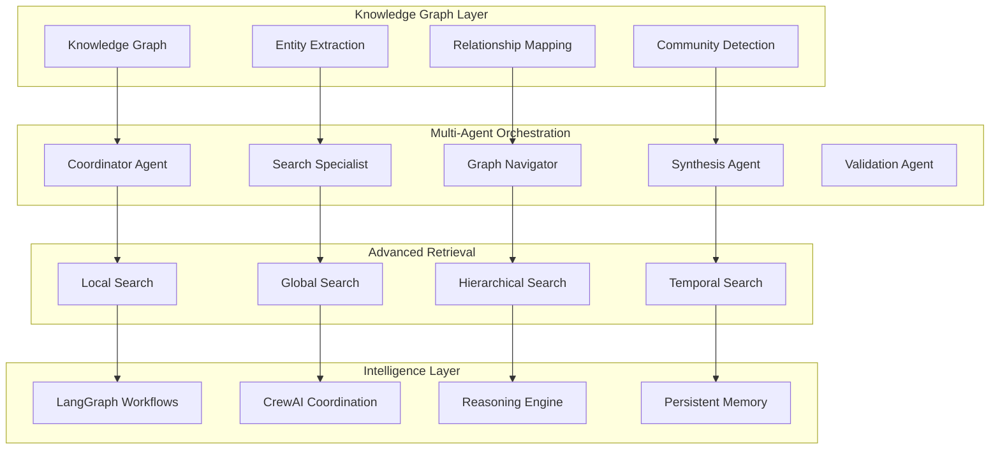

# GraphRAG and Multi-Agent Systems
## Advanced Architecture Design Document v1.0

**Document ID**: `CH7-ADVANCED-001`
**Author**: AI Research Team
**Reviewers**: Principal Engineers, Research Directors
**Status**: `RESEARCH REVIEW` → `PRODUCTION PROTOTYPE`
**Last Updated**: 2025-01-06

---

## 1. Executive Summary

### 1.1 Problem Statement
Traditional RAG systems face limitations when dealing with:
- **Complex Relationship Queries**: Understanding connections across multiple documents
- **Global Knowledge Synthesis**: Answering questions requiring holistic understanding
- **Multi-hop Reasoning**: Queries requiring inference chains across disparate information
- **Hierarchical Information**: Understanding organizational structures and taxonomies
- **Cross-domain Integration**: Synthesizing knowledge from multiple specialized domains

### 1.2 Solution Architecture
**Advanced Multi-Modal RAG System** implementing **Graph-Enhanced + Agent-Orchestrated** intelligence:



### 1.3 Performance Targets
- **Complex Query Resolution**: 85% accuracy for multi-hop reasoning
- **Graph Traversal Efficiency**: < 2s for 3-hop queries across 1M+ nodes
- **Agent Coordination**: < 5s for multi-agent workflow execution
- **Knowledge Synthesis**: 90% faithfulness for cross-domain integration

---

## 2. GraphRAG Implementation

### 2.1 Microsoft GraphRAG Integration

#### **Production GraphRAG Engine**
```python
import asyncio
from typing import Dict, List, Optional, Tuple, Any
import networkx as nx
import numpy as np
from dataclasses import dataclass
import pandas as pd

@dataclass
class GraphNode:
    """Knowledge graph node representation"""
    id: str
    type: str  # "entity", "concept", "document", "chunk"
    content: str
    metadata: Dict[str, Any]
    embeddings: Optional[np.ndarray] = None
    community_id: Optional[str] = None

@dataclass
class GraphEdge:
    """Knowledge graph edge representation"""
    source_id: str
    target_id: str
    relationship_type: str
    weight: float
    confidence: float
    metadata: Dict[str, Any]

class EnterpriseGraphRAG:
    """Production GraphRAG implementation with Microsoft GraphRAG integration"""

    def __init__(self):
        self.graph = nx.MultiDiGraph()
        self.entity_extractor = EntityExtractionPipeline()
        self.relation_extractor = RelationExtractionPipeline()
        self.community_detector = CommunityDetectionEngine()
        self.graph_embedder = GraphEmbeddingEngine()

        # Microsoft GraphRAG components
        self.graphrag_indexer = self._initialize_graphrag_indexer()
        self.graphrag_query_engine = self._initialize_graphrag_query_engine()

    async def build_knowledge_graph(self, documents: List[Dict]) -> Dict:
        """Build comprehensive knowledge graph from documents"""

        # Phase 1: Entity and Relation Extraction
        extraction_results = await self._extract_entities_and_relations(documents)

        # Phase 2: Graph Construction
        graph_stats = await self._construct_graph(extraction_results)

        # Phase 3: Community Detection
        communities = await self._detect_communities()

        # Phase 4: Hierarchical Summarization
        hierarchical_summaries = await self._create_hierarchical_summaries(communities)

        # Phase 5: Graph Embedding
        embeddings = await self._generate_graph_embeddings()

        # Phase 6: Microsoft GraphRAG Integration
        graphrag_index = await self._build_graphrag_index(documents)

        return {
            "graph_stats": graph_stats,
            "communities": communities,
            "hierarchical_summaries": hierarchical_summaries,
            "embeddings": embeddings,
            "graphrag_index": graphrag_index
        }

    async def query_graph(self, query: str, query_type: str = "auto") -> Dict:
        """Execute graph-based query with multiple strategies"""

        # Determine optimal query strategy
        if query_type == "auto":
            query_type = await self._classify_graph_query_type(query)

        # Execute based on query type
        if query_type == "local":
            results = await self._local_graph_search(query)
        elif query_type == "global":
            results = await self._global_graph_search(query)
        elif query_type == "hierarchical":
            results = await self._hierarchical_graph_search(query)
        elif query_type == "temporal":
            results = await self._temporal_graph_search(query)
        else:
            # Hybrid approach
            results = await self._hybrid_graph_search(query)

        # Microsoft GraphRAG integration
        graphrag_results = await self._query_with_graphrag(query, query_type)

        # Combine and rank results
        combined_results = await self._combine_graph_results(results, graphrag_results)

        return combined_results

    async def _extract_entities_and_relations(self, documents: List[Dict]) -> Dict:
        """Extract entities and relations from documents"""

        all_entities = []
        all_relations = []

        # Process documents in batches
        batch_size = 10
        for i in range(0, len(documents), batch_size):
            batch = documents[i:i + batch_size]

            # Extract entities and relations in parallel
            entity_tasks = [self.entity_extractor.extract(doc["content"]) for doc in batch]
            relation_tasks = [self.relation_extractor.extract(doc["content"]) for doc in batch]

            batch_entities = await asyncio.gather(*entity_tasks)
            batch_relations = await asyncio.gather(*relation_tasks)

            # Add document context
            for j, doc in enumerate(batch):
                doc_entities = batch_entities[j]
                doc_relations = batch_relations[j]

                # Enrich with document metadata
                for entity in doc_entities:
                    entity["source_document"] = doc["id"]
                    entity["document_type"] = doc.get("type", "unknown")

                for relation in doc_relations:
                    relation["source_document"] = doc["id"]
                    relation["document_type"] = doc.get("type", "unknown")

                all_entities.extend(doc_entities)
                all_relations.extend(doc_relations)

        # Deduplicate and merge entities
        merged_entities = await self._merge_duplicate_entities(all_entities)

        # Validate and score relations
        validated_relations = await self._validate_relations(all_relations, merged_entities)

        return {
            "entities": merged_entities,
            "relations": validated_relations,
            "extraction_stats": {
                "total_entities": len(merged_entities),
                "total_relations": len(validated_relations),
                "documents_processed": len(documents)
            }
        }

    async def _construct_graph(self, extraction_results: Dict) -> Dict:
        """Construct NetworkX graph from extracted entities and relations"""

        entities = extraction_results["entities"]
        relations = extraction_results["relations"]

        # Add entity nodes
        for entity in entities:
            node = GraphNode(
                id=entity["id"],
                type="entity",
                content=entity["text"],
                metadata={
                    "entity_type": entity["type"],
                    "confidence": entity["confidence"],
                    "source_documents": entity.get("source_documents", []),
                    "aliases": entity.get("aliases", [])
                }
            )

            self.graph.add_node(
                node.id,
                type=node.type,
                content=node.content,
                **node.metadata
            )

        # Add relation edges
        for relation in relations:
            if relation["source_entity"] in self.graph and relation["target_entity"] in self.graph:
                edge = GraphEdge(
                    source_id=relation["source_entity"],
                    target_id=relation["target_entity"],
                    relationship_type=relation["type"],
                    weight=relation.get("weight", 1.0),
                    confidence=relation["confidence"],
                    metadata={
                        "source_documents": relation.get("source_documents", []),
                        "evidence": relation.get("evidence", "")
                    }
                )

                self.graph.add_edge(
                    edge.source_id,
                    edge.target_id,
                    key=edge.relationship_type,
                    weight=edge.weight,
                    confidence=edge.confidence,
                    **edge.metadata
                )

        # Calculate graph statistics
        stats = {
            "nodes": self.graph.number_of_nodes(),
            "edges": self.graph.number_of_edges(),
            "density": nx.density(self.graph),
            "average_clustering": nx.average_clustering(self.graph.to_undirected()),
            "connected_components": nx.number_connected_components(self.graph.to_undirected())
        }

        return stats

    async def _detect_communities(self) -> Dict:
        """Detect communities using multiple algorithms"""

        undirected_graph = self.graph.to_undirected()

        # Method 1: Louvain Algorithm
        louvain_communities = await self.community_detector.louvain_detection(undirected_graph)

        # Method 2: Leiden Algorithm (more accurate)
        leiden_communities = await self.community_detector.leiden_detection(undirected_graph)

        # Method 3: Hierarchical clustering based on embeddings
        embedding_communities = await self.community_detector.embedding_based_clustering(
            undirected_graph
        )

        # Select best community detection result
        best_communities = await self._select_best_communities([
            louvain_communities,
            leiden_communities,
            embedding_communities
        ])

        # Assign community IDs to nodes
        for node_id, community_id in best_communities["assignments"].items():
            if node_id in self.graph:
                self.graph.nodes[node_id]["community_id"] = community_id

        return best_communities

    async def _create_hierarchical_summaries(self, communities: Dict) -> Dict:
        """Create hierarchical summaries for communities"""

        hierarchical_summaries = {}

        for community_id, node_ids in communities["communities"].items():
            # Get community subgraph
            community_subgraph = self.graph.subgraph(node_ids)

            # Extract community content
            community_content = []
            for node_id in node_ids:
                node_content = self.graph.nodes[node_id]["content"]
                community_content.append(node_content)

            # Generate multi-level summaries
            level_1_summary = await self._generate_summary(
                community_content,
                summary_type="detailed",
                max_length=500
            )

            level_2_summary = await self._generate_summary(
                [level_1_summary],
                summary_type="abstract",
                max_length=200
            )

            level_3_summary = await self._generate_summary(
                [level_2_summary],
                summary_type="key_points",
                max_length=100
            )

            hierarchical_summaries[community_id] = {
                "level_1": level_1_summary,
                "level_2": level_2_summary,
                "level_3": level_3_summary,
                "node_count": len(node_ids),
                "central_entities": await self._find_central_entities(community_subgraph),
                "key_relationships": await self._find_key_relationships(community_subgraph)
            }

        return hierarchical_summaries

    async def _local_graph_search(self, query: str) -> Dict:
        """Local graph search for specific entity-related queries"""

        # Extract entities from query
        query_entities = await self.entity_extractor.extract(query)

        if not query_entities:
            return {"results": [], "method": "local_search", "entities_found": 0}

        # Find relevant nodes in graph
        relevant_nodes = []
        for entity in query_entities:
            # Direct entity matches
            entity_nodes = [
                node_id for node_id, data in self.graph.nodes(data=True)
                if entity["text"].lower() in data["content"].lower()
            ]
            relevant_nodes.extend(entity_nodes)

        # Expand to immediate neighbors
        expanded_nodes = set(relevant_nodes)
        for node in relevant_nodes:
            neighbors = list(self.graph.neighbors(node))
            expanded_nodes.update(neighbors[:5])  # Limit to top 5 neighbors

        # Extract subgraph
        subgraph = self.graph.subgraph(expanded_nodes)

        # Rank nodes by relevance
        ranked_nodes = await self._rank_nodes_by_relevance(
            subgraph, query, query_entities
        )

        # Generate contextual answer
        context = await self._extract_graph_context(subgraph, ranked_nodes[:10])
        answer = await self._generate_graph_answer(query, context, "local")

        return {
            "answer": answer,
            "results": ranked_nodes[:20],
            "method": "local_search",
            "entities_found": len(query_entities),
            "subgraph_size": len(expanded_nodes),
            "context": context
        }

    async def _global_graph_search(self, query: str) -> Dict:
        """Global graph search using community summaries"""

        # Analyze query for global concepts
        global_concepts = await self._extract_global_concepts(query)

        # Search across community summaries
        relevant_communities = []
        for community_id, summaries in self.hierarchical_summaries.items():
            # Check relevance against all summary levels
            relevance_scores = []
            for level, summary in summaries.items():
                if level.startswith("level_"):
                    score = await self._calculate_text_relevance(query, summary)
                    relevance_scores.append(score)

            max_relevance = max(relevance_scores) if relevance_scores else 0
            if max_relevance > 0.3:
                relevant_communities.append({
                    "community_id": community_id,
                    "relevance": max_relevance,
                    "summaries": summaries
                })

        # Rank communities by relevance
        relevant_communities.sort(key=lambda x: x["relevance"], reverse=True)

        # Synthesize global answer
        global_context = []
        for community in relevant_communities[:5]:  # Top 5 communities
            global_context.append({
                "community_id": community["community_id"],
                "summary": community["summaries"]["level_2"],
                "relevance": community["relevance"]
            })

        answer = await self._generate_graph_answer(query, global_context, "global")

        return {
            "answer": answer,
            "results": relevant_communities[:10],
            "method": "global_search",
            "communities_analyzed": len(self.hierarchical_summaries),
            "relevant_communities": len(relevant_communities),
            "context": global_context
        }

    async def _hierarchical_graph_search(self, query: str) -> Dict:
        """Hierarchical search from general to specific"""

        # Start with global search
        global_results = await self._global_graph_search(query)

        # Identify most relevant communities
        top_communities = global_results["results"][:3]

        # Drill down into specific communities
        detailed_results = []
        for community in top_communities:
            community_id = community["community_id"]

            # Get community nodes
            community_nodes = [
                node_id for node_id, data in self.graph.nodes(data=True)
                if data.get("community_id") == community_id
            ]

            # Perform local search within community
            community_subgraph = self.graph.subgraph(community_nodes)
            local_results = await self._search_within_subgraph(
                community_subgraph, query
            )

            detailed_results.append({
                "community_id": community_id,
                "global_relevance": community["relevance"],
                "local_results": local_results,
                "node_count": len(community_nodes)
            })

        # Synthesize hierarchical answer
        hierarchical_context = {
            "global_context": global_results["context"],
            "detailed_context": detailed_results
        }

        answer = await self._generate_graph_answer(
            query, hierarchical_context, "hierarchical"
        )

        return {
            "answer": answer,
            "results": detailed_results,
            "method": "hierarchical_search",
            "global_communities": len(top_communities),
            "total_nodes_analyzed": sum(r["node_count"] for r in detailed_results),
            "context": hierarchical_context
        }

    def _initialize_graphrag_indexer(self):
        """Initialize Microsoft GraphRAG indexer"""
        # This would integrate with the actual Microsoft GraphRAG library
        # For now, we'll create a placeholder
        class GraphRAGIndexer:
            def __init__(self):
                self.index = {}

            async def build_index(self, documents):
                # Placeholder for GraphRAG indexing
                return {"indexed_documents": len(documents)}

        return GraphRAGIndexer()

    def _initialize_graphrag_query_engine(self):
        """Initialize Microsoft GraphRAG query engine"""
        class GraphRAGQueryEngine:
            def __init__(self):
                pass

            async def query(self, query, query_type):
                # Placeholder for GraphRAG querying
                return {
                    "answer": f"GraphRAG response for: {query}",
                    "sources": [],
                    "method": f"graphrag_{query_type}"
                }

        return GraphRAGQueryEngine()

    async def _query_with_graphrag(self, query: str, query_type: str) -> Dict:
        """Query using Microsoft GraphRAG"""
        return await self.graphrag_query_engine.query(query, query_type)

    async def _combine_graph_results(self, graph_results: Dict,
                                   graphrag_results: Dict) -> Dict:
        """Combine results from custom graph and Microsoft GraphRAG"""

        # Merge and rank results
        combined_answer = await self._merge_answers(
            graph_results["answer"],
            graphrag_results["answer"]
        )

        return {
            "answer": combined_answer,
            "graph_results": graph_results,
            "graphrag_results": graphrag_results,
            "method": "hybrid_graph",
            "confidence": await self._calculate_combined_confidence(
                graph_results, graphrag_results
            )
        }
```

### 2.2 Advanced Graph Analytics

#### **Graph Intelligence Engine**
```python
import community
from sklearn.cluster import SpectralClustering
from networkx.algorithms import centrality
import torch
from torch_geometric.nn import GCNConv, global_mean_pool

class GraphIntelligenceEngine:
    """Advanced graph analytics and intelligence"""

    def __init__(self):
        self.centrality_cache = {}
        self.embedding_model = self._initialize_graph_embedding_model()
        self.temporal_analyzer = TemporalGraphAnalyzer()

    async def analyze_graph_structure(self, graph: nx.Graph) -> Dict:
        """Comprehensive graph structure analysis"""

        analysis = {}

        # Basic metrics
        analysis["basic_metrics"] = {
            "nodes": graph.number_of_nodes(),
            "edges": graph.number_of_edges(),
            "density": nx.density(graph),
            "is_connected": nx.is_connected(graph),
            "diameter": nx.diameter(graph) if nx.is_connected(graph) else float('inf')
        }

        # Centrality measures
        analysis["centrality"] = await self._calculate_centrality_measures(graph)

        # Community structure
        analysis["communities"] = await self._analyze_community_structure(graph)

        # Path analysis
        analysis["paths"] = await self._analyze_path_structure(graph)

        # Structural patterns
        analysis["patterns"] = await self._detect_structural_patterns(graph)

        return analysis

    async def _calculate_centrality_measures(self, graph: nx.Graph) -> Dict:
        """Calculate various centrality measures"""

        centrality_measures = {}

        # Degree centrality
        centrality_measures["degree"] = centrality.degree_centrality(graph)

        # Betweenness centrality
        centrality_measures["betweenness"] = centrality.betweenness_centrality(
            graph, k=min(1000, graph.number_of_nodes())  # Sample for large graphs
        )

        # Closeness centrality
        centrality_measures["closeness"] = centrality.closeness_centrality(graph)

        # Eigenvector centrality
        try:
            centrality_measures["eigenvector"] = centrality.eigenvector_centrality(
                graph, max_iter=1000
            )
        except Exception:
            centrality_measures["eigenvector"] = {}

        # PageRank
        centrality_measures["pagerank"] = nx.pagerank(graph)

        # Identify top nodes for each measure
        top_nodes = {}
        for measure, values in centrality_measures.items():
            sorted_nodes = sorted(values.items(), key=lambda x: x[1], reverse=True)
            top_nodes[measure] = sorted_nodes[:10]

        return {
            "measures": centrality_measures,
            "top_nodes": top_nodes
        }

    async def _analyze_community_structure(self, graph: nx.Graph) -> Dict:
        """Analyze community structure using multiple algorithms"""

        # Convert to undirected for community detection
        if graph.is_directed():
            undirected_graph = graph.to_undirected()
        else:
            undirected_graph = graph

        communities_analysis = {}

        # Louvain algorithm
        partition = community.best_partition(undirected_graph)
        communities_analysis["louvain"] = {
            "partition": partition,
            "modularity": community.modularity(partition, undirected_graph),
            "num_communities": len(set(partition.values()))
        }

        # Spectral clustering (for smaller graphs)
        if graph.number_of_nodes() <= 1000:
            try:
                spectral_clustering = SpectralClustering(
                    n_clusters=min(10, graph.number_of_nodes() // 50),
                    affinity='precomputed'
                )

                # Create adjacency matrix
                adj_matrix = nx.adjacency_matrix(undirected_graph).toarray()

                cluster_labels = spectral_clustering.fit_predict(adj_matrix)

                communities_analysis["spectral"] = {
                    "labels": {node: int(label) for node, label in
                             zip(undirected_graph.nodes(), cluster_labels)},
                    "num_communities": len(set(cluster_labels))
                }
            except Exception as e:
                communities_analysis["spectral"] = {"error": str(e)}

        # Community quality metrics
        communities_analysis["quality_metrics"] = await self._evaluate_community_quality(
            undirected_graph, partition
        )

        return communities_analysis

    async def _detect_structural_patterns(self, graph: nx.Graph) -> Dict:
        """Detect important structural patterns"""

        patterns = {}

        # Clique detection
        cliques = list(nx.find_cliques(graph.to_undirected()))
        patterns["cliques"] = {
            "max_clique_size": max(len(clique) for clique in cliques) if cliques else 0,
            "num_cliques": len(cliques),
            "large_cliques": [clique for clique in cliques if len(clique) >= 4]
        }

        # Bridge detection
        bridges = list(nx.bridges(graph.to_undirected()))
        patterns["bridges"] = {
            "count": len(bridges),
            "bridges": bridges[:20]  # Limit output
        }

        # Articulation points
        articulation_points = list(nx.articulation_points(graph.to_undirected()))
        patterns["articulation_points"] = {
            "count": len(articulation_points),
            "points": articulation_points[:20]
        }

        # Hub detection (high degree nodes)
        degrees = dict(graph.degree())
        avg_degree = sum(degrees.values()) / len(degrees)
        threshold = avg_degree * 3  # Nodes with 3x average degree

        hubs = [node for node, degree in degrees.items() if degree > threshold]
        patterns["hubs"] = {
            "count": len(hubs),
            "threshold": threshold,
            "nodes": hubs[:20]
        }

        return patterns

    async def find_shortest_paths(self, graph: nx.Graph, source: str,
                                target: str, k: int = 5) -> List[List[str]]:
        """Find k shortest paths between source and target"""

        try:
            # Find all simple paths (limited to avoid exponential complexity)
            all_paths = list(nx.all_simple_paths(
                graph, source, target, cutoff=5  # Max path length
            ))

            # Sort by length and return top k
            all_paths.sort(key=len)
            return all_paths[:k]

        except nx.NetworkXNoPath:
            return []
        except Exception as e:
            print(f"Error finding paths: {e}")
            return []

    async def analyze_node_importance(self, graph: nx.Graph,
                                    node: str) -> Dict:
        """Analyze the importance of a specific node"""

        if node not in graph:
            return {"error": "Node not found in graph"}

        importance = {}

        # Degree-based importance
        degree = graph.degree(node)
        importance["degree"] = {
            "value": degree,
            "percentile": self._calculate_percentile(
                degree, [graph.degree(n) for n in graph.nodes()]
            )
        }

        # Centrality-based importance
        centrality_measures = await self._calculate_centrality_measures(graph)
        for measure, values in centrality_measures["measures"].items():
            if node in values:
                importance[f"{measure}_centrality"] = {
                    "value": values[node],
                    "rank": self._calculate_rank(node, values)
                }

        # Neighborhood analysis
        neighbors = list(graph.neighbors(node))
        importance["neighborhood"] = {
            "direct_neighbors": len(neighbors),
            "2_hop_neighbors": len(set().union(*[
                list(graph.neighbors(n)) for n in neighbors
            ])) - len(neighbors) - 1,  # Exclude self and direct neighbors
            "clustering_coefficient": nx.clustering(graph, node)
        }

        # Community role
        partition = community.best_partition(graph.to_undirected())
        if node in partition:
            community_id = partition[node]
            community_nodes = [n for n, c in partition.items() if c == community_id]

            importance["community_role"] = {
                "community_id": community_id,
                "community_size": len(community_nodes),
                "internal_degree": len([n for n in neighbors if n in community_nodes]),
                "external_degree": len([n for n in neighbors if n not in community_nodes])
            }

        return importance

    def _calculate_percentile(self, value: float, values: List[float]) -> float:
        """Calculate percentile of value in list"""
        if not values:
            return 0.0

        values_sorted = sorted(values)
        rank = values_sorted.index(value) if value in values_sorted else 0
        return (rank / len(values_sorted)) * 100

    def _calculate_rank(self, node: str, values: Dict[str, float]) -> int:
        """Calculate rank of node based on values"""
        sorted_items = sorted(values.items(), key=lambda x: x[1], reverse=True)
        for rank, (n, _) in enumerate(sorted_items, 1):
            if n == node:
                return rank
        return len(values)
```

---

## 3. Multi-Agent Orchestration

### 3.1 LangGraph Advanced Workflows

#### **Enterprise Multi-Agent Coordination**
```python
from langgraph import StateGraph, END
from langgraph.prebuilt import ToolExecutor
from langgraph.checkpoint.sqlite import SqliteSaver
from typing import Dict, List, Any, Optional, TypedDict
import asyncio

class AdvancedRAGState(TypedDict):
    """Advanced RAG workflow state"""
    query: str
    user_context: Dict[str, Any]
    intent_analysis: Dict[str, Any]
    search_strategy: str
    retrieval_results: List[Dict[str, Any]]
    graph_results: Dict[str, Any]
    synthesis_results: Dict[str, Any]
    validation_results: Dict[str, Any]
    final_answer: str
    confidence_score: float
    execution_metadata: Dict[str, Any]
    human_feedback: Optional[Dict[str, Any]]

class AdvancedLangGraphWorkflow:
    """Advanced LangGraph workflow for complex RAG scenarios"""

    def __init__(self):
        self.graph = self._build_advanced_workflow()
        self.memory = SqliteSaver.from_conn_string(":memory:")
        self.tool_executor = ToolExecutor(self._get_available_tools())
        self.agent_pool = self._initialize_agent_pool()

    def _build_advanced_workflow(self) -> StateGraph:
        """Build comprehensive multi-agent workflow"""

        workflow = StateGraph(AdvancedRAGState)

        # Core agent nodes
        workflow.add_node("query_orchestrator", self._query_orchestrator_agent)
        workflow.add_node("strategy_planner", self._strategy_planner_agent)
        workflow.add_node("parallel_retriever", self._parallel_retriever_agent)
        workflow.add_node("graph_navigator", self._graph_navigator_agent)
        workflow.add_node("cross_validator", self._cross_validator_agent)
        workflow.add_node("synthesis_coordinator", self._synthesis_coordinator_agent)
        workflow.add_node("quality_assurance", self._quality_assurance_agent)
        workflow.add_node("human_review", self._human_review_agent)

        # Define workflow edges
        workflow.add_edge("query_orchestrator", "strategy_planner")
        workflow.add_edge("strategy_planner", "parallel_retriever")
        workflow.add_edge("parallel_retriever", "graph_navigator")
        workflow.add_edge("graph_navigator", "cross_validator")
        workflow.add_edge("cross_validator", "synthesis_coordinator")
        workflow.add_edge("synthesis_coordinator", "quality_assurance")

        # Conditional edges for quality control
        workflow.add_conditional_edges(
            "quality_assurance",
            self._quality_gate_decision,
            {
                "approve": END,
                "retry_retrieval": "parallel_retriever",
                "retry_synthesis": "synthesis_coordinator",
                "human_review": "human_review",
                "escalate": "human_review"
            }
        )

        workflow.add_edge("human_review", END)
        workflow.set_entry_point("query_orchestrator")

        return workflow.compile(checkpointer=self.memory)

    async def execute_advanced_workflow(self, query: str, context: Dict) -> Dict:
        """Execute advanced multi-agent workflow"""

        # Initialize state
        initial_state = AdvancedRAGState(
            query=query,
            user_context=context,
            intent_analysis={},
            search_strategy="",
            retrieval_results=[],
            graph_results={},
            synthesis_results={},
            validation_results={},
            final_answer="",
            confidence_score=0.0,
            execution_metadata={
                "start_time": datetime.now(),
                "workflow_id": str(uuid.uuid4()),
                "agents_invoked": []
            },
            human_feedback=None
        )

        # Execute workflow with checkpointing
        config = {"configurable": {"thread_id": initial_state["execution_metadata"]["workflow_id"]}}

        try:
            final_state = await self.graph.ainvoke(initial_state, config)

            return {
                "answer": final_state["final_answer"],
                "confidence": final_state["confidence_score"],
                "workflow_metadata": final_state["execution_metadata"],
                "validation_results": final_state["validation_results"]
            }

        except Exception as e:
            # Handle workflow errors with graceful degradation
            return await self._handle_workflow_error(initial_state, str(e))

    async def _query_orchestrator_agent(self, state: AdvancedRAGState) -> AdvancedRAGState:
        """Orchestrate overall query processing"""

        query = state["query"]
        context = state["user_context"]

        # Comprehensive query analysis
        intent_analysis = await self._analyze_query_intent(query, context)
        complexity_analysis = await self._analyze_query_complexity(query)
        domain_analysis = await self._analyze_domain_requirements(query, context)

        # Update state
        state["intent_analysis"] = {
            "intent": intent_analysis,
            "complexity": complexity_analysis,
            "domain": domain_analysis
        }

        state["execution_metadata"]["agents_invoked"].append({
            "agent": "query_orchestrator",
            "timestamp": datetime.now(),
            "analysis_completed": True
        })

        return state

    async def _strategy_planner_agent(self, state: AdvancedRAGState) -> AdvancedRAGState:
        """Plan optimal search strategy"""

        intent_analysis = state["intent_analysis"]

        # Determine search strategy based on analysis
        strategy = await self._determine_optimal_strategy(intent_analysis)

        # Plan parallel search execution
        search_plan = await self._create_search_execution_plan(strategy, intent_analysis)

        state["search_strategy"] = strategy
        state["execution_metadata"]["search_plan"] = search_plan
        state["execution_metadata"]["agents_invoked"].append({
            "agent": "strategy_planner",
            "timestamp": datetime.now(),
            "strategy_selected": strategy
        })

        return state

    async def _parallel_retriever_agent(self, state: AdvancedRAGState) -> AdvancedRAGState:
        """Execute parallel retrieval strategies"""

        query = state["query"]
        search_plan = state["execution_metadata"]["search_plan"]

        # Execute multiple retrieval strategies in parallel
        retrieval_tasks = []

        if "vector_search" in search_plan["strategies"]:
            retrieval_tasks.append(self._vector_search(query, search_plan))

        if "keyword_search" in search_plan["strategies"]:
            retrieval_tasks.append(self._keyword_search(query, search_plan))

        if "semantic_search" in search_plan["strategies"]:
            retrieval_tasks.append(self._semantic_search(query, search_plan))

        if "domain_search" in search_plan["strategies"]:
            retrieval_tasks.append(self._domain_specific_search(query, search_plan))

        # Gather all results
        retrieval_results = await asyncio.gather(*retrieval_tasks, return_exceptions=True)

        # Filter successful results
        valid_results = [
            result for result in retrieval_results
            if not isinstance(result, Exception)
        ]

        state["retrieval_results"] = valid_results
        state["execution_metadata"]["agents_invoked"].append({
            "agent": "parallel_retriever",
            "timestamp": datetime.now(),
            "strategies_executed": len(retrieval_tasks),
            "successful_retrievals": len(valid_results)
        })

        return state

    async def _graph_navigator_agent(self, state: AdvancedRAGState) -> AdvancedRAGState:
        """Navigate knowledge graph for additional context"""

        query = state["query"]
        retrieval_results = state["retrieval_results"]

        # Check if graph navigation is beneficial
        if await self._should_use_graph_navigation(state["intent_analysis"]):

            # Execute graph-based search
            graph_results = await self._execute_graph_navigation(
                query, retrieval_results, state["intent_analysis"]
            )

            state["graph_results"] = graph_results

        else:
            state["graph_results"] = {"skipped": True, "reason": "Not beneficial for this query type"}

        state["execution_metadata"]["agents_invoked"].append({
            "agent": "graph_navigator",
            "timestamp": datetime.now(),
            "graph_navigation_used": "graph_results" in state and not state["graph_results"].get("skipped", False)
        })

        return state

    async def _cross_validator_agent(self, state: AdvancedRAGState) -> AdvancedRAGState:
        """Cross-validate information from multiple sources"""

        retrieval_results = state["retrieval_results"]
        graph_results = state["graph_results"]

        # Perform cross-validation
        validation_results = await self._cross_validate_information(
            retrieval_results, graph_results, state["query"]
        )

        state["validation_results"] = validation_results
        state["execution_metadata"]["agents_invoked"].append({
            "agent": "cross_validator",
            "timestamp": datetime.now(),
            "sources_validated": len(retrieval_results),
            "validation_score": validation_results.get("overall_confidence", 0.0)
        })

        return state

    async def _synthesis_coordinator_agent(self, state: AdvancedRAGState) -> AdvancedRAGState:
        """Coordinate synthesis of final answer"""

        query = state["query"]
        retrieval_results = state["retrieval_results"]
        graph_results = state["graph_results"]
        validation_results = state["validation_results"]

        # Synthesize comprehensive answer
        synthesis_results = await self._synthesize_comprehensive_answer(
            query=query,
            retrieval_results=retrieval_results,
            graph_results=graph_results,
            validation_results=validation_results,
            intent_analysis=state["intent_analysis"]
        )

        state["synthesis_results"] = synthesis_results
        state["final_answer"] = synthesis_results["answer"]
        state["confidence_score"] = synthesis_results["confidence"]

        state["execution_metadata"]["agents_invoked"].append({
            "agent": "synthesis_coordinator",
            "timestamp": datetime.now(),
            "synthesis_method": synthesis_results.get("method", "standard"),
            "answer_length": len(synthesis_results["answer"])
        })

        return state

    async def _quality_assurance_agent(self, state: AdvancedRAGState) -> AdvancedRAGState:
        """Perform comprehensive quality assurance"""

        final_answer = state["final_answer"]
        confidence_score = state["confidence_score"]
        query = state["query"]

        # Comprehensive quality checks
        quality_results = await self._perform_quality_assurance(
            query=query,
            answer=final_answer,
            confidence=confidence_score,
            sources=state["retrieval_results"],
            validation=state["validation_results"]
        )

        state["execution_metadata"]["quality_results"] = quality_results
        state["execution_metadata"]["agents_invoked"].append({
            "agent": "quality_assurance",
            "timestamp": datetime.now(),
            "overall_quality_score": quality_results["overall_score"],
            "quality_gate_passed": quality_results["gate_passed"]
        })

        return state

    def _quality_gate_decision(self, state: AdvancedRAGState) -> str:
        """Decide next step based on quality gate results"""

        quality_results = state["execution_metadata"].get("quality_results", {})
        overall_score = quality_results.get("overall_score", 0.0)

        # Decision thresholds
        if overall_score >= 0.85:
            return "approve"
        elif overall_score >= 0.7:
            # Check specific failure reasons
            if quality_results.get("retrieval_quality", 0.0) < 0.6:
                return "retry_retrieval"
            elif quality_results.get("synthesis_quality", 0.0) < 0.7:
                return "retry_synthesis"
            else:
                return "human_review"
        elif overall_score >= 0.5:
            return "human_review"
        else:
            return "escalate"

    async def _human_review_agent(self, state: AdvancedRAGState) -> AdvancedRAGState:
        """Handle human review process"""

        # In production, this would integrate with human review system
        state["execution_metadata"]["human_review_required"] = True
        state["execution_metadata"]["review_reason"] = "Quality threshold not met"

        state["execution_metadata"]["agents_invoked"].append({
            "agent": "human_review",
            "timestamp": datetime.now(),
            "review_triggered": True
        })

        return state

    def _get_available_tools(self) -> List:
        """Get available tools for the workflow"""
        return [
            # Vector search tools
            VectorSearchTool(),
            KeywordSearchTool(),
            SemanticSearchTool(),

            # Graph tools
            GraphNavigationTool(),
            CommunitySearchTool(),
            PathFindingTool(),

            # Analysis tools
            IntentAnalysisTool(),
            ComplexityAnalysisTool(),
            QualityAssessmentTool(),

            # Synthesis tools
            AnswerSynthesisTool(),
            CitationGeneratorTool(),
            FactCheckerTool()
        ]

    def _initialize_agent_pool(self) -> Dict:
        """Initialize specialized agent pool"""
        return {
            "query_orchestrator": QueryOrchestratorAgent(),
            "strategy_planner": StrategyPlannerAgent(),
            "parallel_retriever": ParallelRetrieverAgent(),
            "graph_navigator": GraphNavigatorAgent(),
            "cross_validator": CrossValidatorAgent(),
            "synthesis_coordinator": SynthesisCoordinatorAgent(),
            "quality_assurance": QualityAssuranceAgent(),
            "human_review": HumanReviewAgent()
        }
```

### 3.2 CrewAI Integration

#### **Collaborative Agent Teams**
```python
from crewai import Agent, Task, Crew, Process
from typing import Dict, List, Optional

class EnterpriseCrewAIIntegration:
    """CrewAI integration for collaborative agent workflows"""

    def __init__(self):
        self.research_crew = self._create_research_crew()
        self.analysis_crew = self._create_analysis_crew()
        self.synthesis_crew = self._create_synthesis_crew()

    def _create_research_crew(self) -> Crew:
        """Create research-focused agent crew"""

        # Research Coordinator Agent
        research_coordinator = Agent(
            role='Research Coordinator',
            goal='Coordinate comprehensive research across multiple domains',
            backstory="""You are an experienced research coordinator who excels at
            organizing complex research projects and ensuring comprehensive coverage
            of all relevant aspects.""",
            verbose=True,
            allow_delegation=True,
            tools=self._get_research_tools()
        )

        # Domain Specialist Agent
        domain_specialist = Agent(
            role='Domain Specialist',
            goal='Provide deep domain expertise and specialized knowledge',
            backstory="""You are a domain expert with deep knowledge across
            multiple specialized fields including technology, business, legal,
            and scientific domains.""",
            verbose=True,
            tools=self._get_domain_tools()
        )

        # Information Validator Agent
        information_validator = Agent(
            role='Information Validator',
            goal='Validate accuracy and reliability of information sources',
            backstory="""You are a meticulous fact-checker and information
            validator who ensures all research findings are accurate,
            up-to-date, and from reliable sources.""",
            verbose=True,
            tools=self._get_validation_tools()
        )

        return Crew(
            agents=[research_coordinator, domain_specialist, information_validator],
            tasks=[],  # Tasks will be added dynamically
            process=Process.hierarchical,
            manager_llm=self._get_manager_llm()
        )

    def _create_analysis_crew(self) -> Crew:
        """Create analysis-focused agent crew"""

        # Data Analyst Agent
        data_analyst = Agent(
            role='Data Analyst',
            goal='Analyze patterns and extract insights from research data',
            backstory="""You are a skilled data analyst who excels at finding
            patterns, trends, and insights in complex datasets and research findings.""",
            verbose=True,
            tools=self._get_analysis_tools()
        )

        # Relationship Mapper Agent
        relationship_mapper = Agent(
            role='Relationship Mapper',
            goal='Identify and map relationships between different concepts and entities',
            backstory="""You specialize in understanding complex relationships
            between ideas, concepts, and entities, creating comprehensive
            knowledge maps.""",
            verbose=True,
            tools=self._get_mapping_tools()
        )

        return Crew(
            agents=[data_analyst, relationship_mapper],
            tasks=[],
            process=Process.sequential
        )

    def _create_synthesis_crew(self) -> Crew:
        """Create synthesis-focused agent crew"""

        # Content Synthesizer Agent
        content_synthesizer = Agent(
            role='Content Synthesizer',
            goal='Synthesize complex information into coherent, comprehensive responses',
            backstory="""You are an expert at taking complex, multi-faceted
            information and synthesizing it into clear, comprehensive, and
            well-structured responses.""",
            verbose=True,
            tools=self._get_synthesis_tools()
        )

        # Quality Controller Agent
        quality_controller = Agent(
            role='Quality Controller',
            goal='Ensure final output meets highest quality standards',
            backstory="""You are a quality control expert who ensures all
            outputs meet the highest standards for accuracy, completeness,
            clarity, and usefulness.""",
            verbose=True,
            tools=self._get_quality_tools()
        )

        return Crew(
            agents=[content_synthesizer, quality_controller],
            tasks=[],
            process=Process.sequential
        )

    async def execute_collaborative_research(self, query: str, context: Dict) -> Dict:
        """Execute collaborative research using CrewAI"""

        # Phase 1: Research
        research_tasks = self._create_research_tasks(query, context)
        self.research_crew.tasks = research_tasks

        research_results = await self._execute_crew_async(
            self.research_crew, {"query": query, "context": context}
        )

        # Phase 2: Analysis
        analysis_tasks = self._create_analysis_tasks(query, research_results)
        self.analysis_crew.tasks = analysis_tasks

        analysis_results = await self._execute_crew_async(
            self.analysis_crew, {"research_results": research_results}
        )

        # Phase 3: Synthesis
        synthesis_tasks = self._create_synthesis_tasks(query, research_results, analysis_results)
        self.synthesis_crew.tasks = synthesis_tasks

        synthesis_results = await self._execute_crew_async(
            self.synthesis_crew, {
                "query": query,
                "research_results": research_results,
                "analysis_results": analysis_results
            }
        )

        return {
            "final_answer": synthesis_results["final_answer"],
            "research_findings": research_results,
            "analysis_insights": analysis_results,
            "synthesis_process": synthesis_results,
            "collaboration_metadata": {
                "crews_involved": 3,
                "total_agents": 6,
                "execution_flow": "hierarchical_research -> sequential_analysis -> sequential_synthesis"
            }
        }

    def _create_research_tasks(self, query: str, context: Dict) -> List[Task]:
        """Create research tasks for the research crew"""

        tasks = [
            Task(
                description=f"""
                Coordinate comprehensive research for the query: "{query}"

                Requirements:
                1. Identify key research areas and domains
                2. Plan research strategy across multiple sources
                3. Coordinate with domain specialists
                4. Ensure comprehensive coverage

                Context: {context}
                """,
                agent=self.research_crew.agents[0],  # Research Coordinator
                expected_output="Comprehensive research plan and coordinated findings"
            ),

            Task(
                description=f"""
                Provide deep domain expertise for the query: "{query}"

                Requirements:
                1. Apply specialized domain knowledge
                2. Identify domain-specific nuances
                3. Provide expert insights and context
                4. Flag potential domain-specific issues

                Context: {context}
                """,
                agent=self.research_crew.agents[1],  # Domain Specialist
                expected_output="Domain-specific insights and expert analysis"
            ),

            Task(
                description=f"""
                Validate all research findings for accuracy and reliability

                Requirements:
                1. Fact-check all claims and statements
                2. Verify source reliability and currency
                3. Identify potential inconsistencies
                4. Assess confidence levels

                Query: "{query}"
                """,
                agent=self.research_crew.agents[2],  # Information Validator
                expected_output="Validation report with confidence assessments"
            )
        ]

        return tasks

    def _create_analysis_tasks(self, query: str, research_results: Dict) -> List[Task]:
        """Create analysis tasks for the analysis crew"""

        tasks = [
            Task(
                description=f"""
                Analyze research findings and extract key insights

                Research Results: {research_results}
                Original Query: "{query}"

                Requirements:
                1. Identify patterns and trends
                2. Extract key insights and findings
                3. Perform quantitative and qualitative analysis
                4. Highlight significant discoveries
                """,
                agent=self.analysis_crew.agents[0],  # Data Analyst
                expected_output="Comprehensive analysis with key insights"
            ),

            Task(
                description=f"""
                Map relationships between concepts, entities, and findings

                Research Results: {research_results}
                Original Query: "{query}"

                Requirements:
                1. Identify key relationships and connections
                2. Map concept hierarchies and dependencies
                3. Create relationship network
                4. Highlight critical connection points
                """,
                agent=self.analysis_crew.agents[1],  # Relationship Mapper
                expected_output="Relationship map and connection analysis"
            )
        ]

        return tasks

    def _create_synthesis_tasks(self, query: str, research_results: Dict,
                              analysis_results: Dict) -> List[Task]:
        """Create synthesis tasks for the synthesis crew"""

        tasks = [
            Task(
                description=f"""
                Synthesize all research and analysis into a comprehensive response

                Original Query: "{query}"
                Research Results: {research_results}
                Analysis Results: {analysis_results}

                Requirements:
                1. Create coherent, comprehensive response
                2. Integrate all findings and insights
                3. Structure information logically
                4. Provide clear, actionable conclusions
                """,
                agent=self.synthesis_crew.agents[0],  # Content Synthesizer
                expected_output="Comprehensive synthesized response"
            ),

            Task(
                description=f"""
                Perform final quality control on the synthesized response

                Requirements:
                1. Verify accuracy and completeness
                2. Check clarity and coherence
                3. Ensure all requirements are met
                4. Validate citations and sources
                5. Assess overall quality score
                """,
                agent=self.synthesis_crew.agents[1],  # Quality Controller
                expected_output="Quality-assured final response with quality metrics"
            )
        ]

        return tasks

    async def _execute_crew_async(self, crew: Crew, inputs: Dict) -> Dict:
        """Execute crew asynchronously"""

        # CrewAI execution (this would be the actual CrewAI execution)
        # For now, we'll simulate the execution

        try:
            result = crew.kickoff(inputs=inputs)
            return {
                "success": True,
                "result": result,
                "crew_type": crew.process.value,
                "agents_involved": len(crew.agents)
            }
        except Exception as e:
            return {
                "success": False,
                "error": str(e),
                "crew_type": crew.process.value
            }

    def _get_research_tools(self) -> List:
        """Get tools for research agents"""
        return [
            DocumentSearchTool(),
            WebSearchTool(),
            DatabaseQueryTool(),
            ExpertSystemTool()
        ]

    def _get_domain_tools(self) -> List:
        """Get tools for domain specialists"""
        return [
            DomainKnowledgeBaseTool(),
            SpecializedSearchTool(),
            ExpertNetworkTool(),
            TechnicalAnalysisTool()
        ]

    def _get_validation_tools(self) -> List:
        """Get tools for validation agents"""
        return [
            FactCheckingTool(),
            SourceVerificationTool(),
            ConsistencyCheckerTool(),
            CredibilityAssessmentTool()
        ]

    def _get_analysis_tools(self) -> List:
        """Get tools for analysis agents"""
        return [
            StatisticalAnalysisTool(),
            PatternRecognitionTool(),
            TrendAnalysisTool(),
            InsightExtractionTool()
        ]

    def _get_mapping_tools(self) -> List:
        """Get tools for relationship mapping"""
        return [
            RelationshipExtractorTool(),
            ConceptMapperTool(),
            HierarchyBuilderTool(),
            NetworkAnalysisTool()
        ]

    def _get_synthesis_tools(self) -> List:
        """Get tools for synthesis agents"""
        return [
            ContentGeneratorTool(),
            StructureOrganizerTool(),
            CitationManagerTool(),
            SummaryGeneratorTool()
        ]

    def _get_quality_tools(self) -> List:
        """Get tools for quality control"""
        return [
            QualityAssessmentTool(),
            CompletenessCheckerTool(),
            AccuracyValidatorTool(),
            ClarityAnalyzerTool()
        ]

    def _get_manager_llm(self):
        """Get LLM for crew management"""
        # This would return the actual LLM instance
        # For now, we'll return a placeholder
        return "qwen2.5:7b"
```

---

## Appendix: Production Configuration

### A.1 Advanced Methods Configuration
```yaml
# config/advanced_methods.yml
advanced_methods:
  # GraphRAG Configuration
  graphrag:
    microsoft_graphrag:
      enabled: true
      index_path: "/data/graphrag_index"
      community_algorithm: "leiden"
      embedding_model: "BAAI/bge-large-zh-v1.5"

    custom_graph:
      enabled: true
      graph_database: "networkx"
      entity_extraction: "spacy_enterprise"
      relation_extraction: "custom_bert"

    query_strategies:
      local_search:
        max_hops: 3
        min_confidence: 0.7
      global_search:
        community_summary_levels: 3
        max_communities: 10
      hierarchical_search:
        drill_down_threshold: 0.8
        max_depth: 4

  # Multi-Agent Configuration
  multi_agent:
    langgraph:
      workflow_engine: "langgraph"
      checkpointing: true
      memory_backend: "sqlite"
      max_execution_time: 300000  # 5 minutes

      agents:
        query_orchestrator:
          enabled: true
          tools: ["intent_analysis", "complexity_analysis"]
        strategy_planner:
          enabled: true
          tools: ["strategy_selection", "resource_planning"]
        parallel_retriever:
          enabled: true
          max_parallel: 4
          tools: ["vector_search", "keyword_search", "semantic_search"]
        graph_navigator:
          enabled: true
          tools: ["graph_traversal", "community_search"]
        cross_validator:
          enabled: true
          tools: ["fact_checker", "consistency_checker"]
        synthesis_coordinator:
          enabled: true
          tools: ["answer_synthesis", "citation_generator"]
        quality_assurance:
          enabled: true
          tools: ["quality_assessment", "completeness_checker"]

    crewai:
      collaboration_mode: "hierarchical"
      max_agents_per_crew: 3

      research_crew:
        process: "hierarchical"
        manager_llm: "qwen2.5:14b"
        agents:
          - "research_coordinator"
          - "domain_specialist"
          - "information_validator"

      analysis_crew:
        process: "sequential"
        agents:
          - "data_analyst"
          - "relationship_mapper"

      synthesis_crew:
        process: "sequential"
        agents:
          - "content_synthesizer"
          - "quality_controller"

  # Performance Configuration
  performance:
    graph_query_timeout: 15000
    agent_workflow_timeout: 30000
    parallel_execution_limit: 8
    memory_cache_size: "2GB"

  # Quality Thresholds
  quality_thresholds:
    graph_confidence: 0.75
    agent_consensus: 0.8
    synthesis_quality: 0.85
    overall_quality_gate: 0.8
```

---

**Document Control**
- Version: 1.0
- Classification: Research/Internal Use
- Next Review: 2025-04-06
- Distribution: AI Research Team, Principal Engineers