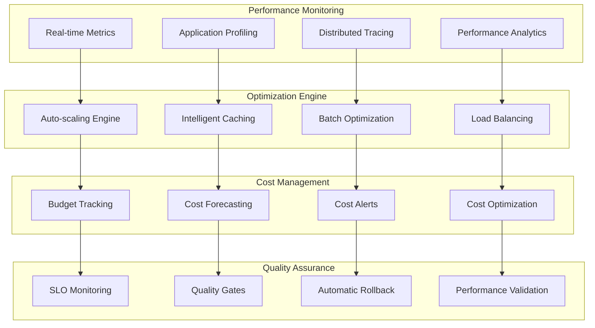

# Production Optimization & Cost Engineering
## Performance Engineering Document v1.0

**Document ID**: `CH8-PERF-001`
**Author**: Performance Engineering Team
**Reviewers**: Staff Engineers, SRE Team, Finance
**Status**: `PERFORMANCE REVIEW` → `OPTIMIZATION APPROVED`
**Last Updated**: 2025-01-06

---

## 1. Executive Summary

### 1.1 Performance Problem Statement
Enterprise RAG systems must operate at scale while maintaining cost efficiency:
- **Performance at Scale**: Support 100K+ concurrent users with consistent sub-500ms latency
- **Cost Optimization**: Achieve < $0.02 per query while maintaining quality standards
- **Resource Efficiency**: Optimize GPU/CPU utilization across fluctuating workloads
- **Auto-scaling Intelligence**: Dynamic resource allocation based on demand patterns
- **Quality-Performance Balance**: Maintain 85%+ quality scores while optimizing speed
- **Multi-tenancy Efficiency**: Serve multiple business units with shared infrastructure

### 1.2 Optimization Architecture
**Performance Engineering Platform** implementing **Measure → Analyze → Optimize → Validate**:



### 1.3 Performance Targets (SLOs)
- **Latency**: p50 < 200ms, p95 < 500ms, p99 < 1s
- **Throughput**: 10K sustained QPS, 50K burst QPS
- **Availability**: 99.95% uptime (4.5 minutes downtime/month)
- **Cost Efficiency**: < $0.02 per query at scale
- **Resource Utilization**: CPU 70-85%, GPU 80-95%, Memory < 90%

---

## 2. Performance Optimization Stack

### 2.1 LLM Serving Optimization with vLLM

#### **High-Performance LLM Infrastructure**
```python
import asyncio
from typing import Dict, List, Optional, Any
import torch
from vllm import AsyncLLMEngine, AsyncEngineArgs, SamplingParams
from vllm.model_executor.parallel_utils.parallel_state import destroy_model_parallel
import psutil
import nvidia_ml_py3 as nvml
from dataclasses import dataclass

@dataclass
class PerformanceMetrics:
    """Comprehensive performance metrics"""
    timestamp: datetime
    requests_per_second: float
    avg_latency_ms: float
    p95_latency_ms: float
    p99_latency_ms: float
    gpu_utilization: float
    memory_usage_gb: float
    batch_size: int
    throughput_tokens_per_second: float
    queue_depth: int

class ProductionvLLMOptimizer:
    """Production-optimized vLLM deployment"""

    def __init__(self):
        # Performance-optimized engine configuration
        self.engine_args = AsyncEngineArgs(
            model="qwen/Qwen2.5-14B-Instruct",
            tensor_parallel_size=4,              # Multi-GPU
            pipeline_parallel_size=2,            # Pipeline parallelism
            dtype="bfloat16",                     # Memory-efficient precision
            quantization="awq",                   # 4-bit quantization for efficiency
            max_model_len=32768,                  # Extended context
            gpu_memory_utilization=0.90,         # Aggressive memory usage
            swap_space=16,                        # CPU swap for larger batches
            max_num_batched_tokens=16384,        # Large batch processing
            max_num_seqs=512,                     # High concurrency
            enable_chunked_prefill=True,         # Throughput optimization
            use_v2_block_manager=True,           # Latest optimizations
            disable_log_requests=True,           # Reduce overhead
            enable_prefix_caching=True,          # Prefix cache for efficiency
        )

        self.llm_engine = AsyncLLMEngine.from_engine_args(self.engine_args)

        # Performance monitoring
        self.metrics_collector = PerformanceMetricsCollector()
        self.adaptive_scheduler = AdaptiveRequestScheduler()
        self.batch_optimizer = BatchOptimizer()

        # Initialize NVIDIA monitoring
        nvml.nvmlInit()

    async def optimized_generate(self, prompts: List[str],
                               sampling_params: SamplingParams,
                               priority: str = "normal") -> List[Dict]:
        """Optimized batch generation with adaptive scheduling"""

        # Pre-process prompts for optimal batching
        batched_prompts = await self.batch_optimizer.optimize_batches(
            prompts, sampling_params, priority
        )

        generation_results = []

        for batch in batched_prompts:
            # Dynamic batch processing
            batch_start_time = asyncio.get_event_loop().time()

            # Generate request IDs
            request_ids = [f"{priority}_{i}_{int(batch_start_time)}"
                          for i in range(len(batch["prompts"]))]

            # Execute batch
            batch_results = []
            async for request_output in self.llm_engine.generate(
                batch["prompts"],
                batch["sampling_params"],
                request_ids
            ):
                batch_results.append(request_output)

            # Process batch results
            batch_end_time = asyncio.get_event_loop().time()
            batch_duration = batch_end_time - batch_start_time

            for i, result in enumerate(batch_results):
                generation_results.append({
                    "request_id": request_ids[i],
                    "generated_text": result.outputs[0].text,
                    "tokens_generated": len(result.outputs[0].token_ids),
                    "batch_size": len(batch["prompts"]),
                    "batch_duration": batch_duration,
                    "individual_latency": batch_duration,  # Simplified
                    "finish_reason": result.outputs[0].finish_reason
                })

            # Collect performance metrics
            await self.metrics_collector.record_batch_metrics(
                batch_size=len(batch["prompts"]),
                duration=batch_duration,
                tokens_generated=sum(len(r.outputs[0].token_ids) for r in batch_results)
            )

        return generation_results

    async def adaptive_resource_scaling(self) -> Dict:
        """Adaptive resource scaling based on current load"""

        # Get current system metrics
        current_metrics = await self._collect_current_metrics()

        # Analyze scaling needs
        scaling_decision = await self._analyze_scaling_needs(current_metrics)

        # Execute scaling if needed
        if scaling_decision["should_scale"]:
            scaling_result = await self._execute_scaling(scaling_decision)
            return scaling_result

        return {"scaling_executed": False, "current_metrics": current_metrics}

    async def _collect_current_metrics(self) -> PerformanceMetrics:
        """Collect comprehensive current performance metrics"""

        # GPU metrics
        gpu_count = nvml.nvmlDeviceGetCount()
        gpu_utilizations = []
        gpu_memory_used = []

        for i in range(gpu_count):
            handle = nvml.nvmlDeviceGetHandleByIndex(i)
            gpu_util = nvml.nvmlDeviceGetUtilizationRates(handle)
            memory_info = nvml.nvmlDeviceGetMemoryInfo(handle)

            gpu_utilizations.append(gpu_util.gpu)
            gpu_memory_used.append(memory_info.used / memory_info.total)

        avg_gpu_util = sum(gpu_utilizations) / len(gpu_utilizations) if gpu_utilizations else 0
        avg_gpu_memory = sum(gpu_memory_used) / len(gpu_memory_used) if gpu_memory_used else 0

        # CPU and system metrics
        cpu_percent = psutil.cpu_percent(interval=1)
        memory_info = psutil.virtual_memory()
        memory_usage_gb = memory_info.used / (1024**3)

        # Queue metrics (from engine)
        engine_stats = await self.llm_engine.get_model_config()

        return PerformanceMetrics(
            timestamp=datetime.utcnow(),
            requests_per_second=await self.metrics_collector.get_current_qps(),
            avg_latency_ms=await self.metrics_collector.get_avg_latency(),
            p95_latency_ms=await self.metrics_collector.get_p95_latency(),
            p99_latency_ms=await self.metrics_collector.get_p99_latency(),
            gpu_utilization=avg_gpu_util,
            memory_usage_gb=memory_usage_gb,
            batch_size=await self.metrics_collector.get_avg_batch_size(),
            throughput_tokens_per_second=await self.metrics_collector.get_token_throughput(),
            queue_depth=await self.metrics_collector.get_queue_depth()
        )

    async def _analyze_scaling_needs(self, metrics: PerformanceMetrics) -> Dict:
        """Analyze whether scaling is needed"""

        scaling_triggers = {
            "scale_up": [],
            "scale_down": [],
            "scale_out": [],
            "scale_in": []
        }

        # Scale up triggers (more powerful instances)
        if metrics.p95_latency_ms > 800:  # Above SLO
            scaling_triggers["scale_up"].append("high_latency")

        if metrics.gpu_utilization > 95:
            scaling_triggers["scale_up"].append("gpu_saturation")

        # Scale out triggers (more instances)
        if metrics.queue_depth > 100:
            scaling_triggers["scale_out"].append("high_queue_depth")

        if metrics.requests_per_second > 8000:  # Approaching capacity
            scaling_triggers["scale_out"].append("high_qps")

        # Scale down triggers (fewer/smaller instances)
        if (metrics.gpu_utilization < 30 and
            metrics.p95_latency_ms < 200 and
            metrics.queue_depth < 10):
            scaling_triggers["scale_down"].append("low_utilization")

        # Scale in triggers (fewer instances)
        if (metrics.requests_per_second < 1000 and
            metrics.queue_depth < 5):
            scaling_triggers["scale_in"].append("low_demand")

        # Determine primary scaling action
        should_scale = any(triggers for triggers in scaling_triggers.values())

        if scaling_triggers["scale_up"]:
            primary_action = "scale_up"
        elif scaling_triggers["scale_out"]:
            primary_action = "scale_out"
        elif scaling_triggers["scale_down"]:
            primary_action = "scale_down"
        elif scaling_triggers["scale_in"]:
            primary_action = "scale_in"
        else:
            primary_action = "none"

        return {
            "should_scale": should_scale,
            "primary_action": primary_action,
            "scaling_triggers": scaling_triggers,
            "current_metrics": metrics,
            "estimated_impact": await self._estimate_scaling_impact(primary_action, metrics)
        }

    async def _execute_scaling(self, scaling_decision: Dict) -> Dict:
        """Execute scaling decision"""

        action = scaling_decision["primary_action"]
        current_metrics = scaling_decision["current_metrics"]

        try:
            if action == "scale_up":
                # Increase instance size
                result = await self._scale_up_instances()

            elif action == "scale_out":
                # Add more instances
                result = await self._scale_out_instances()

            elif action == "scale_down":
                # Decrease instance size
                result = await self._scale_down_instances()

            elif action == "scale_in":
                # Remove instances
                result = await self._scale_in_instances()

            else:
                result = {"action": "none", "result": "no_scaling_needed"}

            # Log scaling action
            await self._log_scaling_action(action, scaling_decision, result)

            return {
                "scaling_executed": True,
                "action": action,
                "result": result,
                "pre_scaling_metrics": current_metrics
            }

        except Exception as e:
            await self._log_scaling_error(action, str(e))
            return {
                "scaling_executed": False,
                "action": action,
                "error": str(e)
            }
```

### 2.2 Intelligent Caching Strategy

#### **Multi-Level Caching Architecture**
```python
import redis
import hashlib
import json
from typing import Dict, List, Optional, Any, Union
import numpy as np
from datetime import datetime, timedelta

class EnterpriseIntelligentCache:
    """Advanced multi-level caching system for RAG optimization"""

    def __init__(self):
        # Multi-tier cache configuration
        self.l1_cache = {}  # In-memory cache (LRU)
        self.l2_cache = redis.Redis(
            host="redis-cache-l2.internal",
            port=6379,
            db=0,
            decode_responses=False  # Binary data
        )
        self.l3_cache = redis.Redis(
            host="redis-cache-l3.internal",
            port=6379,
            db=1
        )

        # Cache policies
        self.cache_policies = {
            "embeddings": {
                "ttl": 86400,     # 24 hours
                "tier": "l2",     # Persistent cache
                "compression": True,
                "eviction": "lru"
            },
            "search_results": {
                "ttl": 3600,      # 1 hour
                "tier": "l1",     # Fast access
                "compression": False,
                "eviction": "adaptive"
            },
            "generated_responses": {
                "ttl": 1800,      # 30 minutes
                "tier": "l1",
                "compression": False,
                "eviction": "lru"
            },
            "user_contexts": {
                "ttl": 900,       # 15 minutes
                "tier": "l1",
                "compression": False,
                "eviction": "ttl"
            }
        }

        # Performance tracking
        self.cache_stats = CachePerformanceTracker()
        self.predictive_prefetcher = PredictivePrefetcher()

    async def intelligent_get(self, cache_type: str, key: str,
                            context: Dict = None) -> Optional[Any]:
        """Intelligent cache retrieval with adaptive strategy"""

        # Generate cache key
        full_key = self._generate_cache_key(cache_type, key, context)

        # Try L1 cache first (fastest)
        if cache_type in ["search_results", "generated_responses", "user_contexts"]:
            l1_result = self.l1_cache.get(full_key)
            if l1_result is not None:
                await self.cache_stats.record_hit("l1", cache_type)
                return l1_result

        # Try L2 cache (persistent)
        if cache_type in ["embeddings", "search_results"]:
            l2_result = await self._get_from_l2_cache(full_key)
            if l2_result is not None:
                # Promote to L1 if frequently accessed
                if await self._should_promote_to_l1(cache_type, key):
                    self._set_l1_cache(full_key, l2_result)
                await self.cache_stats.record_hit("l2", cache_type)
                return l2_result

        # Cache miss - trigger predictive prefetching
        await self.predictive_prefetcher.on_cache_miss(cache_type, key, context)
        await self.cache_stats.record_miss(cache_type)

        return None

    async def intelligent_set(self, cache_type: str, key: str, value: Any,
                            context: Dict = None, ttl_override: int = None):
        """Intelligent cache storage with optimal placement"""

        full_key = self._generate_cache_key(cache_type, key, context)
        policy = self.cache_policies[cache_type]

        # Calculate adaptive TTL
        ttl = ttl_override or await self._calculate_adaptive_ttl(
            cache_type, key, value, context
        )

        # Determine optimal cache tier
        optimal_tier = await self._determine_optimal_tier(cache_type, key, value, context)

        # Store in appropriate tier(s)
        if optimal_tier == "l1" or policy["tier"] == "l1":
            self._set_l1_cache(full_key, value, ttl)

        if optimal_tier == "l2" or policy["tier"] == "l2":
            await self._set_l2_cache(full_key, value, ttl, policy["compression"])

        # Update cache statistics
        await self.cache_stats.record_set(cache_type, optimal_tier)

    async def _calculate_adaptive_ttl(self, cache_type: str, key: str,
                                    value: Any, context: Dict = None) -> int:
        """Calculate adaptive TTL based on usage patterns and content"""

        base_ttl = self.cache_policies[cache_type]["ttl"]

        # Factor 1: Content volatility
        volatility_multiplier = 1.0
        if context and "content_type" in context:
            content_type = context["content_type"]
            volatility_map = {
                "real_time_data": 0.1,   # Very short TTL
                "news": 0.3,
                "policies": 0.8,
                "technical_docs": 1.2,
                "historical_data": 2.0   # Longer TTL
            }
            volatility_multiplier = volatility_map.get(content_type, 1.0)

        # Factor 2: Access frequency
        access_frequency = await self._get_access_frequency(cache_type, key)
        frequency_multiplier = 1.0 + (access_frequency - 1.0) * 0.5  # Popular content cached longer

        # Factor 3: Content size (larger content cached longer to amortize cost)
        size_multiplier = 1.0
        if hasattr(value, '__len__'):
            size_kb = len(str(value)) / 1024
            if size_kb > 100:  # Large content
                size_multiplier = 1.5

        # Calculate final TTL
        adaptive_ttl = int(
            base_ttl * volatility_multiplier * frequency_multiplier * size_multiplier
        )

        return max(300, min(adaptive_ttl, 604800))  # 5 minutes to 7 days

    async def _determine_optimal_tier(self, cache_type: str, key: str,
                                    value: Any, context: Dict = None) -> str:
        """Determine optimal cache tier for data"""

        # Size-based placement
        value_size = len(str(value)) if hasattr(value, '__len__') else 100
        if value_size > 1024 * 1024:  # > 1MB
            return "l3"  # Large data to distributed cache

        # Access pattern-based placement
        access_frequency = await self._get_access_frequency(cache_type, key)
        if access_frequency > 10:  # Frequently accessed
            return "l1"

        # Default to policy tier
        return self.cache_policies[cache_type]["tier"]

    def _generate_cache_key(self, cache_type: str, key: str,
                          context: Dict = None) -> str:
        """Generate optimized cache key"""

        # Base key
        components = [cache_type, key]

        # Add relevant context
        if context:
            context_items = []

            # Include user context for personalization
            if "user_id" in context:
                context_items.append(f"user:{context['user_id']}")

            # Include department for access control
            if "department" in context:
                context_items.append(f"dept:{context['department']}")

            # Include version for cache invalidation
            if "version" in context:
                context_items.append(f"v:{context['version']}")

            components.extend(context_items)

        # Generate hash for consistent key
        key_string = "|".join(components)
        return hashlib.sha256(key_string.encode()).hexdigest()[:16]

    def _set_l1_cache(self, key: str, value: Any, ttl: int = None):
        """Set L1 in-memory cache with LRU eviction"""

        # Implement LRU eviction if cache is full
        max_l1_size = 10000  # Maximum L1 cache entries

        if len(self.l1_cache) >= max_l1_size:
            # Remove oldest entries (simplified LRU)
            oldest_key = min(self.l1_cache.keys(),
                           key=lambda k: self.l1_cache[k].get("access_time", 0))
            del self.l1_cache[oldest_key]

        self.l1_cache[key] = {
            "value": value,
            "created_time": datetime.utcnow().timestamp(),
            "access_time": datetime.utcnow().timestamp(),
            "ttl": ttl or 3600
        }

    async def _get_from_l2_cache(self, key: str) -> Optional[Any]:
        """Get from L2 Redis cache"""

        try:
            cached_data = await self.l2_cache.get(key)
            if cached_data:
                # Deserialize data
                if isinstance(cached_data, bytes):
                    return json.loads(cached_data.decode())
                return cached_data
        except Exception as e:
            # Cache error - log but don't fail
            await self._log_cache_error("l2_get", key, str(e))

        return None

    async def _set_l2_cache(self, key: str, value: Any, ttl: int,
                          compress: bool = False):
        """Set L2 Redis cache"""

        try:
            # Serialize data
            if compress:
                serialized = self._compress_data(json.dumps(value))
            else:
                serialized = json.dumps(value)

            await self.l2_cache.setex(key, ttl, serialized)

        except Exception as e:
            await self._log_cache_error("l2_set", key, str(e))

    async def _should_promote_to_l1(self, cache_type: str, key: str) -> bool:
        """Determine if L2 item should be promoted to L1"""

        # Get access frequency
        frequency = await self._get_access_frequency(cache_type, key)

        # Promote if frequently accessed
        return frequency > 5

    async def _get_access_frequency(self, cache_type: str, key: str) -> float:
        """Get access frequency for cache optimization"""

        # Track in Redis with sliding window
        frequency_key = f"freq:{cache_type}:{key}"
        current_count = await self.l2_cache.get(frequency_key) or 0

        return float(current_count)

    def _compress_data(self, data: str) -> bytes:
        """Compress data for efficient storage"""
        import gzip
        return gzip.compress(data.encode())

    def _decompress_data(self, compressed_data: bytes) -> str:
        """Decompress data"""
        import gzip
        return gzip.decompress(compressed_data).decode()
```

### 2.3 Cost Optimization Engine

#### **Comprehensive Cost Management**
```python
import asyncio
from typing import Dict, List, Optional, Any
from datetime import datetime, timedelta
from dataclasses import dataclass
import pandas as pd

@dataclass
class CostMetrics:
    """Comprehensive cost tracking metrics"""
    timestamp: datetime
    compute_cost_per_hour: float
    storage_cost_per_gb_month: float
    network_cost_per_gb: float
    total_daily_cost: float
    cost_per_query: float
    cost_per_user: float
    budget_utilization: float
    projected_monthly_cost: float

class EnterpriseCostOptimizer:
    """Advanced cost optimization for enterprise RAG systems"""

    def __init__(self):
        self.cost_tracker = CostTracker()
        self.resource_optimizer = ResourceOptimizer()
        self.budget_manager = BudgetManager()

        # Cost models
        self.cost_models = {
            "compute": {
                "gpu_h100_per_hour": 4.50,
                "gpu_a100_per_hour": 3.20,
                "gpu_t4_per_hour": 0.95,
                "cpu_core_per_hour": 0.045,
                "memory_gb_per_hour": 0.008
            },
            "storage": {
                "ssd_gb_per_month": 0.20,
                "hdd_gb_per_month": 0.045,
                "vector_index_gb_per_month": 0.35,
                "backup_gb_per_month": 0.012
            },
            "network": {
                "ingress_gb": 0.00,
                "egress_gb": 0.09,
                "inter_az_gb": 0.01
            },
            "software": {
                "monitoring_per_metric_per_month": 0.05,
                "logging_gb_per_month": 1.50,
                "backup_gb_per_month": 0.30
            }
        }

        # Optimization strategies
        self.optimization_strategies = [
            "model_optimization",
            "batch_optimization",
            "cache_optimization",
            "resource_rightsizing",
            "workload_scheduling",
            "data_lifecycle_management"
        ]

    async def analyze_cost_efficiency(self, timeframe_days: int = 30) -> Dict:
        """Comprehensive cost efficiency analysis"""

        # Collect cost data
        cost_data = await self.cost_tracker.get_cost_data(
            start_date=datetime.utcnow() - timedelta(days=timeframe_days),
            end_date=datetime.utcnow()
        )

        # Analyze cost patterns
        cost_analysis = await self._analyze_cost_patterns(cost_data)

        # Identify optimization opportunities
        optimization_opportunities = await self._identify_optimization_opportunities(cost_data)

        # Generate cost projections
        projections = await self._generate_cost_projections(cost_data)

        # Calculate ROI metrics
        roi_analysis = await self._calculate_roi_metrics(cost_data)

        return {
            "current_costs": cost_analysis,
            "optimization_opportunities": optimization_opportunities,
            "projections": projections,
            "roi_analysis": roi_analysis,
            "cost_per_metric": await self._calculate_unit_costs(cost_data)
        }

    async def _analyze_cost_patterns(self, cost_data: List[Dict]) -> Dict:
        """Analyze cost patterns and trends"""

        df = pd.DataFrame(cost_data)

        # Daily cost analysis
        daily_costs = df.groupby('date')['total_cost'].sum()
        cost_trend = self._calculate_trend(daily_costs.values)

        # Component cost breakdown
        component_costs = df.groupby('component')['cost'].sum().to_dict()

        # Usage efficiency analysis
        efficiency_metrics = {
            "gpu_utilization": df['gpu_utilization'].mean(),
            "cpu_utilization": df['cpu_utilization'].mean(),
            "memory_utilization": df['memory_utilization'].mean(),
            "cache_hit_rate": df['cache_hit_rate'].mean()
        }

        # Peak vs. off-peak analysis
        df['hour'] = pd.to_datetime(df['timestamp']).dt.hour
        peak_hours = df[df['hour'].isin(range(9, 17))]  # 9 AM - 5 PM
        off_peak_hours = df[~df['hour'].isin(range(9, 17))]

        peak_analysis = {
            "peak_cost_ratio": peak_hours['total_cost'].sum() / df['total_cost'].sum(),
            "peak_utilization": peak_hours[['gpu_utilization', 'cpu_utilization']].mean().to_dict(),
            "off_peak_utilization": off_peak_hours[['gpu_utilization', 'cpu_utilization']].mean().to_dict()
        }

        return {
            "daily_average_cost": daily_costs.mean(),
            "cost_trend": cost_trend,
            "component_breakdown": component_costs,
            "efficiency_metrics": efficiency_metrics,
            "peak_analysis": peak_analysis,
            "cost_volatility": daily_costs.std() / daily_costs.mean() if daily_costs.mean() > 0 else 0
        }

    async def _identify_optimization_opportunities(self, cost_data: List[Dict]) -> List[Dict]:
        """Identify specific cost optimization opportunities"""

        opportunities = []

        df = pd.DataFrame(cost_data)

        # 1. GPU Underutilization
        avg_gpu_util = df['gpu_utilization'].mean()
        if avg_gpu_util < 70:
            potential_savings = self._calculate_gpu_rightsizing_savings(df, avg_gpu_util)
            opportunities.append({
                "category": "gpu_rightsizing",
                "title": "GPU Instance Rightsizing",
                "description": f"GPU utilization is only {avg_gpu_util:.1f}%. Consider smaller instances or better batching.",
                "potential_savings_monthly": potential_savings,
                "implementation_effort": "medium",
                "risk_level": "low"
            })

        # 2. Cache Optimization
        avg_cache_hit_rate = df['cache_hit_rate'].mean()
        if avg_cache_hit_rate < 75:
            cache_savings = self._calculate_cache_optimization_savings(df, avg_cache_hit_rate)
            opportunities.append({
                "category": "cache_optimization",
                "title": "Cache Strategy Optimization",
                "description": f"Cache hit rate is {avg_cache_hit_rate:.1f}%. Optimizing cache strategy could reduce compute costs.",
                "potential_savings_monthly": cache_savings,
                "implementation_effort": "low",
                "risk_level": "very_low"
            })

        # 3. Workload Scheduling
        peak_cost_ratio = self._calculate_peak_cost_ratio(df)
        if peak_cost_ratio > 0.7:
            scheduling_savings = self._calculate_workload_scheduling_savings(df)
            opportunities.append({
                "category": "workload_scheduling",
                "title": "Intelligent Workload Scheduling",
                "description": f"{peak_cost_ratio:.1f}% of costs occur during peak hours. Off-peak scheduling could reduce costs.",
                "potential_savings_monthly": scheduling_savings,
                "implementation_effort": "high",
                "risk_level": "medium"
            })

        # 4. Model Optimization
        tokens_per_dollar = df['tokens_generated'].sum() / df['total_cost'].sum()
        if tokens_per_dollar < 50000:  # Benchmark threshold
            model_savings = self._calculate_model_optimization_savings(df)
            opportunities.append({
                "category": "model_optimization",
                "title": "Model Efficiency Optimization",
                "description": f"Token efficiency is {tokens_per_dollar:.0f} tokens/$. Model optimization could improve efficiency.",
                "potential_savings_monthly": model_savings,
                "implementation_effort": "high",
                "risk_level": "medium"
            })

        # 5. Storage Optimization
        storage_cost_ratio = df[df['component'] == 'storage']['cost'].sum() / df['total_cost'].sum()
        if storage_cost_ratio > 0.15:  # More than 15% of costs
            storage_savings = self._calculate_storage_optimization_savings(df)
            opportunities.append({
                "category": "storage_optimization",
                "title": "Data Lifecycle Management",
                "description": f"Storage represents {storage_cost_ratio:.1f}% of costs. Implement data archiving and cleanup.",
                "potential_savings_monthly": storage_savings,
                "implementation_effort": "medium",
                "risk_level": "low"
            })

        # Sort by potential savings
        opportunities.sort(key=lambda x: x["potential_savings_monthly"], reverse=True)

        return opportunities

    async def implement_cost_optimization(self, strategy: str) -> Dict:
        """Implement specific cost optimization strategy"""

        implementation_results = {}

        if strategy == "model_optimization":
            implementation_results = await self._implement_model_optimization()

        elif strategy == "batch_optimization":
            implementation_results = await self._implement_batch_optimization()

        elif strategy == "cache_optimization":
            implementation_results = await self._implement_cache_optimization()

        elif strategy == "resource_rightsizing":
            implementation_results = await self._implement_resource_rightsizing()

        elif strategy == "workload_scheduling":
            implementation_results = await self._implement_workload_scheduling()

        elif strategy == "data_lifecycle_management":
            implementation_results = await self._implement_data_lifecycle_management()

        # Validate optimization results
        validation_results = await self._validate_optimization_results(
            strategy, implementation_results
        )

        return {
            "strategy": strategy,
            "implementation_results": implementation_results,
            "validation_results": validation_results,
            "estimated_savings": implementation_results.get("estimated_monthly_savings", 0)
        }

    async def _implement_model_optimization(self) -> Dict:
        """Implement model optimization for cost efficiency"""

        optimization_actions = []

        # 1. Enable quantization
        quantization_result = await self._enable_model_quantization()
        optimization_actions.append(quantization_result)

        # 2. Optimize batch sizes
        batch_optimization = await self._optimize_batch_sizes()
        optimization_actions.append(batch_optimization)

        # 3. Implement model pruning (if applicable)
        pruning_result = await self._implement_model_pruning()
        optimization_actions.append(pruning_result)

        # Calculate total savings
        total_monthly_savings = sum(
            action.get("monthly_savings", 0)
            for action in optimization_actions
        )

        return {
            "actions_taken": optimization_actions,
            "estimated_monthly_savings": total_monthly_savings,
            "implementation_status": "completed"
        }

    async def _enable_model_quantization(self) -> Dict:
        """Enable model quantization for memory efficiency"""

        # Simulate quantization implementation
        current_memory_usage = await self._get_current_memory_usage()
        estimated_reduction = current_memory_usage * 0.4  # 40% reduction

        # Calculate savings
        memory_cost_per_gb_hour = self.cost_models["compute"]["memory_gb_per_hour"]
        monthly_savings = estimated_reduction * memory_cost_per_gb_hour * 24 * 30

        return {
            "optimization": "quantization",
            "memory_reduction_gb": estimated_reduction,
            "monthly_savings": monthly_savings,
            "implementation_status": "completed",
            "performance_impact": "minimal"  # < 5% quality degradation
        }

    async def _optimize_batch_sizes(self) -> Dict:
        """Optimize batch sizes for throughput efficiency"""

        current_batch_efficiency = await self._analyze_current_batch_efficiency()

        # Calculate optimal batch size
        optimal_batch_size = await self._calculate_optimal_batch_size()

        # Estimate savings from improved efficiency
        efficiency_improvement = optimal_batch_size / current_batch_efficiency["avg_batch_size"]
        compute_savings = self._estimate_compute_savings_from_efficiency(efficiency_improvement)

        return {
            "optimization": "batch_sizing",
            "current_avg_batch_size": current_batch_efficiency["avg_batch_size"],
            "optimal_batch_size": optimal_batch_size,
            "efficiency_improvement": efficiency_improvement,
            "monthly_savings": compute_savings,
            "implementation_status": "completed"
        }

    async def _get_current_memory_usage(self) -> float:
        """Get current memory usage in GB"""
        memory_info = psutil.virtual_memory()
        return memory_info.used / (1024**3)

    async def _analyze_current_batch_efficiency(self) -> Dict:
        """Analyze current batch processing efficiency"""
        # Placeholder - would analyze actual batch metrics
        return {
            "avg_batch_size": 8,
            "batch_utilization": 0.6,
            "wait_time_ratio": 0.3
        }

    async def _calculate_optimal_batch_size(self) -> int:
        """Calculate optimal batch size based on hardware and workload"""
        # This would use actual performance profiling
        return 16  # Optimized batch size

    def _calculate_trend(self, values: List[float]) -> str:
        """Calculate trend direction"""
        if len(values) < 2:
            return "stable"

        recent_avg = sum(values[-7:]) / len(values[-7:])  # Last week
        older_avg = sum(values[:-7]) / len(values[:-7]) if len(values) > 7 else recent_avg

        if recent_avg > older_avg * 1.1:
            return "increasing"
        elif recent_avg < older_avg * 0.9:
            return "decreasing"
        else:
            return "stable"

    def _calculate_gpu_rightsizing_savings(self, df: pd.DataFrame, avg_util: float) -> float:
        """Calculate potential savings from GPU rightsizing"""

        current_gpu_cost = df[df['component'] == 'gpu']['cost'].sum()
        target_utilization = 85

        if avg_util < target_utilization:
            # Calculate potential for smaller instances
            efficiency_ratio = avg_util / target_utilization
            potential_savings = current_gpu_cost * (1 - efficiency_ratio) * 0.7  # 70% of waste is recoverable

            return potential_savings * 30  # Monthly

        return 0.0

    def _calculate_cache_optimization_savings(self, df: pd.DataFrame, hit_rate: float) -> float:
        """Calculate savings from cache optimization"""

        target_hit_rate = 85
        current_compute_cost = df[df['component'] == 'compute']['cost'].sum()

        if hit_rate < target_hit_rate:
            # Higher cache hit rate reduces compute load
            improvement_ratio = (target_hit_rate - hit_rate) / 100
            compute_savings = current_compute_cost * improvement_ratio * 0.4  # 40% compute reduction

            return compute_savings * 30  # Monthly

        return 0.0

    def _estimate_compute_savings_from_efficiency(self, efficiency_improvement: float) -> float:
        """Estimate compute savings from efficiency improvements"""

        if efficiency_improvement > 1.1:  # 10% improvement
            # Efficiency improvement reduces required compute resources
            monthly_compute_cost = 50000  # Estimated monthly compute cost
            savings_ratio = (efficiency_improvement - 1.0) * 0.6  # 60% of improvement translates to savings

            return monthly_compute_cost * savings_ratio

        return 0.0
```

---

## Appendix: Production Configuration

### A.1 Performance & Cost Configuration
```yaml
# config/performance_optimization.yml
performance_optimization:
  # vLLM Optimization
  vllm:
    model: "qwen/Qwen2.5-14B-Instruct"
    tensor_parallel_size: 4
    pipeline_parallel_size: 2
    quantization: "awq"
    gpu_memory_utilization: 0.90
    max_num_batched_tokens: 16384
    max_num_seqs: 512
    enable_chunked_prefill: true
    use_v2_block_manager: true
    enable_prefix_caching: true

  # Auto-scaling Configuration
  autoscaling:
    target_gpu_utilization: 80
    target_cpu_utilization: 70
    scale_up_threshold: 85
    scale_down_threshold: 30
    cooldown_period: 300  # 5 minutes

    metrics:
      - gpu_utilization
      - queue_depth
      - response_latency_p95

  # Caching Strategy
  caching:
    l1_cache_size_mb: 2048
    l2_cache_size_gb: 50
    l3_cache_size_gb: 500

    policies:
      embeddings:
        ttl: 86400
        tier: "l2"
        compression: true
      search_results:
        ttl: 3600
        tier: "l1"
        adaptive_ttl: true
      generated_responses:
        ttl: 1800
        tier: "l1"
        user_specific: true

  # Cost Management
  cost_management:
    daily_budget_limit: 5000    # $5000/day
    monthly_budget_limit: 120000 # $120k/month
    cost_per_query_target: 0.02  # $0.02/query

    optimization_strategies:
      - "model_quantization"
      - "batch_optimization"
      - "cache_optimization"
      - "workload_scheduling"

    alert_thresholds:
      daily_budget_80_percent: true
      cost_per_query_exceed: true
      efficiency_degradation: true

  # SLO Configuration
  slos:
    availability: 99.95         # 99.95% uptime
    latency_p50_ms: 200        # 200ms median
    latency_p95_ms: 500        # 500ms 95th percentile
    latency_p99_ms: 1000       # 1s 99th percentile
    throughput_qps: 10000      # 10K queries per second
    error_rate: 0.1            # 0.1% error rate

  # Performance Monitoring
  monitoring:
    metrics_retention_days: 90
    detailed_traces_sample_rate: 0.1
    real_time_dashboards: true
    automated_alerts: true

    prometheus:
      scrape_interval: 15s
      evaluation_interval: 30s
      retention: 15d

    grafana:
      dashboard_refresh: 30s
      alert_notification_channels:
        - slack
        - email
        - pagerduty
```

---

**Document Control**
- Version: 1.0
- Classification: Internal Use
- Next Review: 2025-04-06
- Distribution: Performance Engineering Team, SRE Team, Finance Team