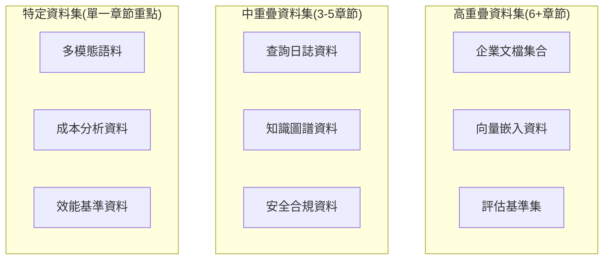

# 企業RAG課程章節共用資料集分析與組織企劃

## 📋 執行摘要

基於對課程教材深度分析，本企劃專注於《企業級檢索增強生成系統》(CS785) 課程各章節間的**資料集共用分析與組織規劃**，建立統一的資料集管理體系。

**核心發現**: 11個主要章節間存在高度重疊的資料集需求和應用場景，通過統一資料集組織可避免重複建置，提升學習連貫性。

---

## 1. 課程結構與章節分析

### 1.1 章節概覽

| 章節 | 主題 | 核心技術 | 資料集需求 |
|------|------|---------|-----------|
| Ch0 | 企業RAG架構概述 | 系統設計、技術棧 | 企業文檔、評估基準 |
| Ch1 | 文檔治理 | Docling、元數據管理 | 多格式企業文檔 |
| Ch2 | 索引與向量資料庫 | Qdrant、混合檢索 | 向量資料集、企業文檔 |
| Ch3 | 檢索工程 | 查詢優化、路由 | 查詢日誌、評估基準 |
| Ch4 | 生成控制 | LLM服務、引用系統 | 評估數據、向量嵌入 |
| Ch5 | 評估與監控 | RAGAS、評估平台 | 評估基準、查詢日誌 |
| Ch6 | 安全與合規 | 權限控制、資料保護 | 合規政策、安全資料 |
| Ch7 | 高級方法 | GraphRAG、多智能體 | 知識圖譜、向量嵌入 |
| Ch8 | 性能與成本 | 優化策略、成本分析 | 查詢日誌、向量嵌入 |
| Ch9 | 企業案例 | 實際部署、最佳實踐 | 企業文檔、知識圖譜 |
| Ch10 | 工具鏈參考 | 技術選型、整合指南 | 企業文檔參考 |

---

## 2. 共用資料集類型分析

### 2.1 核心共用資料集

#### **A. 企業文檔資料集** (跨9個章節)
**使用章節**: Ch0, Ch1, Ch2, Ch3, Ch4, Ch5, Ch7, Ch9, Ch10
**資料類型**:
- PDF技術文檔 (1,000+份)
- Word政策文檔 (500+份)
- PowerPoint演示文稿 (300+份)
- Confluence企業知識庫
- SharePoint協作文檔

**資料集組織架構**:
```
/home/os-sunnie.gd.weng/python_workstation/side-project/RAG_system_design_review/datasets/
└── enterprise_documents/
    ├── technical_specs/     # 技術規範文檔 (PDF/DOCX)
    ├── policies/           # 政策制度文檔 (PDF/DOCX)
    ├── manuals/           # 操作手冊 (PDF/DOCX/PPTX)
    ├── presentations/     # 簡報資料 (PPTX)
    ├── knowledge_base/    # 知識庫文檔 (MD/HTML)
    └── metadata/
        ├── document_registry.json    # 文檔註冊表
        ├── chapter_mapping.json     # 章節使用對應
        └── access_control.json      # 訪問控制配置
```

#### **B. 向量嵌入資料集** (跨7個章節)
**使用章節**: Ch0, Ch2, Ch3, Ch4, Ch5, Ch7, Ch8
**資料規格**:
- BGE-Large-ZH 向量 (1,536維)
- Sentence-Transformers 多語言向量 (768維)
- 預計算向量索引 (10M+ 向量)

#### **C. 評估基準資料集** (跨6個章節)
**使用章節**: Ch0, Ch3, Ch4, Ch5, Ch7, Ch8
**基準類型**:
- MS MARCO 檢索評估
- 企業QA測試集 (1,000組問答對)
- 多跳推理評估集 (HotpotQA改編)
- 忠實度評估基準

### 2.2 專業領域資料集

#### **A. 技術架構領域** (Ch0, Ch2, Ch8, Ch10)
**共用元素**:
- 系統配置模板
- 部署腳本集合
- 性能監控數據
- 技術堆疊對比

#### **B. 知識圖譜領域** (Ch1, Ch7, Ch9)
**共用元素**:
- 企業實體本體庫
- 關係模式定義
- 圖構建算法代碼
- 社群檢測結果

#### **C. 安全合規領域** (Ch1, Ch6, Ch9)
**共用元素**:
- 合規政策框架
- 安全控制矩陣
- 審計日誌模板
- 權限管理規則

---

## 3. 技術棧共用分析

### 3.1 資料集使用重疊度分析



### 3.2 資料集標準化規範

#### **檔案命名與組織標準**
```yaml
# 資料集命名規範
檔案命名格式: "{category}_{domain}_{version}_{language}.{extension}"
範例:
  - tech_spec_networking_v1.2_en.pdf
  - policy_security_v2.0_zh.docx
  - manual_deployment_v1.0_en.pptx

# 元數據標準格式
metadata_fields:
  - document_id: 唯一識別符
  - title: 文檔標題
  - category: 分類 (technical_spec|policy|manual|presentation|knowledge_base)
  - domain: 領域 (networking|security|deployment|governance|evaluation)
  - version: 版本號
  - language: 語言代碼 (en|zh|ja|es)
  - access_level: 訊問等級 (public|internal|confidential)
  - used_in_chapters: 使用章節列表
  - creation_date: 創建日期
  - last_updated: 最後更新日期
```

---

## 4. 資料集組織實施方案

### 4.1 目標資料集架構

```
/home/os-sunnie.gd.weng/python_workstation/side-project/RAG_system_design_review/datasets/
├── enterprise_documents/          # 企業文檔集 (跨9章節)
│   ├── technical_specs/           # 技術規範
│   ├── policies/                  # 政策文檔
│   ├── manuals/                   # 操作手冊
│   ├── presentations/             # 簡報資料
│   ├── knowledge_base/           # 知識庫
│   └── metadata/
│       ├── document_registry.json
│       ├── chapter_mapping.json
│       └── access_control.json
├── vector_embeddings/             # 向量嵌入資料 (跨7章節)
│   ├── bge_large_zh/             # BGE中文向量
│   ├── sentence_transformers/    # 多語言向量
│   ├── custom_embeddings/        # 自定義嵌入
│   └── indices/
│       ├── qdrant_collections/   # Qdrant集合
│       └── index_mappings.json
├── evaluation_benchmarks/         # 評估基準集 (跨6章節)
│   ├── qa_pairs/                 # 問答對
│   ├── retrieval_tests/          # 檢索測試
│   ├── generation_tests/         # 生成測試
│   ├── faithfulness_tests/       # 忠實度測試
│   └── metrics/
│       └── benchmark_configs.json
├── knowledge_graphs/              # 知識圖譜 (Ch1,Ch7,Ch9)
│   ├── entities/                 # 實體資料
│   ├── relations/                # 關係資料
│   ├── ontologies/               # 本體定義
│   └── graph_exports/
│       ├── neo4j_dumps/
│       └── networkx_graphs/
├── query_logs/                   # 查詢日誌 (Ch3,Ch5,Ch8)
│   ├── search_queries/
│   ├── performance_logs/
│   └── analytics/
├── security_compliance/          # 安全合規 (Ch1,Ch6,Ch9)
│   ├── policies/
│   ├── access_patterns/
│   ├── audit_logs/
│   └── compliance_templates/
└── metadata/                     # 全域元數據
    ├── global_registry.json     # 全域註冊表
    ├── chapter_dependencies.json # 章節依賴
    ├── dataset_statistics.json  # 資料集統計
    └── usage_tracking.json      # 使用追蹤
```

### 4.2 分階段實施計劃

#### **Phase 1: 資料集目錄建立** (2週)
**目標**: 建立標準化資料集目錄結構
**交付物**:
- [ ] 完整目錄架構建立
- [ ] 元數據模板文件
- [ ] 資料集命名規範
- [ ] 初始README和使用說明

#### **Phase 2: 核心資料集建置** (4週)
**目標**: 建立高重疊度的核心資料集
**交付物**:
- [ ] 企業文檔資料集 (1K+ 文檔)
- [ ] 評估基準集 (500+ 測試案例)
- [ ] 配置模板集 (100+ 配置文件)
- [ ] 全域元數據系統

#### **Phase 3: 專業資料集補充** (6週)
**目標**: 補充各領域專業資料集
**交付物**:
- [ ] 向量嵌入資料集 (預計算索引)
- [ ] 知識圖譜資料集 (10K+ 實體)
- [ ] 查詢日誌資料集 (模擬數據)
- [ ] 安全合規資料集

#### **Phase 4: 驗證與優化** (持續)
**目標**: 持續驗證資料集品質與可用性
**活動**:
- [ ] 跨章節使用驗證
- [ ] 資料集完整性檢查
- [ ] 使用統計分析
- [ ] 資料集版本管理

